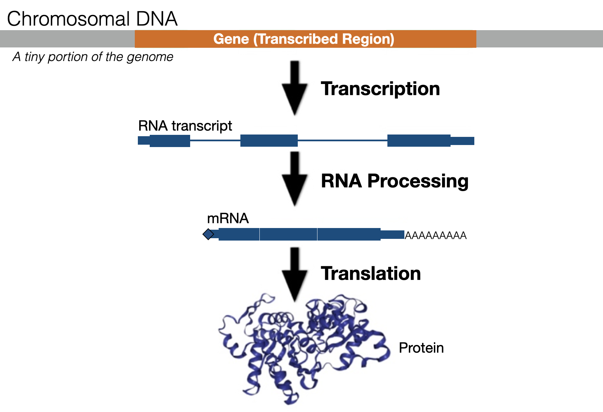
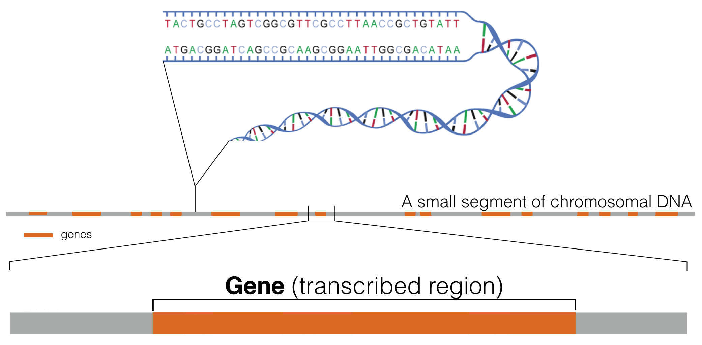
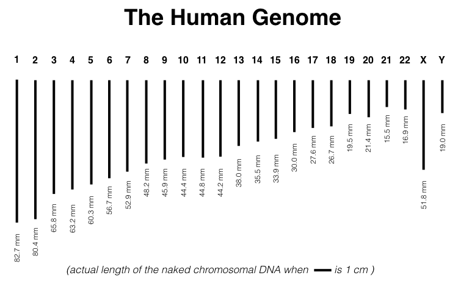
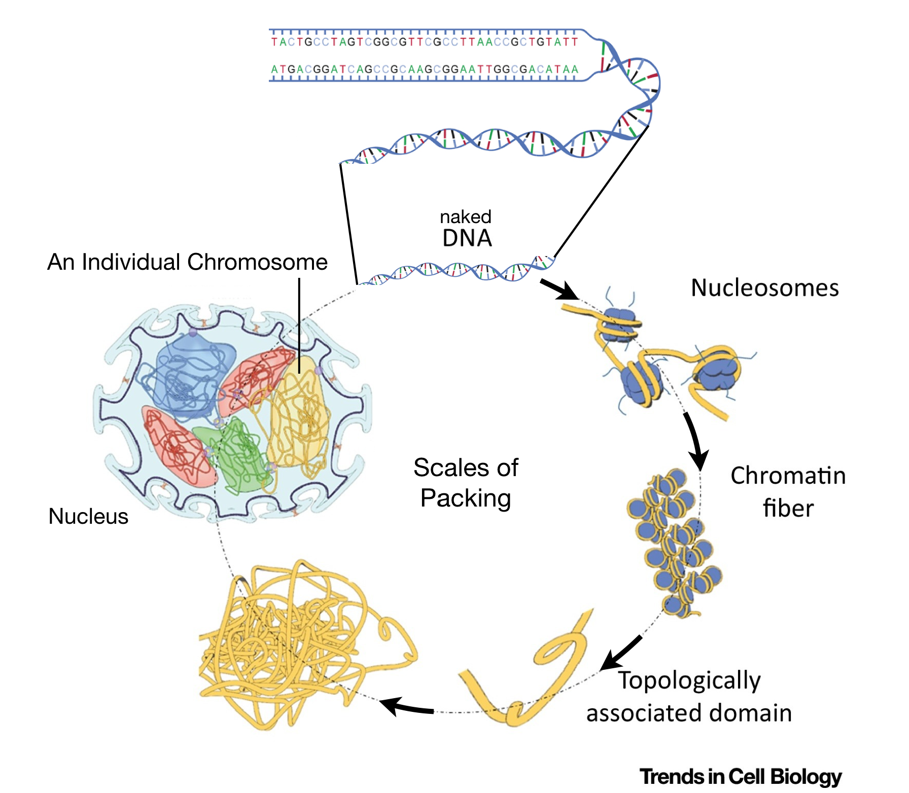
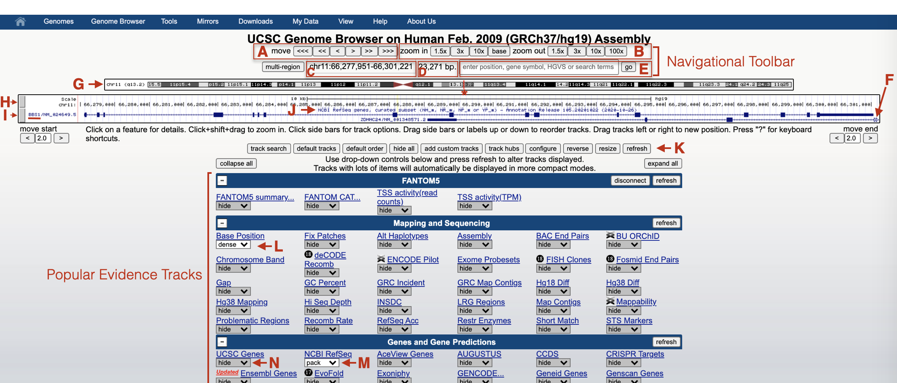
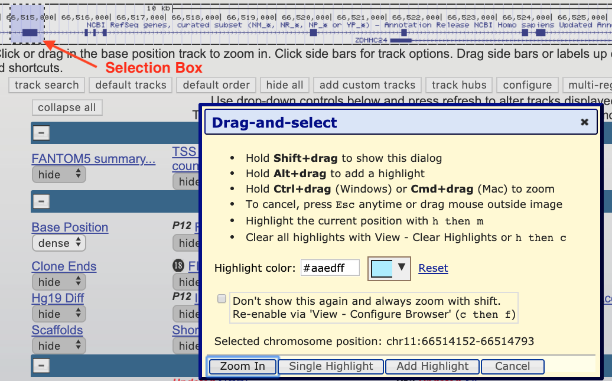

# Genes, Genomes and Genome Browsers

## What is a gene? 
A **gene** is a segment of DNA that directs the production of a functional product (Figure \@ref(fig:geneexpression)). A significant number of eukaroytic genes are protein coding. Each protein-coding gene is first used as a template to create an **RNA transcript** through a process called **transcription**. The RNA transcript is then processed into a messenger RNA (mRNA). The most notable change that occurs during RNA processing is that **intron sequences are removed** (dark gray segments in Figure \@ref(fig:geneexpression)). The mRNA is then exported from the nucleus and used as a template to make a protein in a process called **translation**. Proteins do most of the work necessary to maintain cell structure, function and behavior.

<br>
```{r geneexpression, out.width='75%', fig.align='center', fig.cap = "An overview of Gene Expression. A small segment of DNA (light grey) containing a single gene (orange) is shown. The RNA transcript is highlighted in green (exons) and dark gray (introns)."}
knitr::opts_chunk$set(echo=FALSE)

```
<br>

While a gene requires additional sequence to become transcribed at the right time and place, for simplicity, the size of a gene (number of base pairs) is typically defined by where transcription begins and ends. Thus, the sites of **transcription initiation** and **transcription termination** define both gene size and RNA transcript size (but not mRNA size which is typically shorter as most genes have introns). 

## What is a genome? 
Genes are distributed linearly along chromosomes^[a [chromosome](https://www.nature.com/scitable/definition/chromosome-chromosomes-eukaryotic-chromosome-eucariotic-chromosome-procariotic-6/){target="_blank"} is a single, long molecule of DNA] (Figure \@ref(fig:genomesegment)). One complete set of genes (and thus, one complete set of chromosomes) makes up what we call a genome (sometimes called the "haploid genome")^[Many organisms are diploid (including humans) meaning they have two copies of each chromosome. Thus the phrase "haploid genome" is more precise, although the word "haploid" is often omitted and simply assumed]. The haploid genome consists of 23 chromosomes in XX females and 24 in XY males (both males and females also contain mitochondrial DNA). Each chromosome varies in length. For example, chromosome one is the longest at 248,956,422 base pairs (bp) or 82.7 mm in length^[One way to calculate the length of a chromosome: Multiple the length of a chromosome in base pairs (bp) with 0.000000332, the length (in mm) of each bp.] (Figure \@ref(fig:genome)).  

<br>
```{r genomesegment, out.width='100%', fig.align='center', fig.cap = "This schematic represents a hypothetical segment of a chromosome with orange rectangles representing genes distributed linearly along the DNA segment shown."}
knitr::opts_chunk$set(echo = FALSE)

```
<br>

<br>
```{r genome, out.width='90%', fig.align='center', fig.cap = "Actual length of the human genome when scale bar equals one centimeter. Naken mitochondrial DNA is too small to be shown. It is a small circular DNA molecule, with a circumference of 55 microns."}
knitr::opts_chunk$set(echo = FALSE)

```
<br>

In diploid organisms, somatic cells^[Cells of a multicellular organism can be divided into two main types: germ cells and somatic cells. Germ cells are destined to become the reproductive cells like sperm and oocytes. Somatic cells are destined to become all the other cell types like skin, neurons and muscle. This distinction is made as somatic cells die with the death of the organism while germ cells have the potential to pass their DNA on to the next generation.] harbor *two* complete sets of chromosomes. Thus, over two meters of DNA is crammed into each somatic nucleus! But the diameter of the average mammalian nucleus is only 6 microns or 0.006 of a millimeter. How does the diploid genome fit into this tiny nucleus? First, the *diameter* of a DNA double helix is tiny (2 angstroms^[a unit of length equal to one hundred-millionth of a centimeter - Definition from Oxford Languages]) but also, each chromosome is carefully packaged by proteins in a systematic and stereotypical manner (Figure \@ref(fig:chromatin)). 

<br>
```{r chromatin, out.width='90%', fig.align='center', fig.cap = "This image is modified from Uhler and Shivashankar, 2017. It shows the various levels of chromosome packing found in nuclei during interphase of the cell cycle. The first level of packing requires an octamer of histone proteins that assemble into a ball-like structure called a *nucleosome*. Naked DNA wraps around these octamers forming 'beads on a string'. Additional levels of packing into chromatin fibers and topological associated domains requires additional proteins. Individual chromosomes (23 pairs in humans) are then carefully orgnanized within the cell nucleus in a cell type-dependent manner."}
knitr::opts_chunk$set(echo = FALSE)

```
<br>

### [Test Your Understanding](https://docs.google.com/forms/d/e/1FAIpQLSe8eECUs8Zwm1bFPFWeCK5DKgM4zM0zaRyZNIYWvjbwk1XFAA/viewform?usp=sf_link){target="_blank"}
<style>
div.blue { background-color:#e6f0ff}
</style>
<div class = "blue">

- *Which happens first: RNA processing, transcription or translation?*
<br>
- *Where does RNA processing occur?*
<br>
- *Where does transcription occur?*
<br>
- *Where does translation occur?*
<br>
- *TRUE or FALSE. If I told you the size of a mature mRNA transcript you would know the size of the gene in the genome?*
<br>
- *Chromosome 1 is the longest chromosome at 82.7 mm. How long is it in inches (round to the first decimal place)?*
<br>
- *The longest chromosome in C. elegans is chromosome V. It is 20,924,180 bp. How long is it in mm (round to the nearest whole mm)?*
<br>
- *In humans, there is just over two meters of DNA crammed into each somatic nucleus. What can you find around your house that is about two meters in length?*
<br>
- *Fill in the blank. The first level of chromosomal packing requires an octamer of histone proteins that assemble into a ball-like structure called a _______*
<br>
- *TRUE or FALSE. Each chromosome occupies its own 3-dimensional space within the nucleus. Chromosomes are NOT mixed together like a bowl of spaghetti.*
<br>
</div>

## What is a Genome Browser? 
A Genome Browser is a database that harbors graphical representations of genomes and associated biological *data and information*. According to [Wikipedia](https://en.wikipedia.org/wiki/Genome_browser){target="_blank"}, "Genome browsers enable researchers to visualize and browse entire genomes with annotated data including gene prediction and structure, proteins, expression, regulation, variation, comparative analysis, etc. Annotated data is usually from multiple diverse sources. They differ from ordinary biological databases in that they display data in a graphical format, with genome coordinates on one axis with annotations or space-filling graphics to show analyses of the genes" There are numerous Genome Browsers available. We will be using the UCSC Genome Browser.  

The [UCSC Genome Browser](https://genome.ucsc.edu/cgi-bin/hgGateway){target="_blank"} harbors the sequence of numerous sequenced genomes called "reference genomes"^[A "reference genome" (also called a "reference assembly") is a genome sequence created from thousands of sequence runs assembled *in silico* to represent the sequence of a genome of one idealized individual organism. Since it is assembled from sequence data obtained from a number of donors, reference genomes do not represent the sequence of any *single* individual or organism, but rather a mosaic of multiple donors] (24 linear chromosomes and the mitochondrial genome). Our focus will be on the human genome. Initially, we will focus our Genome Browser window on a single human gene, [BBS1](https://genome.ucsc.edu/s/megallegos/Biol%20310%20Module%201){target="_blank"}. In this chapter, you will learn how the UCSC Genome Browser is organized, how to configure so-called "evidence tracks"^[each evidence track harbors specific biological data from a single source pertaining the sequence displayed in the browser window) and how to navigate through Genome Browser window (scrolling left and right, zooming in and out and jumping to a new location). 

## Navigating the UCSC Genome Browser 
Click the [BBS1](https://genome.ucsc.edu/s/megallegos/Biol%20310%20Module%201){target="_blank"} session link to jump to the human BBS1 gene in the UCSC Genome Browser. The page displayed has been configured to contain only two evidence tracks: The **Base Position** track on top (Figure \@ref(fig:BBS1nav), H) and a **Gene Prediction** track on bottom (Figure \@ref(fig:BBS1nav), I). The Base Position track provides a graphical display of the genome sequence. Although at this zoom level, individual nucleotides are not displayed. The Gene Prediction track shows the basic structure of BBS1. Notice the gene name displayed on the far left (Figure \@ref(fig:BBS1nav), BBS1 underlined). Also, notice that another gene (ZDHHC24) partially overlaps with BBS1. This gene extends farther to the right as indicated by the presence of open triangles on the far right of the gene schematic (Figure \@ref(fig:BBS1nav), F).

<br>
```{r BBS1nav, out.width='90%', fig.align='center', fig.cap = "An annotated version of the Genome Browser as it will appear when you click the saved session link provided in the text above."}
knitr::opts_chunk$set(echo = FALSE)

```
<br>

The gray rectangles on the left side of the browser window (Figure \@ref(fig:BBS1nav), H and I) delineate the boundary of each evidence track displayed. Click on one of the gray rectangles and you will be taken to a "track settings" page for that particular evidence track. Try it. Explore the new page and the information it provides. Then click the back button to get back. You can also right click on a gray rectangle. This will open a small window for quick formatting. Quick formatting options include changing the way the information in the evidence track is displayed (choose hide, dense, squish, pack or full). You can also choose "View Image" to display a high resolution image of the browser window so that it can be downloaded for use in a presentation (NOTE: This knowledge will be useful for your Independent Project - See Chapter 9).

Popular evidence tracks are listed below the browser window. An advanced user might open an evidence track from this list although any changes you make will not be displayed until you click the "Refresh" button (Figure \@ref(fig:BBS1nav), K). You can also see which evidence tracks are currently displayed (Figure \@ref(fig:BBS1nav, L and M). WARNING: The "UCSC Genes" evidence track will sometimes appear unexpectedly and you will see that the evidence track is no longer hidden as it is here (Figure \@ref(fig:BBS1nav), N). When this happens you should re-hide the track then click "Refresh". It can be confusing when **two** gene prediction tracks are open at the same time. 

Above the browser window you will find the navigational toolbar. You can use the navigational toolbar to scroll left <<< or right >>> (Figure \@ref(fig:BBS1nav), A) or zoom in or out (Figure \@ref(fig:BBS1nav), B). The size of the window displayed is also indicated (Figure \@ref(fig:BBS1nav), D) including exact coordinates (Figure \@ref(fig:BBS1nav), E). Finally, there is a window that one can use to jump to a new gene (i.e. ACVR1), specific sequence variant (i.e. NM_024649.5:c.274T>C) or genome coordinates (i.e. chr2:157,736,446-157,876,330). Directly below the navigational toolbar is a schematic representation of the chromosome where BBS1 is located (Figure \@ref(fig:BBS1nav), G). The red vertical line (Figure \@ref(fig:BBS1nav), See asterix) indicates where the browser window is focused within the chromosome. 

Practice navigating through the genome browser. Zoom in. Zoom out. Scroll left. Scroll right. Click on a random position within the chromosome schematic. Hover your mouse over various elements in the browser window to read pop-up messages. Click on any feature for more details. Click on the gray rectangles on the left side to access track settings. Change track settings to see the impact. Look to see what happens when you zoom to base? If/when you get hopelessly lost in the genome or the formatting changes unexpectedly, use the [BBS1](https://genome.ucsc.edu/s/megallegos/Biol%20310%20Module%201){target="_blank"} saved settings link to get back. 

The most important navigational trick to learn is how to **"drag select or click to zoom"** from within the base position track. This trick will allow you to zoom in to a specific location within the browser window, a navigational trick we will use repeatedly. Master it now. Hover your mouse anywhere *within* the base position track until a tiny “drag select or click to zoom” popup message appears. Now you are in the right place to “click” then "drag" (with your finger on the trackpad) to perform the “Drag-and-Select” trick. When you do it correctly, you will create a box around the portion of the gene/genome you want to zoom into (red arrow, Figure \@ref(fig:select)) AND a “Drag-and-Select” window will open. Can't get "click and drag" to work? Again, hover your mouse *within* the base position track until a tiny “drag select or click to zoom” popup message displays. Now you are in the right place to “right click” or “click” then drag to perform the “Drag-and-Select” trick.

<br>
```{r select, out.width='100%', fig.align='center', fig.cap = "The drag select or click to zoom tool is very useful."}
knitr::opts_chunk$set(echo=FALSE)

```
<br>

If you zoom in close enough you will finally see a short segment of the human genome sequence within the Base Position evidence track (Figure \@ref(fig:zoomtosequence), A). In the example shown in Figure \@ref(fig:zoomtosequence), the Gene Prediction track displays an exon-intron junction (See asterix). Moreover, the amino acid sequence is visible on the exon schematic and positioned directly below each 3 bp codon. Zoom into any exon-intron junction. If you do not see the amino acid sequence as shown in Figure \@ref(fig:zoomtosequence), right click on the gray rectangle corresponding to the Gene Prediction track then choose, "Configure RefSeq Curated". Then change "Color track by codons:" from "OFF" to "genomic codons".

<br>
```{r zoomtosequence, out.width='50%', fig.align='center', fig.cap = "The drag-select tool was used to zoom in close to a small portion of an exon intron junction of BBS1. As you can see the first 4 nucleotides of the exon shown are G-A-C-C."}
knitr::opts_chunk$set(echo = FALSE)
knitr::include_graphics('static/images/BBS1zoomtosequence.png')
```
<br>

### [Test Your Understanding](https://forms.gle/LFvwBLFpZh5mQwiX7){target="_blank"}
<style>
div.blue { background-color:#e6f0ff; border-radius: 5px; padding: 5px;}
</style>
<div class = "blue">

- *What year was the most recent Human Genome Assembly uploaded to the UCSC genome browser?*
<br>
- *Go to the UCSC Genome Browser home page. Hover your mouse over the "Genome Browser" link in the toolbar at the top of the page. Choose "Reset all User Settings" in the pop up menu. Choose the Feb. 2009 Human Genome Assembly and click "Go". How many evidence tracks are displayed in the Browser window?*
<br>
- *Where is BBS1 located on chromosome 11, the long arm or the short arm?*
<br>
- *Search for the gene, SOD1. Which chromosome is it on?*
<br>
- *Where is SOD1 located? On the long arm or short arm of the chromosome?*
<br>
- *Search for the gene, ACVR1. Which chromosome is it on?*
<br>
- *Where is ACVR1 located? On the long arm or short arm of the chromosome?*
<br>
- *Fill in the blank. Have you noticed a trend? The short arm of each chromosome is always positioned on the _______?*
<br>
- *First, use my session link to jump to BBS1. Then use the Drag and Select tool to zoom into the beginning of exon 2 of BBS1. Continue to zoom in until you are close enough to see the genome sequence. What are the first four nucleotides?*
</div>

© 2019, Maria Gallegos. All rights reserved.

<style>
p.caption {
  font-size: 0.8em;
  margin-right: 2%;
  margin-left: 2%;
  line-height: 1.2em;
  text-align: left;
}
</style>

<script src="https://ajax.googleapis.com/ajax/libs/jquery/3.1.1/jquery.min.js"></script>

<style>
.zoomDiv {
  opacity: 0;
  position:absolute;
  top: 50%;
  left: 50%;
  z-index: 50;
  transform: translate(-50%, -50%);
  box-shadow: 0px 0px 50px #888888;
  max-height:100%; 
  overflow: scroll;
}

.zoomImg {
  width: 100%;
}
</style>


<script type="text/javascript">
  $(document).ready(function() {
    $('body').prepend("<div class=\"zoomDiv\"></div>");
    // onClick function for all plots (img's)
    $('img:not(.zoomImg)').click(function() {
      $('.zoomImg').attr('src', $(this).attr('src'));
      $('.zoomDiv').css({opacity: '1', width: '95%'});
    });
    // onClick function for zoomImg
    $('img.zoomImg').click(function() {
      $('.zoomDiv').css({opacity: '0', width: '0%'});
    });
  });
</script>
