# Understanding Gene Structure {#chapter2}

In this chapter, you will learn how to "read" a graphical representation of a gene as illustrated in the UCSC genome browser. A graphical representation of a gene, or gene schematic, allows you to visualize gene structure. The various named structures (exon, intron, 5' UTR etc) are determined by gene expression (transcription, RNA processing and translation). First, one continuous strand of genomic DNA is used as a template to produce a single-stranded RNA transcript. This process is called **transcription**. The sequence of the RNA transcript is identical^[almost identical. DNA includes thymine while RNA include uracil instead] to the nontemplate strand of genomic DNA. Before the transcript is exported out into the cytoplasm, it is processed including the removal of internal segments called **introns** (or **int**ervening **r**egi**ons**). *All* the RNA segments that remain are called **exons** (or **ex**pressed regi**ons**). They are *linked* together, in order, through a process called splicing. Then the mRNA is translated in the cytoplasm. Translation begins at the start codon and ends at the stop codon. To follow along with the text and to answer the “Test Your Understanding” questions, start with the [BBS1](https://genome.ucsc.edu/s/megallegos/Biol%20310%20Module%201){target="_blank"} session link. You can also use this link as a starting point to view the gene structure for any gene of interest by typing the name of your gene of interest in the search window.

## Exons and Introns
The first named structure to notice in the gene schematic is the **intron**. The size and position of each intron is illustrated in the UCSC genome browser as a thin horizontal line covered with so-called orientation wedges, "))))" or "((((" (one example is highlighted with a purple bracket/asterix in Figure\@ref(fig:BBS1transcript)). Exons are simply not introns. **In other words, any part of the gene schematic that is not intronic is exonic.** To view the exon/intron organization of BBS1, click on the [BBS1](https://genome.ucsc.edu/s/megallegos/Biol%20310%20Module%201){target="_blank"} session link, and review the schematic within the NCBI RefSeq Gene Prediction Evidence Track (Figure \@ref(fig:BBS1transcript)).Examples of two exons are highlighted with a red bracket/asterix). Now, hover your mouse over various parts of the gene schematic within the Browser window. If you pause long enough, a popup window should appear indicating *which* intron or exon you are pointing to among the total! Thus, this popup window also reveals the location of the beginning of a gene (i.e. exon 1 is always at the beginning of the gene!). This is the part of the gene that is transcribed first. For BBS1, exon 1 is located on the left side of the gene schematic. 

<br>
```{r BBS1transcript, out.width='100%', fig.align='center', fig.cap = "Understanding the gene prediction evidence track schematic. Boxes represent exons (two examples are bracketed and highlighted with a red asterix). The lines represent introns (one example is bracketed and highlighted with a purple asterix)"}
knitr::opts_chunk$set(echo = FALSE)
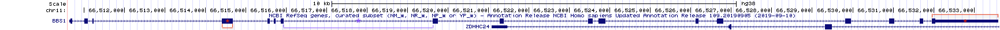
```
<br>

A close up view of an intron-exon junction is displayed in Figure \@ref(fig:zoomtosequence). See the asterix. In this example, the intron is to the left, the exon to the right). Now you try it. Zoom into any exon-intron junction. 

<br>
```{r zoomtosequence, out.width='50%', fig.align='center', fig.cap = "The drag-select tool was used to zoom in close to a small portion of an exon intron junction of BBS1. As you can see the first 4 nucleotides of the exon shown are G-A-C-C."}
knitr::opts_chunk$set(echo = FALSE)
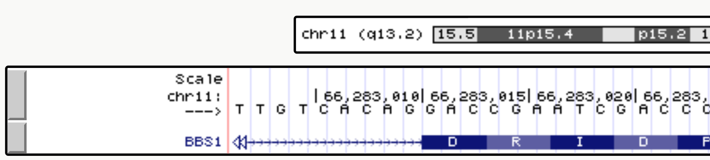
```
<br>

### [Test your understanding](https://docs.google.com/forms/d/e/1FAIpQLScmbCmwXv1K4GU-hl1xiEqE7IvPnTBn-ogVk8YLqFAP74OdmA/viewform?usp=dialog){target="_blank"}
<style>
div.blue {background-color:#e6f0ff}
</style>
<div class = "blue">
<br>
*Click the link above to see the TYU questions.* 
<br>
</div>

## Coding and Noncoding Exons
The spliced transcript or messenger RNA (mRNA) is used as a template to create a polypeptide^[A polypeptide is a chain of amino acids linked together by peptide bonds. While the words “protein” and “polypeptide” are often used interchangeably, the term protein is more vague. It could refer to a single polypeptide or it might mean multiple polypeptides bound together in a complex. On the other hand, polypeptide always refers to a single sequence of amino acids]. This process is called translation and is mediated in part by the ribosome^[A component of the translation machinery (comprised of RNA and protein) which uses the mRNA as a template to synthesize a polypeptide.]. Ribosomes "read" the mRNA from 5' to 3', three nucleotides at a time, translating the triple nucleotide code into a sequence of amino acids. Each set of three nucleotides is called a codon. Codons either specify the incorporation of an amino acid in a growing polypeptide chain or signal the end of polypeptide synthesis. Codons with the latter function are called **"termination codons"** or simply **"stop codons"** (Figure \@ref(fig:ProteinSyn)). 

<br>
```{r ProteinSyn, out.width='100%', fig.align='center', fig.cap = "A schematic representation of translation. Image by Kelvinsong"}
knitr::opts_chunk$set(echo = FALSE)
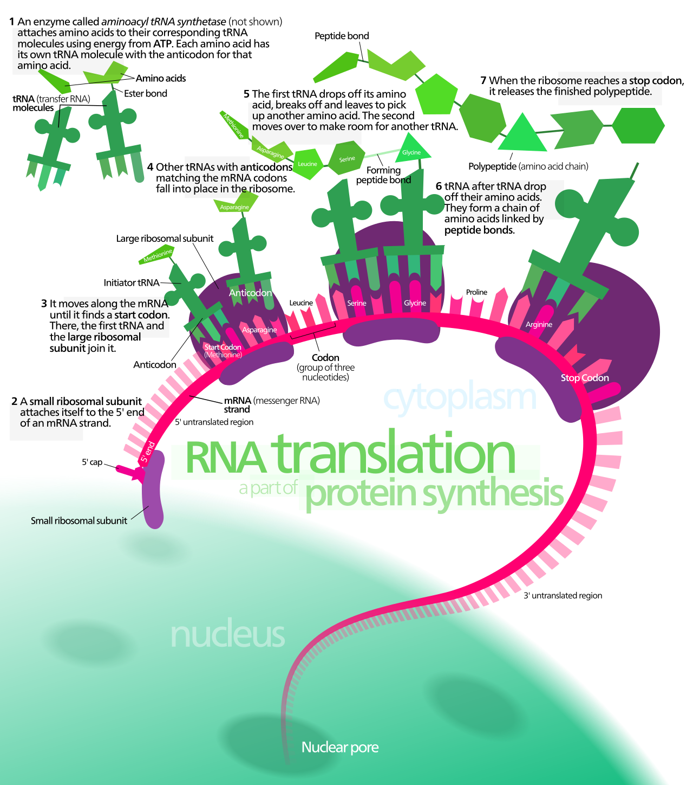
```
<br>

That said, ribosomes don't start translation at the very 5' *end* of the mRNA but from a **"start codon"** located *internally*. Nor do ribosomes read to the very 3' end of the mRNA but only until they encounter a stop codon. Thus, an mRNA is *more* than just codons and those codons *only occupy the central region of mRNA*. The 5' and 3' ends of the mRNA not "read" by the ribosome are called **"noncoding regions"** or **"untranslated regions" (UTRs)**. The noncoding region at the 5' end is called the **5’ untranslated region (5’ UTR)** while the noncoding region at the 3' end is called the **3’ untranslated region (3' UTR)**. 

Figure \@ref(fig:topstrand) shows how noncoding (blue box) and coding (green box) regions of an exon (red box) are illustrated in the UCSC Genome Browser. Notice how the noncoding portion is not as thick as the coding portion. At this zoom level, the coding portion also displays the amino acid sequence that this exon codes for: M-A-A-A-S-S-S-D-S-D-A-C-G-A-E-S (notice each amino acid is placed below 3 nucleotides, the codon). Again, notice how the amino acid sequence does not start at the *beginning* of exon 1 (red box). The thinner portion of exon 1 is the 5’ untranslated region (5’ UTR). Importantly, **exon 1 includes both the noncoding and coding portions**. To confirm that you are looking in the right place, the BBS1 5' UTR (the beginning of exon 1) begins with the sequence G-G-T-T. The coding portion of exon 1 begins with the sequence A-T-G-G. Exon 1 ends with the sequence, AGAG. The intron begins with the sequence G-T-G-A.

<br>
```{r topstrand, out.width='100%', fig.align='center', fig.cap = "Exon 1 (red box) of BBS1 is part noncoding exon (blue box) and part coding exon (green box)"}
knitr::opts_chunk$set(echo = FALSE)
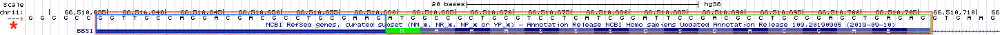
```
<br>

Now use the [BBS1 session link](https://genome.ucsc.edu/s/megallegos/Biol%20310%20Module%201){target="_blank"} to go to BBS1 in the UCSC genome browser. Notice how the transition from noncoding to coding (at the 5' end of the transcript) and back to noncoding (at the 3' end of the transcript) does *not* coincide with exon/intron boundaries. Thus, an exon can be categorized as a **coding exon**, a **noncoding exon** or an exon of mixed character. In fact, exon 1 of BBS1 is part noncoding (5’ UTR) and part coding. The same is true for exon 17 of BBS1 (the last exon). The remaining exons are all coding exons. 

Now zoom into the last **coding exon** of BBS1 (the **coding portion** of the last exon) by using the "drag and select" tool. If your view does not resemble Figure \@ref(fig:lastexon), you may have selected the **entire** last exon when you should have just selected the **coding** portion of the last exon OR your evidence is configured incorrectly^[IMPORTANT: If you do not see the amino acid sequence displayed over the coding exon schematic, you may need to zoom in farther. That said, if you are zoomed in enough to see the genome sequence, and you still don't see the amino acid sequence then something else is wrong. Right click on the gray rectangle corresponding to the NCBI RefSeq Gene Prediction track and choose, "Configure RefSeq Curated". Then change "Color track by codons:" from "OFF" to "genomic codons"].

In Figure \@ref(fig:lastexon), you can clearly see that the amino acid sequence stops before the end of the last exon and the exon schematic transitions from thick to thin. You can also see that the stop codon is represented by an asterix and colored red. In many genes, the first and last exons include both noncoding and coding sequence. As you explore more genes in the genome, you will see there are many exceptions. Sometimes the *first one or more* exons and/or the *last one or more* exons are completely noncoding! Finally, notice that while red codons ALWAYS represent stop codons, green codons do not ALWAYS represent start codons! In fact there is a green codon in the last coding exon. The UCSC genome browser simply highlights *all* A-T-G codons in green. Only those green codons at the *beginning* of a coding sequence are called start codons. 

<br>
```{r lastexon, out.width='100%', fig.align='center', fig.cap = "The coding portion of the last exon of BBS1 ends with the stop codon, a red codon containing an asterix. The 3' UTR begins directly after the stop codon."}
knitr::opts_chunk$set(echo = FALSE)
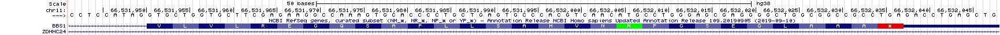
```
<br>

### [Test your understanding](https://docs.google.com/forms/d/e/1FAIpQLSdi9K636IJ9zKXMmcsTmcwTScy5eP2SYAjZXbUNZxMmlepd3g/viewform?usp=dialog){target="_blank"}
<style>
div.blue {background-color:#e6f0ff}
</style>
<div class = "blue">
<br>
*Click the link above to see the TYU questions.* 
<br>

</div>

## Only Coding Exons Determine Protein Sequence
A polypeptide is a sequence of amino acids linked together by peptide bonds. The amino acid sequence is determined by the order of codons present in the central portion of an mRNA (the coding exons).  Each codon consists of a nonoverlapping set of three nucleotides. Since there are four nucleotides in total (G, A, T and C), there are a total of 64 possible codons (4 x 4 x 4). Most of the 64 codons code for an amino acid. Three do not and therefore act as STOP signals also known as "termination codons" or "stop codons". Figure \@ref(fig:geneticcode) is one way to display the genetic code. In this graphic, RNA codons are read from the **center** out to the periphery (from 5’ to 3’). For example, G-C-A codes for Alanine. Ala and A are the standard three letter and single letter codes, respectively. U-U-G codes for Leucine. Confirm this for yourself to make sure you know how to use this genetic code. 

<br>
```{r, echo=FALSE}
cap_geneticcode <- if (knitr::is_latex_output()) {
  'Image from Wikipedia: \\url{https://commons.wikimedia.org/wiki/File:Aminoacids_table.svg}'
} else {
  'Image from Wikipedia: [Aminoacids_table.svg](https://commons.wikimedia.org/wiki/File:Aminoacids_table.svg)'
}
```

```{r geneticcode, out.width='75%', fig.align='center', fig.cap=cap_geneticcode}
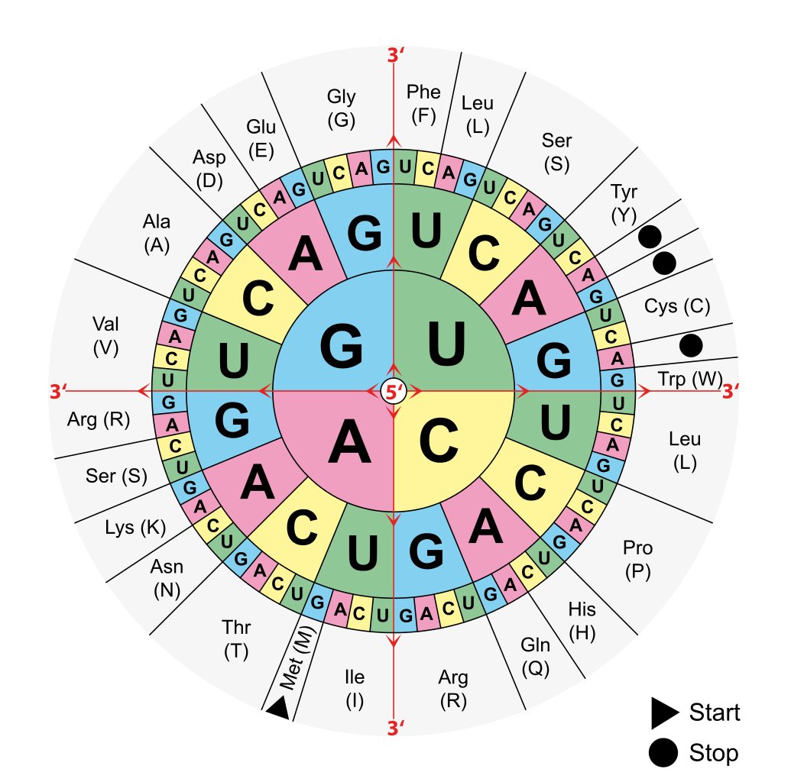
```
<br>

Click on the [BBS1](https://genome.ucsc.edu/s/megallegos/Biol%20310%20Module%201){target="_blank"} session link, then use the "Drag-and-Select" method to get a close-up view of exon 1.  Look directly above the beginning of the coding portion of BBS1 and you will see that the first codon of BBS1 is A-T-G. Using the genetic code from Figure \@ref(fig:geneticcode) you can confirm that this codes for Methionine, Met or M and is labelled as a start codon^[NOTE: Genome browsers only display DNA sequence. So you will always need to mentally change all "T" nucleotides to "U" nucleotides in order to use a genetic code]. Also confirm that you read the second codon as G-C-C and the third codon as G-C-T. Both code for Alanine (Ala, A). This exercise also shows that the mRNA sequence for BBS1 is identical in sequence and orientation to the top strand of the genome (but of course without the introns). Recall, by default the top strand (+ strand) is displayed in the browser window. It is oriented from 5' on the left to 3' end on the right. You can confirm this by checking the arrow positioned in the top left corner (See the asterix in Figure \@ref(fig:topstrand)). Your arrow should be pointing to the right. The orientation of the mRNA is also consistent with the fact that codons are read from 5' to 3' (in this case from left to right). 

### [Test your understanding](https://docs.google.com/forms/d/e/1FAIpQLSff_zvAFmglpmjZHpipDvIt_X2MmYF7FlisD-141DM2QRa0_A/viewform?usp=dialog){target="_blank"}
<style>
div.blue {background-color:#e6f0ff}
</style>
<div class = "blue">
<br>
*Click the link above to see the TYU questions.* 
<br>

</div>

## One gene, many splice variants
A single RNA transcipt is sometimes spliced in a variety of different ways to produce more than one unique mRNA. This is called **alternative splicing** and each mRNA produced is called a **splice variant**. Since each splice variant has the potential to produce a unique protein or **isoform**, the 24,000 protein-coding genes in the human genome can actually produce *many more than* 24,000 unique proteins!

To see how the UCSC genome browser illustrates splice variants, click on the [BBS1](https://genome.ucsc.edu/s/megallegos/Biol%20310%20Module%201){target="_blank"} session link then *zoom out* exactly **10X** to explore a larger section of chromosome eleven^[Notice that at this zoom level some exons simply look like vertical lines. This is because, exons are typically shorter than introns (at least in mammals) and so at this zoom level exons look like lines instead of boxes]. Now more than one gene is present in the browser window. Again, the name of each gene is given on the left side of each gene/transcript schematic. Regions of the genome that are transcribed to produce multiple mRNAs are indicated by a *series* of box/line schematics that are *stacked* vertically. How do I know these stacks represent a single gene? Each gene schematic in the stack has the *same* gene name (Figure \@ref(fig:zoom)). That said, each gene schematic in the stack has a **unique mRNA ID** (i.e. NM_005700.5). This is your indication that each mRNA sequence is unique in some way. One obvious difference observed for DPP3 is highlighted with a red arrow in Figure \@ref(fig:zoom). Notice that the 2nd and 3rd splice forms have an exon not included in the topmost splice form listed. 

<br>
```{r zoom, out.width='100%', fig.align='center', fig.cap = "Notice how DPP3, highlighted with a red box, begins and ends transcription at the same location but the RNA transcript that is produced is spliced in three distinct ways to produce three alternative splice forms. One obvious difference is highlighted with a red arrow. The 2nd and 3rd splice forms have an exon not included in the topmost splice form listed. Each DDP3 splice form rightly has a unique mRNA ID. From top to bottom, there is NM_001256670.2, NM_005700.5 and NM_130443.4"}
knitr::opts_chunk$set(echo = FALSE)
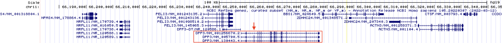
```
<br>

Alternative splicing is only one way multiple unique mRNAs are produced from a single gene (single segment of DNA). There are three main methods: 

1. Use of an alternative transcriptional start site (Figure \@ref(fig:altinit)), 
2. Use of an alternative transcriptional termination site (Figure \@ref(fig:altter)) and 
3. Alternative splicing (Figure \@ref(fig:zoom)).

<br>
```{r altinit, out.width='100%', fig.align='center', fig.cap = "Transcription initiation for the LGALS12 gene can be found at two distinct places according to the NCBI RefSeq gene database. The red arrow points to the two transcription start sites"}
knitr::opts_chunk$set(echo = FALSE)
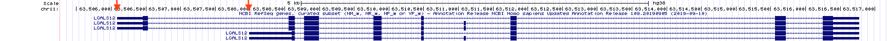
```
<br>

```{r altter, out.width='100%', fig.align='center', fig.cap = "Transcription termination for the TTC17 gene occurs at two different sites according to the NCBI RefSeq gene database. Each is highlighted with a red arrow"}
knitr::opts_chunk$set(echo = FALSE)
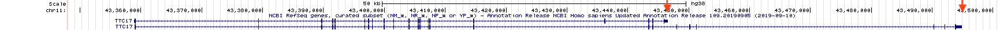
```
<br>

Again, multiple mRNA variants produced by the same gene can (but don't always) produce multiple, unique protein isoforms. In some cases, these unique proteins differ enough to function distinctly. For a hilarious illustration of this concept see Figure \@ref(fig:eat). 

<br>
```{r eat, out.width='50%', fig.align='center', fig.cap = "Concept/Art by Allan James from the University of Glasgow"}
knitr::opts_chunk$set(echo = FALSE)
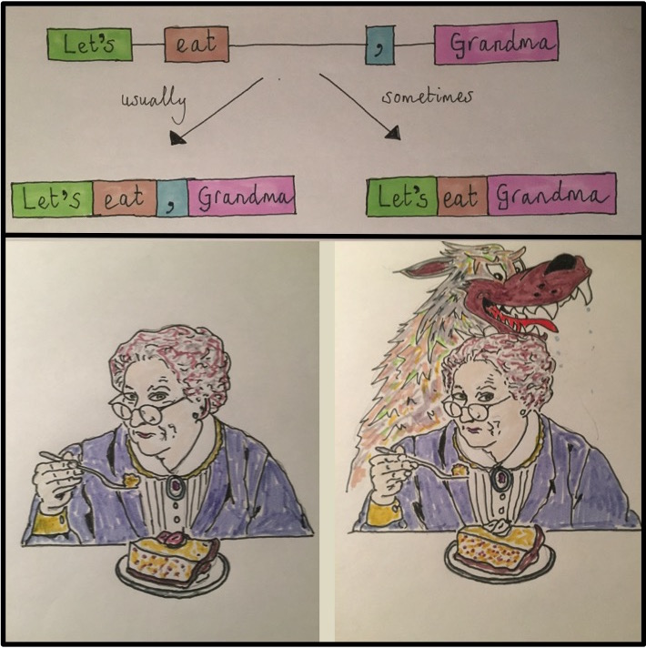
```
<br>

### [Test Your Understanding](https://docs.google.com/forms/d/e/1FAIpQLSch6QU0XzZASORXHmhEVnU4DMU_vBDCmfnc2CMlOelxPlrtdw/viewform?usp=publish-editor){target="_blank"}
<style>
div.blue { background-color:#e6f0ff}
</style>
<div class = "blue">
<br>
*Click the link above to see the TYU questions.* 
<br>

</div>

## Top strand and bottom strand genes

We learned in a previous section that BBS1 codons can be viewed in the top strand of the genome (also known as the + strand). This is because BBS1 uses the bottom strand (- strand) as template during transcription to produce a transcript identical in sequence to the top strand of DNA^[Except that Uracil replaces Thymine]. I like to call BBS1 a top strand gene (or + strand gene). For top strand genes, the top strand can be described as the *sense strand*, *coding strand*, *informational strand* or *nontemplate strand*. My favorites are "nontemplate strand" and "informational strand"^["Coding strand" is misleading because it implies that the entire transcript is coding - not true. "Sense strand" is just not very informative. I like "informational strand" because this is the DNA strand where you will find important sequence information in the RNA - for example, the codons or RNA binding sites that might impact translation or RNA stability. You can't argue with the term "nontemplate strand". It's clearly accurate]. For top strand genes, the bottom strand (- strand) is known as the template strand. This is because the bottom strand of DNA is used as the template to create the RNA transcript.

**Not all genes are top strand genes (+)**. To determine if a gene is a top strand gene (+) or a bottom strand gene (-), click on the gene schematic to open a yellow pop up window containing information about the gene. Scroll down to find the word, "Strand:" along the left side. Alternatively, look at the gene schematic itself. Figure \@ref(fig:orientationwedges) displays the first half of BBS1 and a neighboring gene, ZDHHC24. Notice there are “orientation wedges” spaced regularly along the introns. They are either oriented to the right (red box, Figure \@ref(fig:orientationwedges)) or to the left (green box, Figure \@ref(fig:orientationwedges)). These “orientation wedges” indicate **the direction RNA polymerase travels during transcription** and thus the orientation of the gene on the chromosome. These “orientation wedges” indicate that BBS1 is a top strand gene (+) and ZDHHC24 is a bottom strand gene (-). 

<br>
```{r orientationwedges, out.width='60%', fig.align='center', fig.cap ="The orientation wedges are visible within introns. When they point to the right (red box), the gene is a top strand gene (plus strand). When they point to the left (green box), the gene is a bottom strand gene (minus strand)."}
knitr::opts_chunk$set(echo = FALSE)
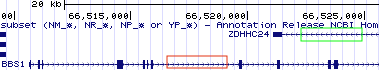
```
<br>

When the orientation wedges point to the right, ") ) ) )" (i.e. see BBS1), 
<br>

1. This is a top strand gene (+).
2. The beginning of the gene is on the left. 
2. The top strand of DNA is the informational strand (nontemplate strand)
3. The bottom strand of DNA is the template strand. 
4. **You would read this gene from left to right.** 
<br>

When the orientation wedges point to the left, "( ( ( (", the reverse is true (i.e. see ZDHHC24),
<br>

1. This is a bottom strand gene (-).
2. The beginning of the gene is on the right. 
2. The top strand of DNA is the template strand. 
3. The bottom strand of DNA is the informational strand (nontemplate strand)
4. **You would read this gene from right to left!** 
<br>

### [Test your understanding](https://docs.google.com/forms/d/e/1FAIpQLSfdSGZgUjW0VctKvMw77qpXOCncpvEEYpTdrGJKfHnYpZfxag/viewform?usp=publish-editor){target="_blank"}
<style>
div.blue {background-color:#e6f0ff}
</style>
<div class = "blue">
<br>
*Click the link above to see the TYU questions.* 
<br>

</div>

<br>
Now let’s look at a bottom strand gene (ZDHHC24) more closely. Click on my saved session for [BBS1](https://genome.ucsc.edu/s/megallegos/Biol%20310%20Module%201){target="_blank"} then zoom out 3X to search for the **beginning** of ZDHHC24 (it should be on the right). "Drag-and-Select" as many times necessary to zoom into the **first** half of the **coding portion** of exon one for ZDHHC24. Your “NCBI Refseq Gene Track should look something like Figure \@ref(fig:firstcodingexonZDHHC24). If not, you may have zoomed into the first half of exon one which is noncoding. Or maybe you are at the wrong end of the gene! 

<br>
```{r firstcodingexonZDHHC24, out.width='100%', fig.align='center', fig.cap ="This is the first half of the first **coding** exon of ZDHHC24. The noncoding portion of exon 1 extends to the right this time because *ZDHHC24* is a bottom strand (or minus strand) gene. The red oval highlights the strand you are currently viewing. Since the arrow points to the right, the top strand (5' on the left) is displayed. You can toggle this arrow with your mouse."}
knitr::opts_chunk$set(echo = FALSE)
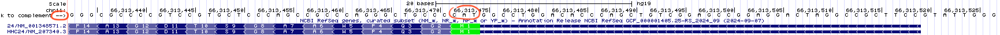
```
<br>
```{r firstcodingexonZDHHC24bottom, out.width='100%', fig.align='center', fig.cap ="Again, this is the first half of the first **coding** exon of ZDHHC24. The red oval highlights the strand you are currently viewing. Since the arrow points to the left, the bottom strand (5' on the right) is displayed. Notice that the DNA sequence is gray. Compare to the top image. This is a visual reminder of which strand you are viewing."}
knitr::opts_chunk$set(echo = FALSE)
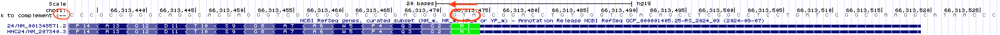
```
<br>

Look at the three nucleotides centered above the Methionine (colored in green on the right side of Figure \@ref(fig:firstcodingexonZDHHC24)). Notice that the nucleotides listed from left to right is NOT an A-T-G as you might expect but instead C-A-T! This is because you are “reading” the top strand of the genomic DNA and ZDHHC24 is a **bottom** strand gene. **To view the bottom strand of the genomic DNA**, click on the far left arrow within the Base Position Track (See the red oval, Figure \@ref(fig:firstcodingexonZDHHC24)). Notice the orientation of the arrow will flip and the genome sequence in your “Base Position” Track will become light gray (red oval, \@ref(fig:firstcodingexonZDHHC24bottom)). *Now* there is an A-T-G directly above the Methionine (M) but only if you read it from *right to left*! This is because the bottom strand of DNA is oriented with 5’ end on the right.  

### [Test your understanding](https://docs.google.com/forms/d/e/1FAIpQLSeRZqrcfWOf5aIb0tVj0NDMMDfh8I-y7M5-3ZNj2CCLgOTP9w/viewform?usp=publish-editor){target="_blank"}
<style>
div.blue {background-color:#e6f0ff}
</style>
<div class = "blue">
<br>
*Click the link above to see the TYU questions.* 
<br>

</div>
<br>
To summarize . . . while DNA is double-stranded, RNA transcripts are single-stranded and thus use only one DNA strand as template (either the top or bottom strand). Some genes, like BBS1, use the bottom strand as template to create an RNA transcript with a sequence that matches the top strand. Other genes, like ZDHHC24, use the top strand as template to create an RNA transcript with a sequence that matches the bottom strand.  

## Reading Frames

Translation begins at the start codon. This is the first codon "read" by the ribosome. All subsequent codons are read in **nonoverlapping groups** of three. Thus, the start codon "sets" the reading frame. A reading frame ends only when a stop codon is encountered that is in the same reading frame as the start codon. This is the last codon "read" by the ribosome. 

Imagine you isolate and sequence a short random stretch of DNA pulled from the ocean. It is likely genomic DNA and you want to see if it corresponds to a coding portion of a gene. Specifically, you want to see if this short stretch of DNA codes for a previously studied protein. Of course, you have no clue which strand might be used as a template for transcription nor where the start codon is. Here is a thought question: ***What is the maximum number of polypeptide sequences that can hypothetically be created by a single segment of double-stranded DNA?*** Your answer will be revealed below. 

To view all possible reading frames associated with a given segment of DNA zoom into to the first exon of BBS1. Next, right click on the grey rectangle corresponding to the Base Position track (See arrow, Figure \@ref(fig:basepositiondense)). A pop-up menu will appear. Choose “full”.

<br>
```{r basepositiondense, out.width='100%', fig.align='center', fig.cap="How to view all three reading frames for a single strand of DNA. Right click on the gray rectangle on the left of the Base Position Track (red arrow). A pulldown menu will open. Choose Full."}
knitr::opts_chunk$set(echo = FALSE)
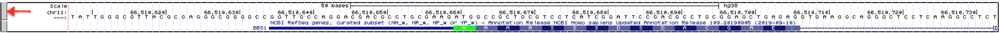
```
<br>

You should now see three reading frames displayed below the nucleotide sequence. Why three? This is the maximum number of unique polypeptides that can be theoretically produced from a given segment of the top strand of DNA. See what happens when you toggle to the bottom strand of DNA (click the arrow ---> on the far left of the DNA sequence). Now you can view the three reading frames that correspond to the bottom strand of DNA. Both views are shown one on top of the other in Figure \@ref(fig:basepositionfullreverse). Notice they are different. 

<br>
```{r basepositionfull, out.width='100%', fig.align='center'}
knitr::opts_chunk$set(echo = FALSE)
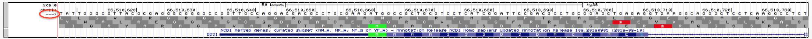
```
<br>
```{r basepositionfullreverse, out.width='100%', fig.align='center', fig.cap="Once you change the base position track to **Full**, the three possible reading frames for a *single* DNA strand will be displayed. When the arrow points to the right, the three reading frames will be of the top strand (top image). Notice the start codon in green matches the start codon in the third reading frame (**NOTE: This image comes from the 2013 genome assembly and will look different for you.**) In fact, nearly all of the amino acids in exon one match the amino acids in the third reading frame. We expect one of the three top strand reading frames to match *BBS1* since BBS1 is a top strand gene. Now , however, when the arrow points to the left (circled in red), the three reading frames displayed are for the bottom strand (bottom image). Now *none* of the amino acids in the three reading frames match the amino acids found in *BBS1*."}
knitr::opts_chunk$set(echo = FALSE)
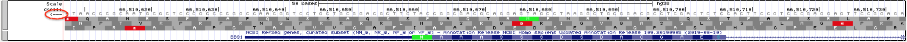
```
<br>

The three reading frames corresponding to the top strand are numbered +1 (top), +2 (middle) and +3 (bottom). The three reading frames corresponding to the bottom strand are numbered -1 (top), -2 (middle) and -3 (bottom). For convenience, the position of all possible start codons are highlighted in green and all possible stop codons (*) are highlighted in red. 

Now, zoom out until you can see the first three exons of BBS1 (Figure \@ref(fig:threeexons)). At this level of zoom, you should still be able to read the amino acid sequence within the gene schematic *and* within the base position track. Notice there are many “start” and “stop” codons scattered throughout this segment of the genome (red and green boxes). This should not be surprising given that start and stop codons are only three nucleotides in length and thus they occur by chance. That said, **the ability of an ATG or TGA, TAA, TAG to function as a start or stop codon, respectively, depends on context**. For example, the real start codon for a given gene is typically the first start codon encountered in an mRNA as the Ribosome scans the mRNA from 5’ to 3’ (more about this later).  
<br>
```{r threeexons, out.width='100%', fig.align='center', fig.cap="All ATG codons are colored green regardless if they function as a start codon or not. Similarly, all TGA, TAA and TAG codons are colored red regardless if they function as a stop codon. How these triplets function depends on context."}
knitr::opts_chunk$set(echo = FALSE)
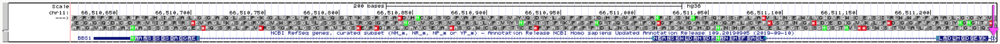
```
<br>

Now, notice that the amino acid sequence within the coding exons of BBS1 always match **one** of the three reading frames. For our example, the coding portion of exon 1 begins with a methionine (highlighted in green). The +3 reading frame also has a methionine in this same position. Compare a few more amino acids in BBS1 and the +3 reading frame. You should see that all match (except one - do you see which one?). Thus, coding exon 1 utilizes the +3 reading frame! 

Which reading frame do the other coding exons utilize? Is it always the same reading frame? Or does it change from exon to exon.  New trick:  To easily view exons farther *downstream*  (or 3’ of), click on the open arrow head on the far right (See hot pink arrow at the far right of the image, Figure \@ref(fig:threeexons)). Also, if you hover over the open triangle and don’t click, a small pop up will appear with information about which exon you are jumping to! This may come in handy while answering the following questions. 

### [Test your understanding](https://docs.google.com/forms/d/e/1FAIpQLScM61c3FU25CziMHvm-TkiNy2aES4o1a34iOEiLdEThc7bjzw/viewform?usp=publish-editor){target="_blank"}
<style>
div.blue {background-color:#e6f0ff}
</style>
<div class = "blue">
<br>
*Click the link above to see the TYU questions.* 
<br>
</div>


© `r as.numeric(format(Sys.Date(), "%Y"))`, Maria Gallegos. All rights reserved.

<style>
p.caption {
  font-size: 0.8em;
  margin-right: 2%;
  margin-left: 2%;
  line-height: 1.2em;
  text-align: left;
}
</style>

<script src="https://ajax.googleapis.com/ajax/libs/jquery/3.1.1/jquery.min.js"></script>

<style>
.zoomDiv {
  opacity: 0;
  position:absolute;
  top: 50%;
  left: 50%;
  z-index: 50;
  transform: translate(-50%, -50%);
  box-shadow: 0px 0px 50px #888888;
  max-height:100%; 
  overflow: scroll;
}

.zoomImg {
  width: 100%;
}
</style>


<script type="text/javascript">
  $(document).ready(function() {
    $('body').prepend("<div class=\"zoomDiv\"></div>");
    // onClick function for all plots (img's)
    $('img:not(.zoomImg)').click(function() {
      $('.zoomImg').attr('src', $(this).attr('src'));
      $('.zoomDiv').css({opacity: '1', width: '100%'});
    });
    // onClick function for zoomImg
    $('img.zoomImg').click(function() {
      $('.zoomDiv').css({opacity: '0', width: '0%'});
    });
  });
</script>

