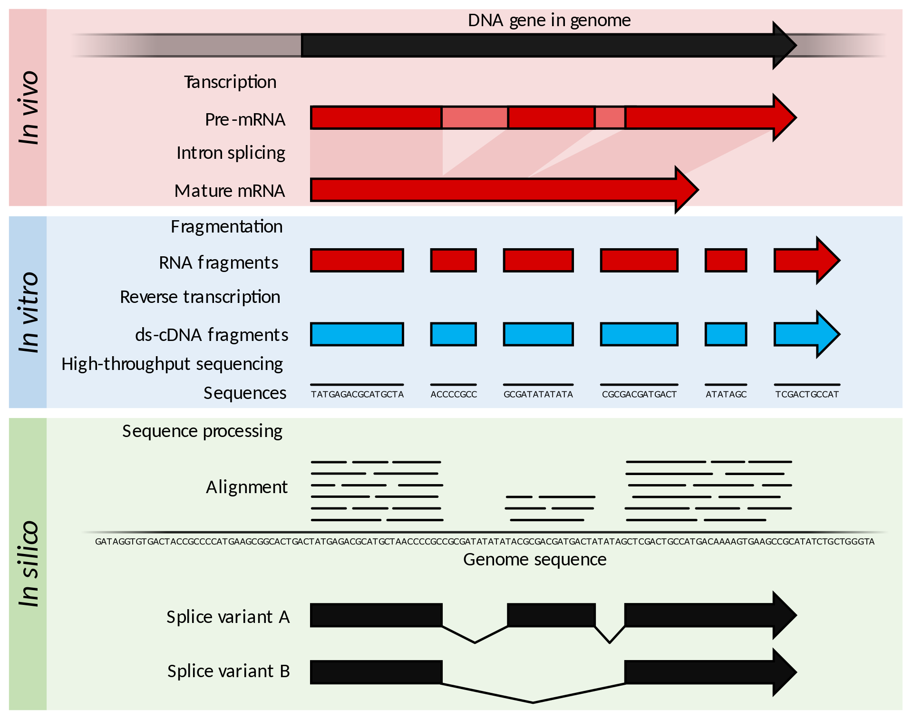
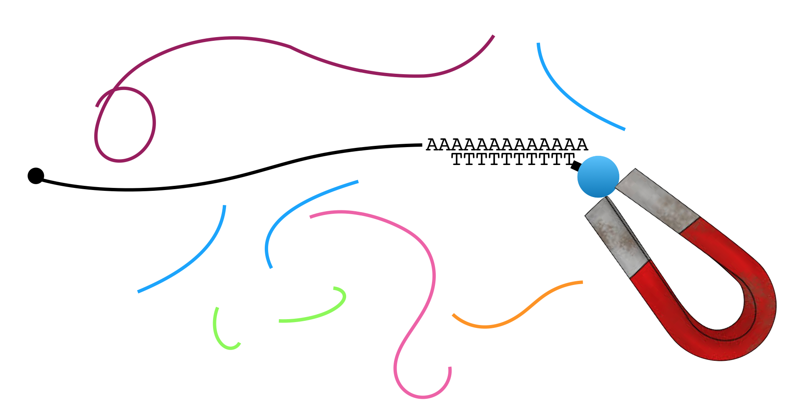
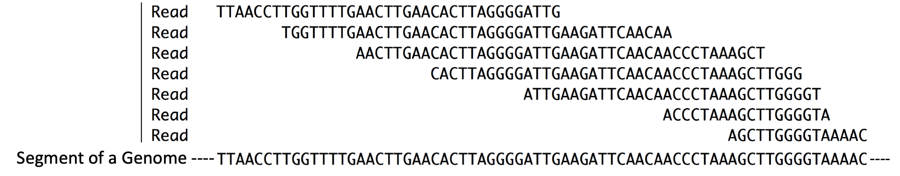
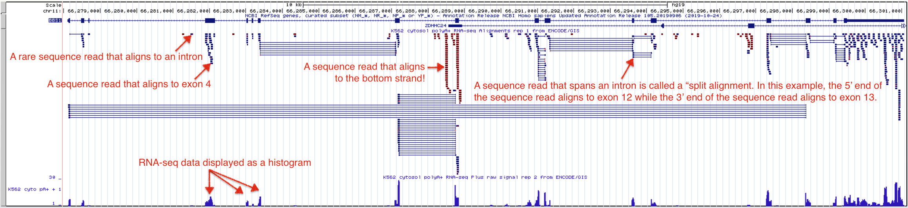
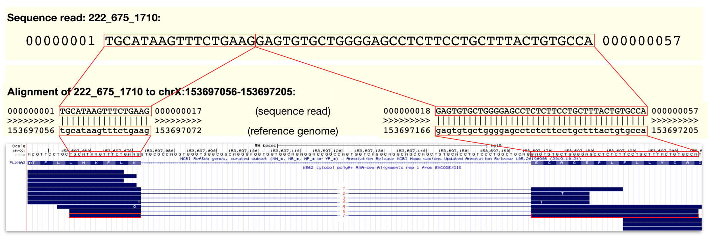

# Finding Genes with *RNA-seq* {#chapter3}
RNA sequencing is a technique that allows one to identify *all* the genes in the genome that are being transcribed at any given time in any group of cells. Thus, RNA sequencing can reveal where genes are in the genome. To follow along with the text and to answer the "Test Your Understanding" questions, start with the [RNA-seq](https://genome.ucsc.edu/s/megallegos/Biol%20310%3A%20Module%202%20RNA%2Dseq){target="_blank"} session link. You can also use this link as a starting point to view RNA-seq data for any gene of interest by typing the name of your gene of interest in the search window.

## Gene expression Reviewed
For a gene to *do* anything it must be *expressed*. When it is expressed, it is either transcribed to produce a functional RNA (i.e. tRNA) or transcribed *and* translated to produce a functional polypeptide (i.e. actin). In both cases, the first step in producing a gene product is *ALWAYS* transcription. It logically follows that if you extract RNA from a cell, sequence it then find the regions in the genome with matching sequence, you have discovered regions of the genome that have been transcribed. Regions of the genome that are transcriptionally active pinpoint the position of genes. The most important take home message for this chapter: ***RNA sequence provides important physical evidence to identify and locate genes in the genome***. It can also tell you how transcriptionally active a gene is by counting the number of transcripts present at the time of RNA extraction. 

## RNA-seq
The basic steps involved in RNA sequencing are outlined in Figure \@ref(fig:rnaseq). In brief, mRNA is extracted from cells, fragmented into pieces then converted into double-stranded DNA (Figure \@ref(fig:rnaseq), see *in vitro*)^[NOTE: If *mRNA* is collected for RNA-seq, only *protein coding genes* are identified and characterized]. These short DNA fragments are then sequenced and computationally aligned to the genome sequence. Notice that the sequence reads only align to the exon portions of the gene. This is because mRNA lack introns (Figure \@ref(fig:rnaseq), see *in vivo*^[“in vivo” is a Latin phrase biologists use to describe a process taking place inside a living organism (online dictionary)]).

<br>
```{r rnaseq, out.width='100%', fig.align='center', fig.cap = "Source: [Wikipedia](https://en.wikipedia.org/wiki/RNA-Seq)"}
knitr::opts_chunk$set(echo = FALSE)

```
<br>

To enrich for mRNA, one can exploit one of two features unique to mRNA: All mRNAs possess a 5’ cap structure and a 3' poly-A tail (a string of adenines). Figure \@ref(fig:rnaextraction) demonstrates how the poly-A tail can be used to purify mRNA from total RNA^[**Total RNA** includes all the RNA molecule types that are found in cells. Total RNA includes mRNA (the only RNA type that is loaded into ribosomes and translated to make protein) and a wide variety of functional RNAs (i.e. tRNA, rRNA, miRNA, piRNA, piwiRNA, 22G and 26G RNA).] for RNA-seq and other applications. In brief, mRNA (black) is separated from all other types of RNA (all other colors) through the use of oligo dT-magnetic beads. Oligo is short for oligonucleotide, a short strand of single stranded DNA. Oligo dT is a single-stranded oligo that consists only of thymines. As a result, only RNA molecules with poly-A tails will bind (hybridize) to the magnetic bead-linked oligo dT through base pairing. 

<br>
```{r rnaextraction, out.width='100%', fig.align='center', fig.cap = "A common mRNA extraction method involves the use of magnetic beads attached to oligo dT. The oligo dT binds the poly-A tail present on mRNA. The magnet captures the mRNA while the other types of RNA are removed during a washing step."}
knitr::opts_chunk$set(echo = FALSE)

```
<br>

The magnet holds on to the beads that are bound to mRNA (NOTE: Each bead actually has thousands of oligos attached and thus binds thousands of mRNA molecules present in the sample). All other RNAs can now be washed away. Then to separate the poly-A+ mRNA from the oligo dT magnetic beads, gentle heat is applied. Once the mRNA has been purified, it is broken into fragments in a variety of ways. In one method, a light treatment with an enzyme called RNAse III is used. RNase III breaks phosphodiester bonds in RNA chains at random. 

Next the RNA fragments are converted into DNA. But how? Most DNA polymerases are so-called *DNA-dependent, DNA polymerases* and by definition cannot use RNA as a template for DNA synthesis. Luckily, retroviruses encode a unique type of DNA polymerase known as reverse transcriptase, which is an *RNA-dependent DNA polymerase*! Like most DNA polymerases, however, reverse transcriptase can only add new nucleotides to the 3’ end of a pre-existing chain. Thus, a primer is needed. There are two options: 1) the use of so-called random primers ^[random primers are a mixture of oligonucleotides representing all possible sequence for a given size (i.e. hexamers are common). Random Primers can be used to prime cDNA synthesis (modified from Bioline).] which will anneal at 'random' along the fragmented RNA molecules to prime DNA synthesis or 2) the use of a sequence specific primer that has been designed to anneal to an RNA oligo that had been ligated to the 3’ end of all the fragmented RNAs. 

Whichever method is used to prime DNA synthesis, the resulting DNA produced is called complementary DNA or cDNA (it is complementary to the RNA template). The millions of unique cDNA molecules converted from RNA fragments are then sequenced using a high throughput sequencing method (i.e. Illumina or Ion Torrent). All the millions of short “sequence reads” obtained are then computationally aligned (Figure \@ref(fig:rnaseq), *in silico*^[***in silico*** is an expression meaning "performed on computer or via computer simulation" in reference to biological experiments]) to a reference genome assembly. In Figure \@ref(fig:alignmentread), you can get a sense for what it means to align sequence reads to a reference genome^[A reference genome (also known as a reference assembly) is a digital nucleic acid sequence database, assembled by scientists as a representative example of the set of genes in one idealized individual organism of a species (wikipedia definition).]. So long as a sequence read is long enough you can align it to a *single* region of the genome with confidence. 

Now that you understand how RNA sequencing (RNAseq) is done, you can see that RNAseq is a misnomer. RNA is **NOT** sequenced directly. Only the DNA that is made using the RNA as template can be sequenced! 

<br>
```{r alignmentread, out.width='100%', fig.align='center', fig.cap = "Reads = Sequence reads. They are typically short. These sequence reads align (match) the short segment of genome shown below. Compare the sequences that are placed directly above one another."}
knitr::opts_chunk$set(echo = FALSE)

```
<br>

In summary, RNAseq provides *unbiased*, experimental evidence about which segments of a genome are transcriptionally “active” and thus harbor genes. Why do I say “unbiased”? No prior knowledge about which parts of the genome are transcribed and thus harbor genes is necessary. That said, the absence of sequence reads for a given segment of genomic DNA does NOT indicate the absence of a gene in that region of the genome. After all, muscle tissue is not expected to express the same set of genes as brain tissue. Using RNAseq to identify all genes in the genome would require the extraction of mRNA from a large variety of cells and/or tissue types under an exhaustive set of conditions. 

RNAseq can also reveal *how* transcriptionally active genes are by keeping track of the *number of reads*. Genes that are highly transcribed are expected to produce more sequence reads than genes that are transcribed to lower levels. Finally, RNAseq can reveal exon-intron boundaries since introns are absent in mRNA and thus not sequenced^[That said, it is difficult to remove *all* pre-mRNA and all DNA from the extraction and so introns are occasionally sequenced as you will see when you examine the RNA seq data].


### [Test your understanding](https://docs.google.com/forms/d/e/1FAIpQLScuUuXiMMYcvuTlpRtc05eraxygSWT_QiME269isDUAnfzJRQ/viewform?usp=publish-editor){target="_blank"}
<style>
div.blue {background-color:#e6f0ff}
</style>
<div class = "blue">
<br>
*Click the link above to see the TYU questions.* 
<br>

## Understanding the Encode RNA-seq Evidence Track 
The UCSC Genome Browser contains numerous evidence tracks containing RNA-seq data from a variety of labs and institutes. Again, these tracks are useful for visualizing regions of the genome that are transcriptionally active in specific cells or tissue types. We will focus on one evidence track that displays RNA sequencing data from the [ENCODE project](https://www.genome.gov/Funded-Programs-Projects/ENCODE-Project-ENCyclopedia-Of-DNA-Elements){target="_blank"}. One goal of the ENCODE project has been to identify and characterize transcribed regions of the human genome. I like this evidence track because it lets you see the alignment of individual sequence reads to the reference genome. To view the Encode RNA-seq evidence track for BBS1, click on the [RNA-seq](https://genome.ucsc.edu/s/megallegos/Biol%20310%3A%20Module%202%20RNA%2Dseq){target="_blank"} session link. Your evidence track display window will look like Figure \@ref(fig:seqreads). 

<br>
```{r seqreads, out.width='100%', fig.align='center', fig.cap = "The Encode evidence track here shows high throughput sequencing of RNA samples from the K562 immortal cell line. The Alignment view on top shows where the sequence reads align to the genome including alignments that map to a single exon and *split alignments* that are interrupted by an intron. Sequences determined to be transcribed on the positive strand are shown in blue. Sequences determined to be transcribed on the negative strand are shown in red. Click on the image to enlarge."}
knitr::opts_chunk$set(echo = FALSE)

```
<br>

This RNA-seq data corresponds to an RNAseq experiment performed at the Genome Institute of Singapore in 2009. In this experiment, RNA was extracted from K562 cells, an immortal cell line that was established in 1970 from fluid that built up around the lungs of a 53-year-old woman with chronic myelogenous leukemia. The extracted RNA was purified over a column containing oligo dT magnetic beads aimed at enriching for polyA+ RNA (mRNA) and removing contaminants (e.g. rRNA, tRNA, DNA, protein etc.). The mRNA was then fragmented into small, random-sized pieces then converted into cDNA by reverse transcriptase. This cDNA library^[**Library**: There are many types of libraries in molecular biology including cDNA and genomic libraries. A cDNA library is a complex mixture of cDNA representing all the genes that were transcriptionally active at the time of RNA collection. A genomic library is a complex mixture of genomic DNA fragments that in sum include all the genomic DNA for a given species. The DNA fragments are stored in DNA vectors such that each vector contains a unique insert of DNA.] was then amplified by PCR^[the Polymerase Chain Reaction or PCR is a powerful molecular technique designed to make multiple copies of any DNA sequence below a certain size] and sequenced. Short, 35 bp sequence reads were collected and computationally aligned to the genome assembly. How did I know all this? Right click on the gray rectangle at the far left of the Encode RNA-seq evidence track to view its “Track Settings” page. Scroll down to read the “Methods” then when you are done click on the K562 link to learn more about the cell line used in the study. The UCSC Genome Browser is rich with information worth exploring. If you ever get lost down a rabbit hole simply click the the [RNA-seq](https://genome.ucsc.edu/s/megallegos/Biol%20310%3A%20Module%202%20RNA%2Dseq){target="_blank"} session link to get back to the beginning. 

The RNA-seq data is displayed in the UCSC Genome Browser in two ways: as individual sequence read alignments and as a histogram. In the top half of the evidence track, the sequence read alignments are displayed in blue or red. The tiny blue horizontal lines represent reads that align and match the top strand (these sequence reads align to BBS1, a top strand gene), while the tiny, red lines represent sequence reads that align and match the bottom strand (these sequence reads align to the position of bottom strand genes). Notice that some sequence read alignments are interrupted by a thin, horizontal line. These are called "split alignments".

Split alignment sequence reads are less intuitive. Recall that this RNA-seq experiement involved the sequencing of fragmented mRNA (not tRNA, rRNA, pre-mRNA etc.). Since mRNAs lack introns and the RNA fragmentation process is random, a single sequence reads can align to **two** adjacent exons in the genome. To indicate that a *single* sequence read aligns to two adjacent exons, they are connected by a thin line. These types of sequence reads are particularly useful because they provide information about the position of exon-intron junctions. Review Figure \@ref(fig:splitalign) to view an example of a split alignment spanning a particularly short intron found in a gene called PLXNA3. In this figure I provide the actual sequence of a sequence read and a pairwise alignment to the genome. You can see this type of information for yourself by clicking on any individual sequence read. This action takes you to the sequence read information page.  

<br>
```{r splitalign, out.width='100%', fig.align='center', fig.cap = "The top panel contains the sequence data for a single sequence read (read ID: 222_675_1710). The middle panel displays the alignment between this sequence read and the reference genome. Regions identical in sequence are boxed and connected by lines. Notice that the alignment is *split*. **This is because the sequence read does NOT align to one single contiguous stretch of genomic DNA**. The bottom panel is a display of all the sequence read alignments that map to a small region of PLXNA3 including 222_675_1710 outlined in red. In this region, I count 7 split alignments that span intron 24 of PLXNA3. Click image to enlarge."}
knitr::opts_chunk$set(echo = FALSE)

```
<br>

The bottom section of the Encode RNA-seq window shows the sequence read data as a **histogram** (Figure \@ref(fig:seqreads)). As in all histograms, the Y-axis represents frequency (in this case, it represents the number of “reads” counted or “read counts”) and the X-axis represents chromosomal position (in bp). In general, the histogram graphically describes how many sequence reads are found to align to a given nucleotide position in the genome. The taller the peak, the more “reads” that are counted for that particular nucleotide. By the way, the evidence track is configured such that the histogram data for the bottom strand is hidden *and* the value of the Y axis is dynamic and depends on the maximum number of reads present in the browser window. In figure \@ref(fig:seqreads), it is 58. Zoom into exon 4 of BBS1 (See Figure \@ref(fig:histogramannotated)). At this zoom level, the value of the Y-axis has changed to 11. Also, notice that the number of reads for any given nucleotide position along exon four varies depending on the number of read counts for that nucleotide (compare to the top half of the evidence track).    

<br>
```{r histogramannotated, out.width='100%', fig.align='center', fig.cap = "A close up view of exon 4 of BBS1. Notice the Y axis for the histogram indicates that the maximum number of sequence reads that map to this region is 11. The height for any given region of the histogram is determined by the number of reads counted. On the left, I highlight a region of exon 4 that has 5 total reads. On the right I highlight a region of exon 4 that has 2 total reads. Click image to enlarge."}
knitr::opts_chunk$set(echo = FALSE)
knitr::include_graphics('static/images/histogram.png')
```
<br>

### [Test your understanding](https://docs.google.com/forms/d/e/1FAIpQLSeJEhchHA54M_GTbj2cZASp5qOPKRpobz8PbWyR2_KVduM17Q/viewform?usp=publish-editor){target="_blank"}
<style>
div.blue {background-color:#e6f0ff}
</style>
<div class = "blue">
<br>
*Click the link above to see the TYU questions.* 
<br>

## Switching Data Sets
You have been evaluating RNAseq data collected from K562 cells. To answer the following questions you need to switch data sets. To do this, click on the gray rectangle (at left) corresponding to the “Encode RNA-seq” evidence track to view the track settings page. Within track settings, unclick the K562 data set and click on the **H1-hESC** data set. To learn more about these cells, click on the “H1-hESC” link. Copy (control C) the information in the description column (this is the answer to the first problem!).  Now hit “Submit” to go back to the browser display window. 

### [Test Your Understanding](https://docs.google.com/forms/d/e/1FAIpQLSf4fcc57bfhUFKRBDyqeUTgSEvr4B9TKqiK8-EKO1P3AWJAgA/viewform?usp=sf_link){target="_blank"}
<style>
div.blue {background-color:#e6f0ff}
</style>
<div class = "blue">
<br>
*Click the link above to see the TYU questions.* 
<br>


## Take Home Messages

- RNA-seq data shows which parts of the genome are transcriptionally active (and how active!). 
<br>
- When mRNA is “sequenced”, RNA-seq reads map to exons of protein coding genes only.
<br>
- Split alignment reads are able to pinpoint the position of introns with single nucleotide resolution! 
<br>

© `r as.numeric(format(Sys.Date(), "%Y"))`, Maria Gallegos. All rights reserved.

<style>
p.caption {
  font-size: 0.8em;
  margin-right: 2%;
  margin-left: 2%;
  line-height: 1.2em;
  text-align: left;
}
</style>

<script src="https://ajax.googleapis.com/ajax/libs/jquery/3.1.1/jquery.min.js"></script>

<style>
.zoomDiv {
  opacity: 0;
  position:absolute;
  top: 50%;
  left: 50%;
  z-index: 50;
  transform: translate(-50%, -50%);
  box-shadow: 0px 0px 50px #888888;
  max-height:100%; 
  overflow: scroll;
}

.zoomImg {
  width: 100%;
}
</style>


<script type="text/javascript">
  $(document).ready(function() {
    $('body').prepend("<div class=\"zoomDiv\"></div>");
    // onClick function for all plots (img's)
    $('img:not(.zoomImg)').click(function() {
      $('.zoomImg').attr('src', $(this).attr('src'));
      $('.zoomDiv').css({opacity: '1', width: '95%'});
    });
    // onClick function for zoomImg
    $('img.zoomImg').click(function() {
      $('.zoomDiv').css({opacity: '0', width: '0%'});
    });
  });
</script>
