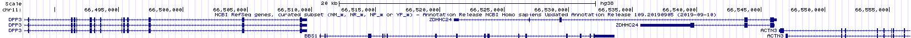
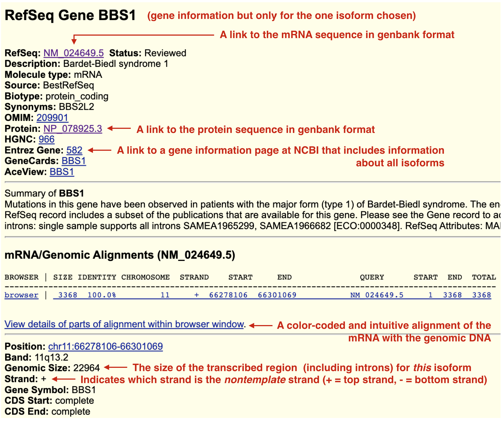
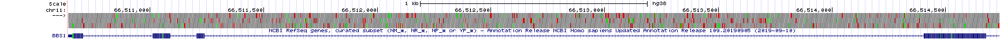

# *An Introduction to Gene Structure*

To follow along with the text and to answer the "Test Your Understanding" questions use the ["BBS1 gene structure" session](https://genome.ucsc.edu/s/megallegos/Biol%20310%20Module%201
){target="_blank"} at the UCSC Genome Browser.

## Exons and Introns
During gene expression, one continuous strand of genomic DNA is used as a template to produce a single-stranded RNA transcript. This process is called **transcription**. This RNA transcript is nearly an identical copy of of the nontemplate strand of genomic DNA^[The only difference: uracil bases replace thymine bases].  In eukaryotes, internal segments of the RNA transcript are often removed. These internal segments are called **introns** (or **int**ervening **r**egi**ons**). The segments of RNA that remain are *welded* back together (in order) and are called **exons** (or **ex**pressed regi**ons**). To view the exon/intron organization of the BBS1 RNA transcript, click on my named session entitled, [BBS1 gene structure](https://genome.ucsc.edu/s/megallegos/Biol%20310%20Module%201){target="_blank"} and review the schematic within the NCBI RefSeq Gene Prediction Evidence Track. The BBS1 transcript consists of "boxes" connected by lines (Figure \@ref(fig:BBS1transcript)). The boxes are exons (two examples are highlighted with a red asterix). The lines are introns (one example is highlighted with a purple asterix). Now, hover your mouse over various parts of the schematic (at the UCSC genome browser page). If you hover long enough a popup window will appear indicating which intron or exon you are pointing to! 

<br>
```{r BBS1transcript, out.width='100%', fig.align='center', fig.cap = "Understanding gene prediction evidence track schematic. The boxes are exons (two examples are bracketed and highlighted with a red asterix). The lines are introns (one example is bracketed and highlighted with a purple asterix)"}
knitr::opts_chunk$set(echo = FALSE)
knitr::include_graphics('static/images/exonintron.png')
```
<br>

### [Test your understanding](https://forms.gle/V4fYwV2ZoiCVXfEv8){target="_blank"}
<style>
div.blue {background-color:#e6f0ff}
</style>
<div class = "blue">

- *How many exons does BBS1 contain?*
<br>
- *How many introns does BBS1 contain?*
<br>
- *Which exon is the longest (as judged by eye)?* 
<br>
- *Find SOD1 in the UCSC Genome Browser. Which SOD1 intron is the shortest (as judged by eye)?*
<br>

</div>

## One gene, many splice variants

A single RNA transcipt is sometimes spliced in a variety of different ways to produce more than one unique mRNA. This is called **alternative splicing** and each mRNA produced is called a **splice variant**. Since each splice variant has the capacity to produce a unique protein or **isoform**, the 24,000 protein-coding genes present in the human genome can actually produce *many more than* 24,000 unique proteins!

To see this for yourself, zoom out exactly **10X** to explore a larger section of chromosome 11^[Notice that at this zoom level some exons look more like vertical lines. This is because, exons are typically shorter than introns (at least in mammals) and so at this zoom level exons look like lines instead of boxes]. Now more than one gene can be viewed in the browser window. Again, the name of each gene is given on the left side of each gene/transcript schematic. Regions of the genome that are transcribed to produce multiple mRNAs are indicated by a *series* of box/line schematics that are *stacked* vertically. How do I know these stacks represent a single gene? Each graphical representation in the stack has the *same* gene name (Figure \@ref(fig:zoom)). 

<br>
```{r zoom, out.width='100%', fig.align='center', fig.cap = "The DPP3 gene produces three unique mRNAs. See the red box. One obvious difference is highlighted with a red arrow. The 2nd and 3rd splice form have an exon not included in the topmost splice form listed."}
knitr::opts_chunk$set(echo = FALSE)
knitr::include_graphics('static/images/10zoom.png')
```
<br>

Alternative splicing is only one way multiple unique mRNAs are produced from a single region of DNA (a single gene)? There are three main methods: 1) Use of an alternative transcriptional start site (Figure \@ref(fig:altinit)), 2) use of an alternative transcriptional termination site (Figure \@ref(fig:altter)) and 3) alternatively splicing. For example, DPP3 begins and ends transcription at the same location but the RNA transcript that is produced is spliced in three distinct ways to produce three alternative splice forms (Figure \@ref(fig:zoom)).

<br>
```{r altinit, out.width='100%', fig.align='center', fig.cap = "Transcription initiation for the LGALS12 gene can be found at two distinct places according to the NCBI RefSeq gene database. The red arrow points to the two transcription start sites"}
knitr::opts_chunk$set(echo = FALSE)
knitr::include_graphics('static/images/altinitiation.png')
```
<br>

```{r altter, out.width='100%', fig.align='center', fig.cap = "Transcription termination for the TTC17 gene occurs at two different sites according to the NCBI RefSeq gene database. Each is highlighted with a red arrow"}
knitr::opts_chunk$set(echo = FALSE)
knitr::include_graphics('static/images/alttermination.png')
```
<br>

Again, multiple mRNA isoforms from the same gene can (but don't always) produce multiple, unique protein isoforms. In some cases, these unique proteins differ enough to function distinctly. For a hilarious illustration of this concept see Figure \@ref(fig:eat). 

<br>
```{r eat, out.width='50%', fig.align='center', fig.cap = "Concept/Art by Allan James from the University of Glasgow"}
knitr::opts_chunk$set(echo = FALSE)
knitr::include_graphics('static/images/eatgrandma.jpg')
```
<br>

### [Test Your Understanding](https://forms.gle/s1Ca2HyWLNyakJN38){target="_blank"}
<style>
div.blue { background-color:#e6f0ff}
</style>
<div class = "blue">

- *How many unique mRNAs does PELI3 produce?*
<br>
- *Are the various mRNA forms produced by PELI3 the result of alternative splicing, alternative transcription initiation, alternative transcription termination or some combination?*
<br>
- *How many unique mRNAs does MRPL11 produce?*
<br>
- *Are the various mRNA forms the result of alternative splicing, alternative transcription initiation, alternative transcription termination or some combination?*
<br>
- *How many unique mRNAs does ACTN3 produce?*
<br>
- *Are the various mRNA forms the result of alternative splicing, alternative transcription initiation, alternative transcription termination or some combination?*

</div>

## Coding and Noncoding Exons
The spliced transcript or messenger RNA (mRNA) is used as a template to create a polypeptide^[A chain of amino acids linked together by peptide bonds. While the words “protein” and “polypeptide” are often used interchangeably, the term protein is more vague. It could refer to a single polypeptide or it might mean multiple polypeptides bound together in a complex. On the other hand, polypeptide always refers to a single sequence of amino acids]. This process is called translation and is mediated in part by the ribosome^[A cytoplasmic machine (comprised of RNA and protein) which uses the mRNA to synthesize a polypeptide.]. The ribosome “reads” each codon^[A set of three adjacent nucleotides in an mRNA molecule that specify the incorporation of an amino acid in a growing polypeptide chain or that signals the end of polypeptide synthesis. Codons with the latter function are called termination codons (Snustad).] within the mRNA to create a polypeptide. That said, an mRNA is more than just codons! In fact, codons **only occupy the central region of an mRNA**. The ends of the mRNA are called **noncoding regions** or untranslated regions (UTRs). The noncoding region at the 5' end is called the 5’ untranslated region (5’ UTR). While the noncoding region at the 3' end is called the 3’ untranslated region (3' UTR). The transition from noncoding to coding and back to noncoding does *not* coincide with exon boundaries. Thus, exons can be described as coding exons, noncoding exons or exons of mixed character. In fact, exon 1 of BBS1 is part noncoding (5’ UTR) and part coding. The same is true of exon 17.

Let’s see how the 5’ UTR, coding and 3’ UTR are illustrated in the UCSC Genome Browser. “Drag-and-Select” exon 1 of BBS1 until your window looks similar to Figure \@ref(fig:topstrand). You should now see the top strand of the genome sequence in the “base position” track. The predicted transcript begins with G-G-T-T etc. If you do not see sequence in the base position track, you have not zoomed in far enough. Zoom in farther. If you do not see the G-G-T-T sequence at the beginning of BBS1, you are in the wrong location. 

How do I know this sequence is the top strand^[The top strand of DNA is also referred to as the “+ strand”] of this DNA segment? Because the arrow to the left of the genome sequence (see red Asterix, Figure \@ref(fig:topstrand))  is pointing to the right (--->). In genetics and molecular biology, the blunt end of an arrow represents the 5’ end of a DNA strand while the pointed end of an arrow represents the 3’ end. *Always*.

<br>
```{r topstrand, out.width='100%', fig.align='center', fig.cap = "Exon 1 (red box) of BBS1 is part noncoding exon (blue box) and part coding exon (green box)"}
knitr::opts_chunk$set(echo = FALSE)
knitr::include_graphics('static/images/topstrandexon1.png')
```
<br>

At this zoom level, you should also be able to see the amino acid sequence that exon 1 codes for (Figure \@ref(fig:topstrand): M-A-A-A-S-S-S-D-S-D-A-C-G-A-E-S. Notice that the amino acid sequence does not start at the beginning of exon 1. Moreover, the noncoding portion of exon 1 is also not drawn as thick as the coding portion of exon 1. This thinner portion of exon 1 is the 5’ untranslated region (5’ UTR). This is because it contains no codons (it is noncoding) AND it is the 5’ end of BBS1. 

### [Test your understanding](https://forms.gle/DaZ8kh1EH7Bqi6Fr7){target="_blank"}
<style>
div.blue {background-color:#e6f0ff}
</style>
<div class = "blue">

- *How long is the 5’ UTR of BBS1 (manually count the number of nucleotides)?*
<br>
- *Consider this arrow: <--- representing a single strand of DNA. Is the 3’ end of this DNA on the right or left?*
<br>
- *Search for the gene, MDM4 in the UCSC Genome Browser. What type of exon is exon 1 (noncoding, coding or both - of mixed character)?*
<br>

</div>

To view the entire BBS1 gene again, click on the named session link for [BBS1 Gene Structure](https://genome.ucsc.edu/s/megallegos/Biol%20310%20Module%201){target="_blank"}. Notice the box representing the last exon of BBS1 also consists of both a thick and thin portion. The thin portion at the end of the BBS1 gene is also noncoding. Since this is the 3’ end of BBS1, this portion of BBS1 is called the 3’ untranslated region or 3’ UTR. Now "Drag-and-Select" the **coding** portion of the last exon. If your view does not look like (Figure \@ref(fig:lastexon)), you may have selected the **entire** last exon when you should have just selected the **coding** portion of the last exon. See the difference? Now you can clearly see that the amino acid sequence stops before the end of the last exon and the exon schematic transitions from thick to thin. NOTE: The stop codon is represented by an asterix. In many genes, the first and last exons consist of both noncoding and coding sequence while the central exons are coding only. As you explore more of the genome, you will see there are exceptions. Sometimes the *first few* exons and/or the *last few* exons are completely noncoding!

<br>
```{r lastexon, out.width='100%', fig.align='center', fig.cap = "The coding portion of the last exon of BBS1"}
knitr::opts_chunk$set(echo = FALSE)
knitr::include_graphics('static/images/lastcodingexon.png')
```
<br>

## Coding Exons Determine Protein Sequence
Polypeptides are a series of amino acids held together by peptide bonds. The amino acid sequence is determined by the order of codons present in the central portion of a mature mRNA, the coding exons.  Each codon consists of a group of three consecutive bases. Since there are four nucleotides total (G, A, T and C), the equation, 4^3, indicates that there are 64 possible codons. Most of the 64 codons code for an amino acid. Three do not and therefore act as STOP signals also known as termination codons. Figure \@ref(fig:geneticcode) is one way to display the genetic code. In this graphic, codons are read from the **center** out to the periphery (from 5’ to 3’). For example, G-C-A codes for Alanine. Ala and A are the standard three letter and single letter codes, respectively. In this genetic code, Uracil replaces Thymine as ribosomes scan mRNA molecules not DNA. 

<br>
```{r geneticcode, out.width='75%', fig.align='center', fig.cap = "[Image from wikipedia](https://commons.wikimedia.org/wiki/File:Aminoacids_table.svg)"}
knitr::opts_chunk$set(echo = FALSE)
knitr::include_graphics('static/images/circulargeneticcode.png')
```
<br>

Use whatever method you’d like to get back to a close-up view of exon 1 of BBS1 Figure \@ref(fig:topstrand).  Notice that the first amino acid of the protein is a methionine (M) and is shaded in green. In fact, the first amino acid of all proteins should be methionine as the A-U-G codon is the start codon in most cases. You can confirm that this is true for BBS1 by looking at the three nucleotides positioned directly above the “M” (You should see ATG since you are viewing genomic DNA). The second codon is G-C-C. The third codon is G-C-T. Both code for Alanine (Ala, A).

In BBS1, it is clear that the codons are read from left to right in non-overlapping groups of three nucleotides. Since the codons are found in the top strand, you can also say that these codons are read from 5’ to 3’. In fact, codons are always read from 5’ to 3’ in non-overlapping, groups of three nucleotides. Now let’s re-examine the last **coding** exon of BBS1 (Figure \@ref(fig:lastexon). Notice that the stop codon at the end of BBS1 is represented by an "*" and highlighted in red.

### [Test your understanding](https://forms.gle/LUjW3ngaerH1ipeV6){target="_blank"}
<style>
div.blue {background-color:#e6f0ff}
</style>
<div class = "blue">
The codons below are written as a DNA sequence from 5' on the left to 3' on the right (5' to 3'). Use the genetic code found in Figure \@ref(fig:geneticcode) to answer the top three questions (open in a new tab). Use the UCSC genome browser to answer the remaining questions.

- *What amino acid does the codon, CGG, code for?*
<br>
- *What amino acid does the codon, TTC, code for?*
<br>
- *What amino acid does the codon, CAT, code for*
<br>
- *Write out the DNA sequence of the 5th codon for BBS1*
<br>
- *What does the 5th codon of BBS1 code for?*
<br>
- *Write out the DNA sequence of the 8th codon for BBS1*
<br>
- *What does the 8th codon of BBS1 code for?*
<br>
- *Write out the DNA sequence of the stop codon for BBS1*
<br>
- *EXTRA CREDIT! Write out the DNA sequence of the 16th codon*
<br>

</div>

## Top strand and bottom strand genes

We learned in the last section that the codons for BBS1 can be read from within the top strand (+ strand) and they are read from left to right. For BBS1, this means that the top strand is the sense strand while the bottom strand is the template strand^[For BBS1, the bottom strand is used as the template for transcription and by definition is complementary to the top strand]. Sometimes the sense strand is also called the nontemplate strand. **That said, the sense strand of a gene is not ALWAYS the top strand in a genome browser**. Click on the Named Session for [BBS1 Gene Structure](https://genome.ucsc.edu/s/megallegos/Biol%20310%20Module%201){target="_blank"} then zoom out 3X to look at BBS1 and its neighboring genes. Your NCBI Refseq gene track should look something like (Figure \@ref(fig:neighboringgenes)).

<br>
```{r neighboringgenes, out.width='100%', fig.align='center', fig.cap ="BBS1 and its neighboring genes. BBS1 is flanked by DPP3 on the left and ZDHHC24 on the right. DPP3 is upstream. ZDHHC24 is downstream. Click on the image to enlarge. Click again to resume reading."}
knitr::opts_chunk$set(echo = FALSE)

```
<br>

Now "Drag-and-Select" the first half of BBS1 to zoom in somewhat. Notice there are “orientation wedges” spaced regularly along all introns ((Figure \@ref(fig:orientationwedges)). They are either oriented to the right (red box) or to the left (green box). These “orientation wedges” indicate the orientation of the gene on the chromosome. They tell you where the 5' end of the gene is and they indicate which strand of chromosomal DNA is the sense strand for a given gene (top or bottom, + or -). 

<br>
```{r orientationwedges, out.width='60%', fig.align='center', fig.cap ="The orientation wedges are visible within introns. When they point to the right (red box), the beginning of the gene is on the left and the gene is a top strand gene (plus strand). When they point to the left (green box), the beginning of the gene is on the right and the gene is a bottom strand gene (minus strand)."}
knitr::opts_chunk$set(echo = FALSE)
knitr::include_graphics('static/images/orientationwedges.png')
```
<br>

When the orientation wedges point to the right, ") ) ) )" (i.e. see BBS1), 
<br>

1. The beginning of the gene is on the left. 
2. The top strand (+ strand) is the sense strand (nontemplate strand)
3. the bottom strand (- strand) is the template strand. 
<br>

When the orientation wedges point to the left, "( ( ( (", the reverse is true (i.e. see ZDHHC24),
<br>

1. The beginning of the gene is on the right. 
2. The top strand (+ strand) is the template strand. 
3. The bottom strand (-strand) is the sense strand (nontemplate strand)
<br>

These orientation wedges not only represent the orientation of the gene on the chromosome but also the direction of transcription. The beginning of a gene (the 5' end) is always transcribed first. RNA polymerase, the enzyme that catalyzes RNA transcription, moves from the beginning of the gene towards the end of the gene. Thus, for BBS1, RNA polymerase moves from left to right using the bottom strand as a template. For ZDHHC24, RNA polymerase moves from right to left using the top strand as a template!  

### [Test your understanding](https://docs.google.com/forms/d/e/1FAIpQLScgFkZWsytBOOLiaJeJi8fTler4YYHuWkDosv5gGORJIneT0w/viewform?usp=sf_link){target="_blank"}
<style>
div.blue {background-color:#e6f0ff}
</style>
<div class = "blue">
To answer the following set of questions, go to my [BBS1 Gene Structure named session](https://genome.ucsc.edu/s/megallegos/Biol%20310%20Module%201){target="_blank"} then zoom out 10X. 
<br>

- *How are the various mRNA forms produced by the ZDHHC24 gene? Do they result from alternative splicing, transcription initiation, transcription termination or a combination of these events?*
<br>
- *Which strand (top or bottom) is the sense strand for ACTN3?*
<br>
- *Where is the beginning of the ACTN3 gene as displayed in the browser, on the left or right?*
<br>
- *Which direction does RNA polymerase travel along genomic DNA during transcription of ACTN3 (as displayed in the browser), to the left or to the right?*
<br>
- *Which strand (top or bottom) is the sense strand for DPP3?*
<br>
- *Where is the beginning of the DPP3 gene as displayed in the browser, on the left or right?*
<br>
- *Which direction does RNA polymerase travel along DPP3 during transcription (as displayed in the browser), to the left or to the right?*
<br>
- *Which strand (top or bottom is the sense strand for CTSF?*
<br>
- *Where is the beginning of the CTSF gene, on the left or right as displayed in the browser?*
<br>
- *Which direction does RNA polymerase travel along CTSF during transcription (as displayed in the browser), to the left or to the right?*

</div>

Now let’s look at the beginning of the first coding exon for ZDHHC24 up close. First, click on my named session for [BBS1 Gene Structure](https://genome.ucsc.edu/s/megallegos/Biol%20310%20Module%201){target="_blank"} then zoom out 3X to find the **beginning** of ZDHHC24. "Drag-and-Select" as many times necessary to zoom to the **first** half of the **first coding exon** for ZDHHC24. Your “NCBI Refseq Gene Track should look something like Figure \@ref(fig:firstcodingexonZDHHC24). If not, you may have zoomed into the first half of exon 1 which is noncoding. Or maybe you are at the wrong end of the gene! Make sure you understand what went wrong and how to find the right spot. 

<br>
```{r firstcodingexonZDHHC24, out.width='100%', fig.align='center', fig.cap ="This is the first half of the first **coding** exon of ZDHHC24. The noncoding portion of exon 1 extends to the right this time because *ZDHHC24* is a bottom strand (or minus strand) gene. The red oval highlights the strand you are currently viewing. Since the arrow points to the right, the top strand (5' on the left) is displayed. You can toggle this arrow with your mouse."}
knitr::opts_chunk$set(echo = FALSE)
knitr::include_graphics('static/images/firstcodingexonZDHHC24.png')
```
<br>
```{r firstcodingexonZDHHC24bottom, out.width='100%', fig.align='center', fig.cap ="Again, this is the first half of the first **coding** exon of ZDHHC24. The red oval highlights the strand you are currently viewing. Since the arrow points to the left, the bottom strand (5' on the right) is displayed. Notice that the DNA sequence is gray. Compare to the top image. This is a visual reminder of which strand you are viewing."}
knitr::opts_chunk$set(echo = FALSE)
knitr::include_graphics('static/images/firstcodingexonZDHHC24bottom.png')
```
<br>

Look at the three nucleotides centered above the Methionine (colored in green on the right side of Figure \@ref(fig:firstcodingexonZDHHC24)). Notice that the nucleotides listed from left to right is NOT an A-T-G as you might expect but instead C-A-T! This is because you are “reading” the top strand of DNA. ZDHHC24 is a **bottom** strand gene. To view the bottom strand of DNA, click on the far left arrow within the Base Position Track (See the red oval, Figure \@ref(fig:firstcodingexonZDHHC24)). Notice the orientation of the arrow will flip and the genome sequence in your “Base Position” Track will transform into light gray (red oval, \@ref(fig:firstcodingexonZDHHC24bottom)). Now there is an A-T-G directly above the Methionine (M) but instead of reading it from left to right, you must read it from right to left! This is because the bottom strand is oriented with 5’ end on the right. **You ALWAYS read and write sequence from 5’ to 3’**.  

### [Test your understanding](https://docs.google.com/forms/d/e/1FAIpQLSeaojvlNdLiH-VjdFQA-tjv3U3-f8dCK1mZA2n4KQXwoCI5NQ/viewform?usp=sf_link){target="_blank"}
<style>
div.blue {background-color:#e6f0ff}
</style>
<div class = "blue">

- *Write out the DNA sequence of the 3rd codon for ZDHHC24 (Always write sequence from 5’ to 3’).*
<br>
- *Write out the DNA sequence of the 5th codon for ZDHHC24.*
<br>
- *Write out the DNA sequence of the stop codon used by the **short** mRNA form of ZDHHC24.*
<br>
- *Write out the DNA sequence of the stop codon used by the **long** mRNA form of ZDHHC24 (Notice: the stop codon is not always in the last exon!).*
<br><br>
HINT: To confirm that you have chosen your codon sequence correctly, use the [genetic code](https://commons.wikimedia.org/wiki/File:Aminoacids_table.svg){target="_blank"} to confirm that the codon you chose codes for the amino acid found at that position in the gene (NOTE: In general, genetics substitute U for T).

</div>

Don't forget, DNA is double-stranded. The two DNA strands anneal (hybridize) in an **antiparallel** orientation. The 5’ end of the top strand is on the left. The 5’ end of the bottom strand is on the right. Some genes, like BBS1 create an RNA transcript with a sequence that matches the top strand. Other genes, like ZDHHC24, create an RNA transcript with a sequence that matches the bottom strand. 

## Reading Frames

A reading frame begins with a start codon. This is the first codon "read" by the ribosome. All subsequent codons are read in **nonoverlapping groups** of three. Thus, the start codon "sets" the reading frame. A reading frame ends only when a stop codon is encountered that is in the same reading frame as the start codon. This is the last codon "read" by the ribosome. 

Imagine you isolate and sequence a short random stretch of DNA pulled from the ocean. It is likely genomic DNA and you want to see if corresponds to a coding portion of a gene. Specifically, you want to see if this short stretch of DNA codes for a previously studied protein. Of course, you have no clue which strand might be used as a template for transcription nor where the start codon is. Here is a thought question: ***What is the maximum number of unique polypeptides that a single segment of double-stranded DNA could theoretically produce?*** Your answer will be revealed below. 

To view all possible reading frames associated with a given segment of DNA zoom into to the first exon of BBS1. Next, right click on the grey rectangle corresponding to the Base Position track (See arrow, Figure \@ref(fig:basepositiondense)). A pop-up menu will appear. Choose “full”.

<br>
```{r basepositiondense, out.width='100%', fig.align='center', fig.cap="How to view all three reading frames for a single strand of DNA. Right click on the gray rectangle on the left of the Base Position Track (red arrow). A pulldown menu will open. Choose Full."}
knitr::opts_chunk$set(echo = FALSE)
knitr::include_graphics('static/images/basepositiondense.png')
```
<br>

You should now see three reading frames displayed below the nucleotide sequence. Why three? This is the maximum number of unique polypeptides that can be theoretically produced from a given segment of the top strand of DNA. See what happens when you toggle to the bottom strand of DNA (click the arrow ---> on the far left of the DNA sequence). Now you can view the three reading frames that correspond to the bottom strand of DNA. Both views are shown one on top of the other in Figure \@ref(fig:basepositionfullreverse). Notice they are different. 

<br>
```{r basepositionfull, out.width='100%', fig.align='center'}
knitr::opts_chunk$set(echo = FALSE)
knitr::include_graphics('static/images/basepositionfull.png')
```
<br>
```{r basepositionfullreverse, out.width='100%', fig.align='center', fig.cap="Once you change the base position track to **Full**, the three possible reading frames for a *single* DNA strand will be displayed. When the arrow points to the right, the three reading frames will be of the top strand (top image). Notice the start codon in green matches the start codon in the third reading frame and nearly all of the amino acids in exon one match the amino acids in the third reading frame. This is because *BBS1* is a top strand gene and we are viewing the three reading frames for the top strand. Now when the arrow points to the left, the three reading frames are for the bottom strand (bottom image). Now *none* of the amino acids in the three reading frames match the amino acids found in *BBS1*"}
knitr::opts_chunk$set(echo = FALSE)
knitr::include_graphics('static/images/basepositionfullreverse.png')
```
<br>

The three reading frames corresponding to the top strand are numbered +1 (top), +2 (middle) and +3 (bottom). The three reading frames corresponding to the bottom strand (when shown) are numbered -1 (top), -2 (middle) and -3 (bottom). For convenience, the position of all possible start codons are highlighted in green and all possible stop codons (*) are highlighted in red. 

Now, zoom out until you can see the first three exons of BBS1 (Figure \@ref(fig:threeexons)). At this level of zoom, you should still be able to read the amino acid sequence within the gene schematic *and* within the base position track. Notice there are many “start” and “stop” codons scattered throughout this segment of the genome (red and green boxes). This should not be surprising given that start and stop codons are only three nucleotides in length and they would simply occur by chance. **The ability of an ATG or TGA, TAA, TAG to function as a start or stop codon, respectively, depends on context**. For example, the real start codon for a given gene is typically the first start codon encountered in an mRNA as the Ribosome scans the mRNA from 5’ to 3’ (more about this later).  
<br>
```{r threeexons, out.width='100%', fig.align='center', fig.cap="All ATG codons are colored green regardless if they function as a start codon or not. Similarly, all TGA, TAA and TAG codons are colored red regardless if they function as a stop codon. How these triplets function depends on context."}
knitr::opts_chunk$set(echo = FALSE)
knitr::include_graphics('static/images/firstthreeexons.png')
```
<br>

Now, notice that the amino acid sequence within the BBS1 gene schematic always matches **one** of the three reading frames. For our example, the coding portion of exon 1 begins with a methionine (highlighted in green). The +3 reading frame also has a methionine in this same position. Compare a few more amino acids in BBS1 and the +3 reading frame. You should see that all match (except one). Thus, coding exon 1 utilizes the +3 reading frame! By the way, do you see the exception? 

Which reading frame do the other coding exons utilize? Is it always the same reading frame? Or does it change from exon to exon.  New trick:  To easily view exons farther downstream  (3’ of), click on the open arrow head on the far right (See hot pink arrow at the far right of the image, Figure \@ref(fig:threeexons)). Also, if you hover over the open triangle and don’t click, a small pop up will appear with information about which exon you are jumping to! This may come in handy while answering the following questions. 

### [Test your understanding](https://docs.google.com/forms/d/e/1FAIpQLSckMbKa16Rv7ZEFuQNP8Q1joHgU04UJx-oHZznrnbpaBOAqcQ/viewform?usp=sf_link){target="_blank"}
<style>
div.blue {background-color:#e6f0ff}
</style>
<div class = "blue">

Recall: The three reading frames corresponding to the top strand (plus strand) are called +1 (top), +2 (middle) and +3 (bottom). The three reading frames corresponding to the bottom strand (minus strand) are called -1 (top), -2 (middle) and -3 (bottom). Answer the following questions about BBS1 (a top strand gene) and ZDHHC24 (a bottom strand gene). 
<br>

- *Which reading frame does exon 2 of BBS1 use?*
<br>
- *Which reading frame does exon 3 of BBS1 use?*
<br> 
- *Which reading frame does exon 4 of BBS1 use?*
<br>
- *Which reading frame does exon 5 of BBS1 use?*
<br>
- *Which reading frame does exon 1 of the long form of ZDHHC24 use?*
<br>
- *Which reading frame does exon 2 of the long form of ZDHHC24 use?*
<br>
- *Which reading frame does exon 3 of the long form of ZDHHC24 use?*
<br>
- *Which reading frame does exon 4 of the long form of ZDHHC24 use?*
<br>
- *Review your answers above. Are the reading frames used by BBS1 the same for each exon examined? Are the reading frames used by ZDHHC24 the same for each exon examined?*

</div>

## How to View and Retrieve Gene Product Sequences

To retrieve BBS1 gene product sequences (or any gene product sequence) from the UCSC genome browser, click on the schematic for the BBS1 transcript in the “Gene and Gene Predictions track”. The top half of the new page contains numerous links to pages that provide sequence information associated with this gene (Figure \@ref(fig:geneinfo)). For example, to view information specifically about the BBS1 mRNA, click on the NM_024649.5 link. To view information specifically about the protein sequence, click on the NP_078925.3 link. NM_024649.5 and NP_078925.3 are known as accession codes. Accession codes that begin with NM_ correspond to mRNA sequences. While those that begin with NP_  correspond to protein sequences. Both sequence pages are in so-called "Genbank format". This format includes useful annotations that can be “read” by sequence analysis software programs. The mRNA or protein sequence is at the very bottom of the page. Scroll down. Alternatively, click the "FASTA" link to see the sequence in a simpler format. One thing you might notice: There are no uracil bases (U) in the mRNA sequence! Sequence databases do not expend any computational energy to convert thymines (T) to uracils (U) for display purposes only. 

Finally, to get an overview of how BBS1 mRNA aligns with the genomic sequence, click on the “View details of parts of alignment within browser window”. Read the text to determine what highlighting means although you may be able to deduce their meaning.  

<br>
```{r geneinfo, out.width='100%', fig.align='center', fig.cap="When you click on a gene/transcript schematic in the gene prediction track you are taken to its gene information page. BBS1 only has one isoform and so there is only one gene information page. In other words, this information is transcript specific and depends on which isoform you click on. Useful links are highlighted. Some links will help you answer Test Your Understanding questions. Explore!"}
knitr::opts_chunk$set(echo = FALSE)

```
<br>

### [Test Your Understanding](https://docs.google.com/forms/d/e/1FAIpQLSdHCmDq82g5JPHIwzBtboqVw0SHCKUhkeLTWn-ZFTriPWsrhA/viewform?usp=sf_link){target="_blank"}
<style>
div.blue { background-color:#e6f0ff; border-radius: 5px; padding: 5px;}
</style>
<div class = "blue">

- *List the first four nucleotides of the BBS1 mRNA according to the accession record, NM_024649.5 (Answer found in FASTA or Genbank format).*
<br>
- *How long (in bp) is the BBS1 spliced transcript (mRNA) according to the accession record, NM_024649.5 (Answer found in Genbank format only)?*
<br>
- *List the first four amino acids of the BBS1 protein according to the accession record, NP_078925.3 (Answer found in FASTA or Genbank format).*
<br>
- *How long (in amino acids) is the protein according to the accession record, NP_078925.3 (Answer found in Genbank format only)?*
<br>
- *In general, what is the difference between FASTA and Genbank formats?*
<br>
- *EXTRA CREDIT!!! How long is the BBS1 unspliced transcript (the pre-mRNA)? (HINTS:You will find this information in the gene information page for BBS1 although you will not find the phrase “unspliced transcript” there. That said, the length of the unspliced transcript is equivalent to the length of the _______)*
<br>


</div>

## [For Discussion](https://docs.google.com/forms/d/e/1FAIpQLSe7zNC1r8-TAGZXSN2-4BIDmX8gZ93CDlUUW0xzxQoiJVJcJA/viewform?usp=sf_link){target="_blank"}
<br>
```{r fourexons, out.width='100%', fig.align='center', fig.cap="The first four exons of *BBS1* with the base position track set to full. All ATG codons are displayed in green. All stop codons are displayed in red."}
knitr::opts_chunk$set(echo = FALSE)

```
<br>
Figure \@ref(fig:fourexons) above is focused on the first four exons of BBS1. It is formatted to display the three reading frames associated with the top strand. To see this section of BBS1 within the UCSC Genome Browser, click [here](https://genome.ucsc.edu/s/megallegos/FirstFourExons){target="_blank"}. Use the image or link to answer the following questions: 

- *What do you notice in general about the distribution of stop codons in introns? To see if there is a pattern, count the number of stop codons in each reading frame (+1, +2 and +3) within intron 1. Then do the same thing for intron 2 and so on. You are looking for trends. If you don't see any trends, you can review more introns and exons for BBS1.* <br>
- *What do you notice in general about the distribution of stop codons in exons? To see if there is a pattern, count the number of stop codons in each reading frame (+1, +2 and +3) within exon 1. Then do the same thing for exon 2 and so on. Again, you are looking for trends.* <br>
- *Do the same type of analysis but for start codons^[I call them start codons but I really mean ATG codons. The only true start codon is the one where translation initiation begins. All others are simply codons for methionine. That said, all ATG codons are colored green]. Is the distribution pattern you observe for start codons similar or different than the pattern observed for stop codons?* <br>

If you created a graph or table (in excel or by hand) to answer this, take a picture and save it. You can upload it **here**^[link will appear shortly!] for extra credit.

## Addendum

Now that you have more familiarity with gene structure, the following tutorials are highly recommended. They were created by the UCSC Genome Browser team. These are also worth revisiting before you embark on your **Independent Project** at the end of the term. 

- [UCSC Genome Browser Basics. Part 1: Getting around in the Browser](https://www.youtube.com/watch?v=NBDMNv2KFik&feature=youtu.be&list=UUQnUJepyNOw0p8s2otX4RYQ){target="_blank"}
<br>
- [UCSC Genome Browser Basics, Part 2: Configuring the Browser](https://www.youtube.com/watch?v=cYys5iXN0NY&feature=youtu.be&list=UUQnUJepyNOw0p8s2otX4RYQ){target="_blank"}
<br>
- [UCSC Genome Browser Basics. Part 3: Configuration + DNA navigation](https://www.youtube.com/watch?v=I25Q136d6NU&feature=youtu.be&list=UUQnUJepyNOw0p8s2otX4RYQ){target="_blank"}
<br>
- [Saving and Sharing Sessions on the UCSC Genome Browser](https://www.youtube.com/watch?v=d5rHBLXwraM&feature=youtu.be&feature=player_detailpage&v=8ATcoDTOc0g&list=UUQnUJepyNOw0p8s2otX4RYQ){target="_blank"}
<br>
- [Controlling the visibility of data tracks on the UCSC Genome Browser](https://www.youtube.com/watch?v=jKix2B3hwnw&feature=youtu.be&feature=player_detailpage&v=8ATcoDTOc0g&list=UUQnUJepyNOw0p8s2otX4RYQ){target="_blank"}
<br>
- and there is [more](https://genome.ucsc.edu/training/){target="_blank"}! 
<br>


© 2019, Maria Gallegos. All rights reserved.

<style>
p.caption {
  font-size: 0.8em;
  margin-right: 2%;
  margin-left: 2%;
  line-height: 1.2em;
  text-align: left;
}
</style>

<script src="https://ajax.googleapis.com/ajax/libs/jquery/3.1.1/jquery.min.js"></script>

<style>
.zoomDiv {
  opacity: 0;
  position:absolute;
  top: 50%;
  left: 50%;
  z-index: 50;
  transform: translate(-50%, -50%);
  box-shadow: 0px 0px 50px #888888;
  max-height:100%; 
  overflow: scroll;
}

.zoomImg {
  width: 100%;
}
</style>


<script type="text/javascript">
  $(document).ready(function() {
    $('body').prepend("<div class=\"zoomDiv\"></div>");
    // onClick function for all plots (img's)
    $('img:not(.zoomImg)').click(function() {
      $('.zoomImg').attr('src', $(this).attr('src'));
      $('.zoomDiv').css({opacity: '1', width: '100%'});
    });
    // onClick function for zoomImg
    $('img.zoomImg').click(function() {
      $('.zoomDiv').css({opacity: '0', width: '0%'});
    });
  });
</script>

