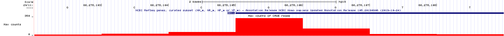
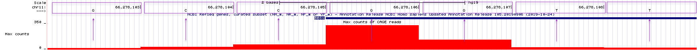

# *Gene Discovery with TSS-seq*

TSS stands for Transcriptional Start Site, also known as the +1 position of transcription^[The +1 position marks the position of the first *templated* nucleotide of the transcript. You may already know that a 5' cap is added to the mRNA. As a result, the +1 position of transcription becomes the second nucleotide of the mRNA.]. In this module, you will learn how RNA sequencing near transcriptional start sites (TSS-seq) is done, how the sequence data is displayed in the UCSC Genome Browser and how this data can be used to surmise where the *beginning* of genes are located in the genome. You will also see how TSS-seq together with RNA-seq (Chapter 4) provides a more complete picture of where individual genes are located. To follow along with the text and to answer "Test Your Understanding" questions, begin with the ["TSS-seq"](https://genome.ucsc.edu/s/megallegos/Biol%20310%3A%20Module%202%20TSS%2Dseq){target="_blank"} session at the UCSC Genome Browser.

## How TSS-seq is done. 

How might one identify the transcriptional start sites of most genes in the genome without prior knowledge of where those start sites are located? Recall that mRNA has *two* unique features: 1) a 5’ cap and 2) a 3' poly A tail. While both can be exploited to purify mRNA away from all other RNA types, the 5’ cap can be used specifically to pinpoint the transcriptional start site (TSS) as it is only added to the *beginning* of a message (mRNA) By sequencing only that portion of the mRNA that is next to the 5' cap you can identify the TSS! Dubbed TSS-seq, these sequence reads are then aligned to a reference genome as is done for RNA-seq. 

The steps necessary to prepare mRNA for TSS-seq are outlined in Figure \@ref(fig:TSSseqsteps). First, poly-A containing RNA (mRNA) is extracted from an organism, tissue or cell of interest as described previously (Figure \@ref(fig:rnaextraction)). Due to the fragility of RNA in general, RNA extractions typically include full length mRNA (with a 5’ cap) and partially degraded mRNA (with a 5' phosphate instead). You do not want to sequence the 5' ends of partially degraded mRNA as these molecules do not pinpoint the location of the TSS but instead map to the interior of a gene. 

<br>
```{r TSSseqsteps, out.width='75%', fig.align='center', fig.cap = "TSSseq protocol. A) All mRNA possessing a poly A tail is separted from total RNA. The resulting sample contains both full length mRNA with a 5' cap and partially degraded mRNA with a 5' phosphate (P-). B) An enzyme that removes 5' phosphates is added. See the P change to OH. C) An enzyme is added that removes the 5' cap structure. See the black circle change to a P. D) RNA ligase attaches an RNA oligo (green rectangle) to all RNAs that had a 5' phosphate in C). E) The addition of reverse transcriptase and random oligos produce cDNA fragments. Those cDNA fragments that once had a 5' cap all have the same sequence at their 3' ends."}
knitr::opts_chunk$set(echo = FALSE)
knitr::include_graphics('static/images/TSSseqmethod.png')
```
<br>

How can one distinguish full length mRNA from partially degraded fragments? Scientists have devised a clever method:  First, they add an enzyme that removes 5’ phosphates from *all* partially degraded RNA molecules in the tube. Full-length, capped mRNAs do not possess a 5’ phosphate and are thus impervious to^[not affected by] this step. Next, they add an enzyme that removes the 5’ cap from full length mRNAs. Now the full-length mRNAs that were once capped possess a 5’ phosphate instead^[At this point, full length mRNA possess a 5' phosphate while partially degraded mRNA posses a 5' hydroxyl - so they are still different and distringuishable]! Next, RNA ligase^[**RNA ligase** is similar to DNA ligase in that both require a 5’ phosphate and a 3’ hydroxyl to form a phosphodiester bond between two nucleic acid chains. The main difference: RNA ligase links two RNA chains together while DNA ligase links two DNA chains together] is used to attach a single-stranded **RNA** oligo^[Short single-stranded RNA chain] to the 5’ end of only those RNAs that have 5’ phosphates. Finally, *all* the RNA in the tube is converted into cDNA using a reverse transcriptase and random primer (as described previously). Importantly, only those  cDNAs that once had a 5' cap are tagged with the specific primer sequence at their 3' end (NOTE: Do you understand why this primer sequence is now at the 3' end of the DNA?). This 3' sequence tag can now be exploited for sequencing as the sequencing reaction is primed with a DNA oligo that base pairs^[The phrase "base pairs" here is used as a verb to mean "hybridizes to" or "anneals to"] to the sequence tag. The short sequence reads that are collected (about 35 bp in length) are then computationally aligned to the genome and counted as described previously (chapter 4). 

## Why TSS-seq is useful

As we just saw, RNA-Seq data can identify segments of the genome that are transcribed *and* remain in mRNA (introns are transcribed but removed from mRNA). In other words, this type of data is excellent for identifying the position of **exons**. Often, RNA-seq data will also reveal how exons are linked together (with split alignments). That said, it is not always sufficient for gene identification purposes. To identify an individual transcription unit (a single gene) with more confidence, it is better to know the position of the exons *and* the TSS. To see this for yourself, review RNAseq data corresponding to a small region of the genome (Figure \@ref(fig:RNAseqdataonly)). The NCBI Refseq gene prediction track is hidden on purpose. As you can see, the histogram and sequence read alignments including the split alignments are displayed. How many genes do you think are in this region? What is your rationale? 

<br>
```{r RNAseqdataonly, out.width='100%', fig.align='center', fig.cap = "RNAseq data corresponding to a small region in the genome with the base position and gene prediction tracks hidden. Guess how many genes you think map to this region of the human genome."}
knitr::opts_chunk$set(echo = FALSE)
knitr::include_graphics('static/images/histogram.png')
```
<br>

In Figure \@ref(fig:RNAseqdataonly), there are two main groups of split alignments. It would be reasonable to guess that there are two genes in this region. To see the true number of genes click [here](https://genome.ucsc.edu/s/megallegos/DPP3){target="_blank"}. This link takes you to the same genome region as in Figure \@ref(fig:RNAseqdataonly) but with the gene prediction and base position tracks visible. If you guessed wrong, do you see why you were misled? 


## Understanding the TSS-seq Evidence Track 
The UCSC Genome Browser contains numerous evidence tracks displaying TSS-seq data. We will focus on one that was generated by the FANTOM5 Consortium of labs in Japan (FANTOM stands for Functional Annotation of the Mammalian Genome). Click the link to learn more about [FANTOM5](http://fantom.gsc.riken.jp/){target="_blank"}. FANTOM5 is a custom evidence track that I added by clicking on “Add Custom Tracks” then searching for "FANTOM5". To view this evidence track click the link for the [TSS-seq](https://genome.ucsc.edu/s/megallegos/Biol%20310%3A%20Module%202%20TSS%2Dseq){target="_blank"} session. You can also use this link as a starting point for questions related to TSS-seq data for any gene.  

Your genome browser should now display the “Max Counts of CAGE^[CAGE is short for "**C**ap **A**nalysis **G**ene **E**xpression"] reads” evidence track for BBS1. This evidence track displays TSS-seq data in histogram form only (Figure \@ref(fig:TSSseqforBBS1)). The track settings are configured such that that the Y-axis is set at 350 read counts. This can be changed at the track settings page for this evidence track. Setting the Y-axis at 350 is sufficient for most genes. For some highly expressed genes it is better to set the Y-axis to "". Go to the track settings page. Scan down until you see "Data view scaling:". Change the pulldown menu from "use vertical viewing range setting" to "autoscale to data view". Then click submit. If you do this for BBS1, the Y-axis should end at 69.0667. Before you move on, change the Y-axis back to "use vertical viewing range setting". 

<br>
```{r TSSseqforBBS1, out.width='100%', fig.align='center', fig.cap = "TSSseq data for BBS1."}
knitr::opts_chunk$set(echo = FALSE)
knitr::include_graphics('static/images/TSSseqBBS1.png')
```
<br>

Zoom out 10X. The genome browser window is now focused on a larger portion of the genome surrounding BBS1 (Figure \@ref(fig:TSSseqfor10X)). Notice that there are both red peaks and blue peaks. There are also tall peaks and tiny peaks.

Recall that genes can be found on the top strand or the bottom strand as RNA polymerase can use either strand as template for transcription. If RNA polymerase uses the bottom strand as template then it moves from left to right (5' to 3') and produces an mRNA that *matches* the top strand sequence and is complementary to the bottom strand. If RNA polymerase uses the top strand as template then it moves from right to left (also 5' to 3' relative to the bottom strand) and produces an mRNA that matches the *bottom strand* sequence. Histrogram peaks displayed in **red** represent the TSS of top strand genes. Histogram peaks displayed in **blue** represent the TSS of bottom strand genes. 

The taller a histrogram peak at a given location, the more sequence reads that map to that region. The more read counts, the more reliable the data and the more likely the data represents a true TSS. In fact, the tiny peaks observed in Figure \@ref(fig:TSSseqfor10X) (find each red asterix) likely reflect background noise^[Molecular biology is messy. Each enzymatic step listed in Figure \@ref(fig:TSSseqsteps) is not likely to achieve 100% success. For example, partial mRNAs that fail to have their 5' phosphates removed can be sequenced along side all the true full-length mRNAs.] and may not represent the position of a TSS at all. That said, the *absence* of a peak at a location where one was predicted to exist does not mean that the gene prediction is incorrect. This might be an instance where a gene was not expressed in the tissue sample that was used to generate the TSS-seq data.  There is a common saying, "Absence of evidence is not evidence of absence". 

<br>
```{r TSSseqfor10X, out.width='100%', fig.align='center', fig.cap = "TSSseq data of a larger region surrounding BBS1. Each asterix (my annotation) highlights sequence reads that are not likely to represent true transcriptional start sites."}
knitr::opts_chunk$set(echo = FALSE)
knitr::include_graphics('static/images/TSSseq10X.png')
```
<br>

Now zoom in to the TSS for BBS1 (Figure \@ref(fig:TSSclose)). You can see that the majority of experimentally defined TSSs are located at the predicted transcriptional start site. This is not always the case. Also, notice that there are a range of TSSs for BBS1. This is normal. 

<br>
```{r TSSclose, out.width='100%', fig.align='center', fig.cap = "A close up view of the TSS-seq histogram data surrounding the predicted **transcriptional** start site for BBS1 (as defined by the NCBI refseq evidence track). The **translational** start site of BBS1 is shown in green."}
knitr::opts_chunk$set(echo = FALSE)
knitr::include_graphics('static/images/TSSBBS1close.png')
```
<br>

If you zoom in even farther you can determine the *exact* nucleotide position of the TSS used most often in BBS1. **The first templated ribonucleotide of BBS1 is the "G" at position 66,278,106 on chromosome 11** (Figure \@ref(fig:TSScloser)). To see how the nucleotide position is aligned to the nucleotide and the TSS-seq histogram data in the UCSC genome browser window, see the same image but annotated (Figure \@ref(fig:TSScloserwithannotation)). 

<br>
```{r TSScloser, out.width='100%', fig.align='center', fig.cap = "An even closer view of the TSS-seq histogram data surrounding the predicted transcriptional start site for BBS1. At this zoom level, the genome sequence *and* individual nucleotide positions are notable"}
knitr::opts_chunk$set(echo = FALSE)

```
<br>
```{r TSScloserwithannotation, out.width='100%', fig.align='center', fig.cap = "An annotated version of the same view of BBS1 as above."}
knitr::opts_chunk$set(echo = FALSE)

```
<br>

Again, this is a great example of an evidence track that provides unbiased experimental evidence for the existence of a gene. It provides the position of all transcriptional start sites (TSS) within the genome. Each TSS identified by TSS-seq was not predicted to exist but was experimentally determined without prior knowledge (no bias).

That said, TSSseq data is not sufficient to determine the number of individual genes in a given region of the genome. For example, review the histrogram data in (Figure \@ref(fig:TSSdataalone)) and try to predict the number of genes in this region. Again, I have omitted the gene prediction track. Moreover, there are individual genes that utilize alternative transcription initiation sites (Review chapter 3, "One gene, many splice variants")!

<br>
```{r TSSdataalone, out.width='100%', fig.align='center', fig.cap = "This is an image of the TSSseq evidence track for a small region of the human genome. All other tracks have been hidden. Count the number of transcription starts sites then guess how many genes you think these TSS peaks correspond to."}
knitr::opts_chunk$set(echo = FALSE)
knitr::include_graphics('static/images/TSSdataonly.png')
```
<br>

Only when a sufficient amount of RNAseq data **combined with** TSSseq data is available can one determine the number of genes in a given genomic region with confidence. Click [here](https://genome.ucsc.edu/s/megallegos/TSSproblem2){target="_blank"} to review the gene prediction track and RNAseq data for the genomic region shown in Figure \@ref(fig:TSSdataalone) to see how the RNAseq data combined with the TSS seq data provides a more complete picture of the true number of genes present.  How does this differ from what you thought? Do you see why you were misled? 

### [Test Your Understanding](https://docs.google.com/forms/d/e/1FAIpQLSdoZhdWlHjqL4CDLwYROE0EiyIVDlYp0qbOYrwDt0HGiG7Dcg/viewform?usp=sf_link){target="_blank"}
<style>
div.blue {background-color:#e6f0ff}
</style>
<div class = "blue">

**The first three questions require the TSS-seq data displayed in the figure below.**
<br>
```{r TSSdataalone2, out.width='100%', fig.align='center'}
knitr::opts_chunk$set(echo = FALSE)
knitr::include_graphics('static/images/TSSdataonlyTYU.png')
```

- *How many prominent transcription start sites (>50 Max Count Reads) can be found in the genome region displayed above?* 
<br>
- *Among the TSS peaks displayed in the figure above, how many use the top strand as a template for transcription?* 
<br>
- *Among the TSS peaks displayed in the figure above, how many involve RNA polymerase traveling from left to right?* 
<br>

**Search for a gene called, DPF2. Then zoom into the region where transcription initiation occurs MOST prominently**.
<br>

- *Where is this experimentally defined TSS peak relative to the predicted TSS for DPF2? To find the experimentally defined TSS, look at the TSS-seq data. By predicted TSS, look at the NCBI Refseq gene prediction track^[NOTE: The UCSC gene prediction track may also open. This is a bug. If the added clutter is distracting, right click on its corresponding gray rectangle and choose "hide".].*
<br>
- *Now determine the exact nucleotide position where transcription initiation occurs most often for DPF2 (enter a specific number).*
<br>
- *Now determine the first templated nucleotide (G A U or C) for DPF2. Choose the one that is observed most often.* 
<br>
</div>


### [Test Your Understanding](https://docs.google.com/forms/d/e/1FAIpQLSewgrAT0bWLa87TPlI-dcFIbXBKRn0yrZw9ELWU6JgWWg9V_g/viewform?usp=sf_link){target="_blank"}
<style>
div.blue {background-color:#e6f0ff}
</style>
<div class = "blue">
**Search for a gene called, ANO9 then zoom into the region where transcription initiation occurs MOST prominently**.
<br>

- *Where is this experimentally defined TSS peak relative to the predicted TSS for ANO9? To find the experimentally defined TSS, look at the TSS-seq data. By predicted TSS, look at the NCBI Refseq gene prediction track^[NOTE: The UCSC gene prediction track may also open. This is a bug. If the added clutter is distracting, right click on its corresponding gray rectangle and choose "hide".].*
<br>
- *Now determine the exact nucleotide position where transcription initiation occurs most often for ANO9 (enter a specific number).*
<br>
- *Now determine the templated nucleotide (G A U or C) for ANO9 that occurs most often.* 
<br>

**Search for a gene called, ZDHHC24 then zoom into the region where transcription initiation occurs MOST prominently**
<br>

- *Where is this experimentally defined TSS peak relative to the predicted TSS for ZDHHC24? To find the experimentally defined TSS, look at the TSS-seq data. By predicted TSS, look at the NCBI Refseq gene prediction track^[NOTE: The UCSC gene prediction track may also open. This is a bug. If the added clutter is distracting, right click on its corresponding gray rectangle and choose "hide".].*
<br>
- *Now determine the exact nucleotide position where transcription initiation occurs most often for ZDHHC24 (enter a specific number).*
<br>
- *Now determine the templated nucleotide (G A U or C) for ZDHHC24 that occurs most often.* 
<br>
</div>

### [For Discussion](https://docs.google.com/forms/d/e/1FAIpQLSeR06s09E1L8aZKmYzKyJwuSNjVxeYzn7mpXPM555K0qOM9Xw/viewform?usp=sf_link){target="_blank"} 

1. What surprised you the most as you reviewed the TSS-seq data (there are no correct answers)? 
<br>
2. Explain in your own words, why I say that RNA-seq and TSS-seq are **unbiased** molecular techniques that can be used to pinpoint the position of genes. 
<br>
3. Explain in your own words, why TSS-seq data alone can be misleading when attempting to identify genes in a given region of the genome. 
<br>
4. Explain in your own words, why RNA-seq data alone can be misleading when attempting to identify genes in a given region of the genome. 
<br>

## Take Home Messages

- TSS-seq data is similar to RNA-seq data but with TSS-seq only the mRNA segment closest to the 5’ cap is sequenced.
<br>
- Thus, TSS-seq data identifies transcription start sites (TSS). 
<br>
- Finally, TSS-seq data combined with RNA-seq data is able to identify each transcription unit with more confidence. 
<br>

© 2019, Maria Gallegos. All rights reserved.


<style>
p.caption {
  font-size: 0.8em;
  margin-right: 2%;
  margin-left: 2%;
  line-height: 1.2em;
  text-align: left;
}
</style>

<script src="https://ajax.googleapis.com/ajax/libs/jquery/3.1.1/jquery.min.js"></script>

<style>
.zoomDiv {
  opacity: 0;
  position:absolute;
  top: 50%;
  left: 50%;
  z-index: 50;
  transform: translate(-50%, -50%);
  box-shadow: 0px 0px 50px #888888;
  max-height:100%; 
  overflow: scroll;
}

.zoomImg {
  width: 100%;
}
</style>


<script type="text/javascript">
  $(document).ready(function() {
    $('body').prepend("<div class=\"zoomDiv\"></div>");
    // onClick function for all plots (img's)
    $('img:not(.zoomImg)').click(function() {
      $('.zoomImg').attr('src', $(this).attr('src'));
      $('.zoomDiv').css({opacity: '1', width: '100%'});
    });
    // onClick function for zoomImg
    $('img.zoomImg').click(function() {
      $('.zoomDiv').css({opacity: '0', width: '0%'});
    });
  });
</script>
