# *Finding Genes with TSS-seq* {#chapter4}
All genes are transcribed (at some point). For protein coding genes, the pre-mRNA transcript is spliced, where introns are removed and exons remain. When an mRNA is used as the starting material for RNAseq, one learns where all exons are located within the genome. Again, these are the segments of the genome that were transcribed and retained in the mRNA following splicing. TSSseq data is different. It reveals where all transcriptional start sites (TSS) are located within the genome! The TSS marks the position of the first (+1) *templated* nucleotide for a given gene. With RNAseq and TSSseq combined one can obtain a more complete picture of where genes in the genome are located. To follow along with the text and to answer the "Test Your Understanding" questions, start with the ["TSS-seq"](https://genome.ucsc.edu/s/megallegos/Biol%20310%3A%20Module%202%20TSS%2Dseq){target="_blank"} session link. You can also use this link as a starting point to view TSS-seq data for any gene of interest.

## What is TSS-seq? 
Recall that RNAseq involves the sequencing of DNA fragments derived from *all* mRNA present in a sample at the time of extraction. In this way, RNAseq attempts to identify all exons. TSS-seq is a special type of RNA sequencing that involves sequencing DNA that is ONLY derived from the 5' end of all the mRNA present in a sample at the time of mRNA extraction.  How was RNA sequencing modified so that only the sequenced fragments come from the 5' end of mRNA? Recall that mRNAs all have a 5’ cap structure. It's the 5’ cap that is exploited in TSS-seq to pinpoint the transcriptional start site (TSS). By sequencing only the portion of mRNA that is next to the 5' cap one can identify the TSS! 

The steps necessary to prepare mRNA for TSS-seq are outlined in Figure \@ref(fig:TSSseqsteps). First, poly-A containing RNA (mRNA) is extracted from as described previously (Figure \@ref(fig:rnaextraction)). Due to the fragility of RNA, however, RNA extractions typically includes full length mRNA (with a 5’ cap) and partially degraded mRNA (with a 5' phosphate instead). How can one distinguish full length mRNA from partially degraded fragments? Scientists have devised a clever method. 

<br>
```{r TSSseqsteps, out.width='75%', fig.align='center', fig.cap = "TSSseq protocol. A) All mRNA possessing a poly A tail is separted from total RNA. The resulting sample contains both full length mRNA with a 5' cap and partially degraded mRNA with a 5' phosphate (P-). B) An enzyme that removes 5' phosphates is added. See the P change to OH. C) An enzyme is added that removes the 5' cap structure. See the black circle change to a P. D) RNA ligase attaches an RNA oligo (green rectangle) to all RNAs that had a 5' phosphate in C). E) The addition of reverse transcriptase and random oligos produce cDNA fragments. Those cDNA fragments that once had a 5' cap all have the same sequence at their 3' ends."}
knitr::opts_chunk$set(echo = FALSE)
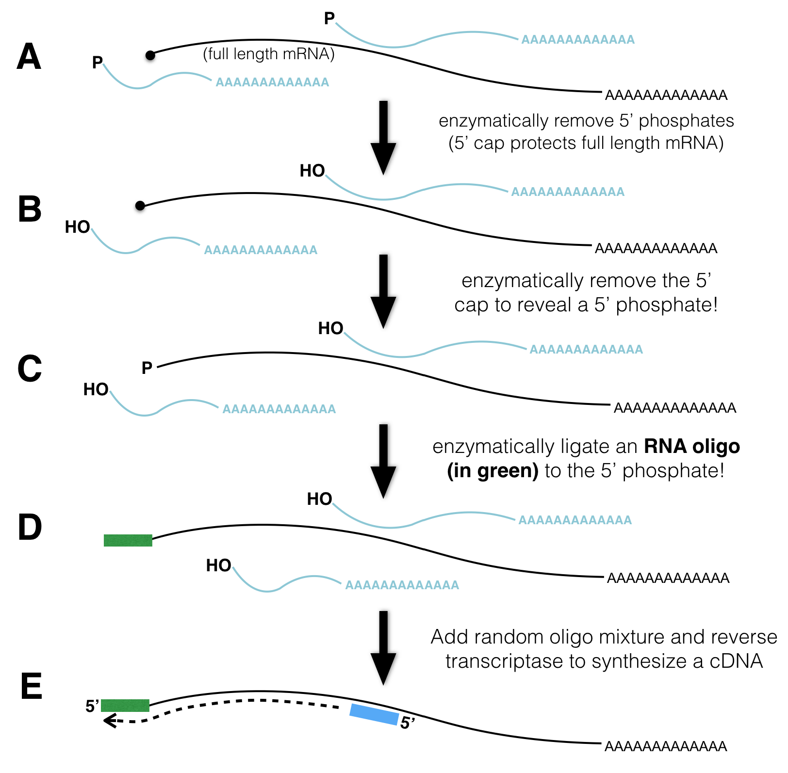
```
<br>

First, an enzyme that removes 5’ phosphates from *all* partially degraded RNA molecules is added to the tube. Full-length, capped mRNAs do not possess a 5’ phosphate and are thus not affected by this enzyme. Second, an enzyme that removes the 5’ cap from full length mRNAs is added next. Now, full-length mRNAs that were once capped possess a 5’ phosphate while partially degraded mRNAs do not! Third, an RNA oligo^[Short single-stranded RNA chain] and RNA ligase^[**RNA ligase** is similar to DNA ligase in that both require a 5’ phosphate and a 3’ hydroxyl to form a phosphodiester bond between two nucleic acid chains. The main difference: RNA ligase links two RNA chains together while DNA ligase links two DNA chains together]. As a result, the single-stranded **RNA** oligo is ligated to the 5’ end of only those RNAs that have 5’ phosphates. Finally, reverse transcriptase and random primers are added. As a result, *all* the RNA in the tube is used as template to synthesize cDNA (complementary DNA). Importantly, only those cDNAs that once had a 5' cap are tagged with a known sequence at their 3' ends. This sequence tag can now be exploited for sequencing as the sequencing reaction is primed with a DNA oligo that hybridizes to the sequence tag. The short sequence reads that are collected are then computationally aligned to the genome. 

## Why is TSS-seq useful?

As we saw in the previous chapter, RNA-Seq data can identify the position of exons, segments of the genome that were transcribed *and* remain in mRNA following splicing. RNA-seq data can also reveal how exons are linked together (with split alignments). That said, it is not always sufficient for gene identification purposes. To identify an individual transcription unit (a single gene) with more confidence, it is better to know the position of the exons *and* the TSS. To see this for yourself, review the RNAseq data corresponding to a small region of the genome (Figure \@ref(fig:RNAseqdataonly)). The NCBI Refseq gene prediction track is hidden on purpose. Can you determine how many genes are in this region? Why or why not? 

<br>
```{r RNAseqdataonly, out.width='100%', fig.align='center', fig.cap = "RNAseq data corresponding to a small region in the genome with the base position and gene prediction tracks hidden. Guess how many genes you think map to this region of the human genome. Continue reading below to discover the answer."}
knitr::opts_chunk$set(echo = FALSE)
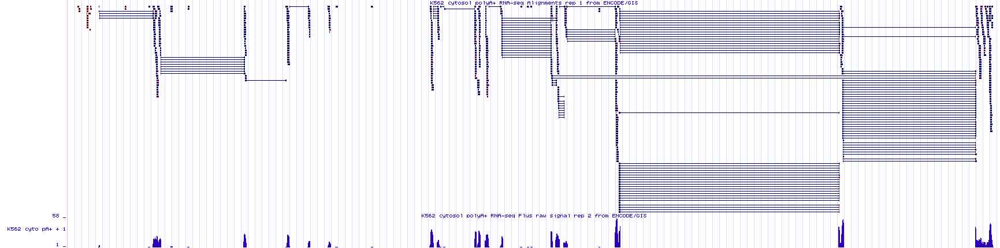
```
<br>

To see the true number of genes click [here](https://genome.ucsc.edu/s/megallegos/DPP3){target="_blank"}. This link takes you to the same genome region as in Figure \@ref(fig:RNAseqdataonly) but with the gene prediction and base position tracks visible. Did you guess right? 


## How is TSS-seq Data Visualized?
The UCSC Genome Browser contains numerous evidence tracks displaying TSS-seq data. We will focus on one that was generated by the FANTOM5 Consortium of labs in Japan (FANTOM stands for Functional Annotation of the Mammalian Genome). Click the link to learn more about [FANTOM5](http://fantom.gsc.riken.jp/){target="_blank"}. To view this evidence track click the [TSS-seq](https://genome.ucsc.edu/s/megallegos/Biol%20310%3A%20Module%202%20TSS%2Dseq){target="_blank"} session link. 

Your genome browser should now display the “Max Counts of CAGE^[CAGE is short for "**C**ap **A**nalysis **G**ene **E**xpression"] reads” evidence track for BBS1. This evidence track displays TSS-seq data in histogram form only (Figure \@ref(fig:TSSseqforBBS1)). The track settings are configured so that the Y-axis maximum is set to an absolute value of 350 read counts. Setting the Y-axis maximum to 350 is sufficient for most genes. For *highly* expressed genes it is better to set the Y-axis to "auto-scale to data view". Specifically, go to the track settings page. Scan down until you see "Data view scaling:". Change the pulldown menu from "use vertical viewing range setting" to "auto-scale to data view". Then click submit. If you do this for BBS1, the Y-axis should be considerably less. Before you move on, change the Y-axis back to "use vertical viewing range setting". If you forget, you may notice that TSSseq data is noisy. Single sequence reads that map to random positions in the genome are plentifal and can be ignored.

<br>
```{r TSSseqforBBS1, out.width='100%', fig.align='center', fig.cap = "TSSseq data for BBS1."}
knitr::opts_chunk$set(echo = FALSE)
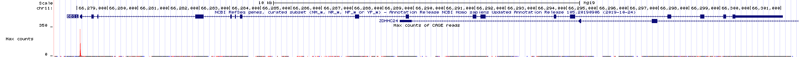
```
<br>

Zoom out 10X. The genome browser window is now focused on a larger portion of the genome surrounding BBS1 (Figure \@ref(fig:TSSseqfor10X)). Notice that there are both red peaks and blue peaks. There are also tall peaks and tiny peaks.

Recall that genes can be found on the top strand or the bottom strand as RNA polymerase can use either strand as template for transcription. If RNA polymerase uses the bottom strand as template then it moves from left to right (5' to 3') and produces an mRNA that *matches* the top strand sequence and is complementary to the bottom strand (the top strand is the informational strand). If RNA polymerase uses the top strand as template then it moves from right to left (also 5' to 3' relative to the bottom strand) and produces an mRNA that matches the *bottom strand* sequence (the bottom strand is the informational strand). Histrogram peaks displayed in **red** represent TSSes for top strand genes. Histogram peaks displayed in **blue** represent TSSes for bottom strand genes. 

The taller a histrogram peak at a given location, the more sequence reads that start at that spot. The more read counts, the more reliable the data and the more likely the data represents a true TSS. In fact, the tiny peaks observed in Figure \@ref(fig:TSSseqfor10X) (find each red asterix) may reflect background noise^[Molecular biology is messy. Each enzymatic step listed in Figure \@ref(fig:TSSseqsteps) is not likely to achieve 100% success. For example, partial mRNAs that fail to have their 5' phosphates removed can be sequenced along side all the true full-length mRNAs.] and may not represent a true TSS. Moreover, the *absence* of a peak at a location where one is predicted to exist does not mean that the gene prediction is incorrect. This might be an instance where the gene was not expressed in the tissue sample that was used to generate the TSS-seq data.  There is a common saying, **"Absence of evidence is not evidence of absence"**. 

<br>
```{r TSSseqfor10X, out.width='100%', fig.align='center', fig.cap = "TSSseq data of a larger region surrounding BBS1. Each asterix (my annotation) highlights sequence reads that are not likely to represent true transcriptional start sites."}
knitr::opts_chunk$set(echo = FALSE)
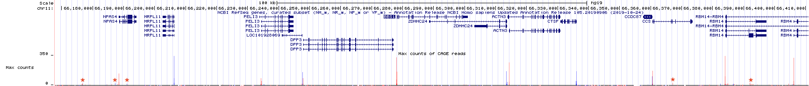
```
<br>

Now zoom in to the TSS for BBS1 (Figure \@ref(fig:TSSclose)). You can see that the position in the genome where the majority of *experimentally* defined TSSs are located is at the *predicted* transcriptional start site. This is not always the case. Also, notice that the transcriptional start sites for BBS1 are spread out to some degree. This is normal. 

<br>
```{r TSSclose, out.width='100%', fig.align='center', fig.cap = "A close up view of the TSS-seq histogram data surrounding the predicted **transcriptional** start site for BBS1 (as defined by the NCBI refseq evidence track). The **translational** start site of BBS1 is shown in green."}
knitr::opts_chunk$set(echo = FALSE)
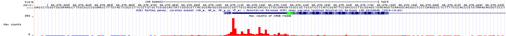
```
<br>

Again, this is a great example of an evidence track that provides unbiased experimental evidence for the existence of a gene. It provides the position of all transcriptional start sites (TSS) within the genome. Each TSS identified by TSS-seq was not predicted to exist but was experimentally determined without prior knowledge (no bias).

That said, TSSseq data is not always sufficient to determine the number of individual genes in a given region of the genome. For example, review the TSS-seq histogram data in (Figure \@ref(fig:TSSdataalone)) and try to predict the number of genes in this region. I have omitted the gene prediction track to illustrate a point. 
<br>
```{r TSSdataalone, out.width='100%', fig.align='center', fig.cap = "This is an image of the TSSseq evidence track for a small region of the human genome. All other tracks have been hidden. Count the number of transcription starts sites then guess how many genes you think these TSS peaks correspond to."}
knitr::opts_chunk$set(echo = FALSE)
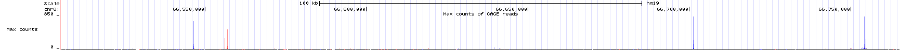
```
<br>

Now click [here](https://genome.ucsc.edu/s/megallegos/TSSproblem2){target="_blank"} to see how many genes there really are in the genomic region shown in Figure \@ref(fig:TSSdataalone). How does this differ from what you thought? Notice that the link has been configured to include the gene prediction track along with the RNA-seq and TSS-seq data tracks. Do you see how the RNA-seq data combined with the TSS-seq data provides a more complete picture of the true number of genes present? After all, there are genes that utilize alternative transcription *initiation* sites (Review ([Chapter 2](#chapter2)), "One gene, many splice variants")!


### [Test Your Understanding](https://docs.google.com/forms/d/e/1FAIpQLSeqnQfdqFYzX32YzqgbZoToWZ-mPgjzn84ptA5UldGHJmYHPA/viewform?usp=publish-editor){target="_blank"}
<style>
div.blue {background-color:#e6f0ff}
</style>
<div class = "blue">

**Some of the TYU questions will require the TSS-seq data displayed in the figure below (NOTE that the gene prediction track is hidden).** To enlarge click on the image. 
<br>
```{r TSSdataalone2, out.width='100%', fig.align='center'}
knitr::opts_chunk$set(echo = FALSE)
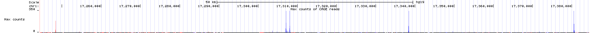
```

Click on the link above to see the questions.
<br>
</div>

## How does a cell know where to initiate transcription? 
One might assume that a transcriptional start site (TSS) identified by TSSseq, also reveals the site of a core promoter where general transcription factors (GTFs) bind and recruit RNA polymerase II ((Figure \@ref(fig:80nt)). 

<br>
```{r 80nt, out.width='75%', fig.align='center', fig.cap = "A schematic of a focused core promoter and the GTFs/RNA polymerase II that bind to it. The horizontal line is the genomic DNA. **TATA**, **Inr**, **MTE** and **DPE** are DNA sequence motifs positioned along the core promoter as shown. The **Inr** spans the TSS (+1) while the **TATA-box** is upstream and the **MTE** and **DPE** motifs are downstream.  Image from Danino et al. 2015."}
knitr::opts_chunk$set(echo = FALSE)
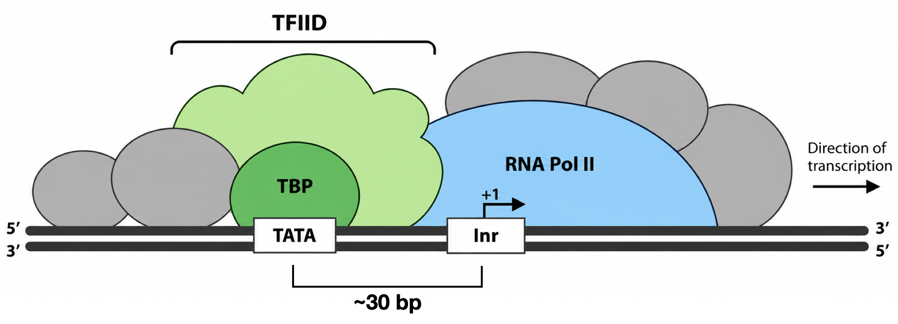
```
<br>

Our understanding of core-promoter sequence motifs is based largely on a limited set of experimentally tractable promoters—especially viral promoters and highly expressed cellular genes such as HBB. Many of these promoters exhibit focused transcription initiation, in which transcription begins predominantly at one or a few closely spaced TSSs. Consequently, the canonical motifs identified from these studies may not represent all RNA polymerase II promoters. A substantial fraction of mammalian promoters exhibit dispersed initiation, with transcription beginning across a broader region and often lacking a clearly defined combination of core-promoter motifs (Figure \@ref(fig:promotertypes)).

<br>
```{r promotertypes, out.width='100%', fig.align='center', fig.cap = "The left schematic from Vo ngoc et al. 2017 illustrates the three main types of promoters that are found in animals: Focused, Dispersed and Mixed. The right image from Carninci et al. 2006 displays TSS seq data for a number of genes that illustrate each type of promoter."}
knitr::opts_chunk$set(echo = FALSE)
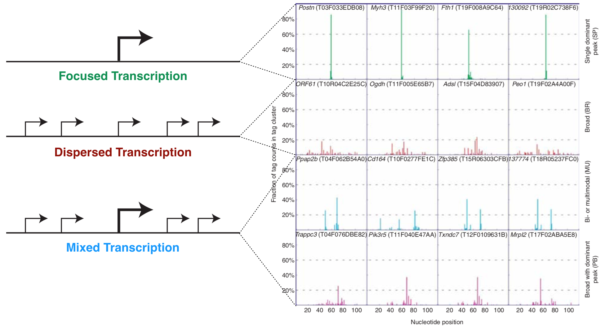
```
<br>

One of the first core promoter motif identified was the so-called **TATA-box**, an A/T rich motif bound by TBP or "TATA binding protein". TBP is a single polypeptide that is part of a larger protein complex, or GTF called TFIID (for Transcription Factor of RNA polymerase II, factor D). TBP/TFIID binding initiates a cascade of events that ultimately leads to formation of a preinitiation complex (PIC) at the TSS. Initially, the TATA-box was thought to be an essential motif that *most* core promoters possess. We now know it is only present in a minority of core promoters. For example, only 24% of human genes have a TATA-box. The core promoter motif found *most often* is the **Initiator** (Inr). This DNA motif spans the TSS and also helps recruit TFIID. That said, nearly half of human promoters lack both a TATA-box *and* an Inr! The take home message? ***There may not be even one universal sequence motif required for transcription initiation in Eukaryotes.*** This despite the fact that TBP does appear to be universally required for all transcription (RNA pol I, pol II and pol III)!

## Consensus Sequences
Sequence conservation can highlight which nucleotides are critical for trans-acting factor binding^[I am deliberately vague here as the trans-acting factor, a freely diffusible molecule might be a protein, nucleic acid sequence or small molecule] as "conservation indicates that a sequence has been maintained by natural selection"^[Quote from Wikipedia article about conserved sequences]. That said, sequence conservation is rarely absolute. For example, the actual sequence of a core promoter motif is variable to some degree. By creating a multiple sequence alignment of a conserved motif (ie. the TATA-box), one can evaluate the degree of conservation and create a **consensus sequence**. A consensus sequence (also known as a **canonical sequence**) can be defined as the “the most frequent residues, either nucleotide or amino acid, that are found at each position in a multiple sequence alignment” (Wikipedia). For a simple example, see Figure \@ref(fig:consensusonly). Notice that the multiple sequence alignment contains only G, A, T and C while this consensus sequence contains additional letters (Y, N and R). Y,N and R belong to an agreed upon list of [**IUPAC nucleotide codes**](https://www.bioinformatics.org/sms/iupac.html){target="_blank"} also known as IUPAC ambiguity codes. Here, Y = C or T, N = any nucleotide and R = G or A. 


```{r consensusonly, out.width='50%', fig.align='center', fig.cap = "This is a simple multiple sequence alignment (MSA) that includes only 4 sequences. The consensus sequence corresponding to this alignment is written directly below. It was created by examining the observed frequency of each nucleotide present in each column of sequence in the MSA."}
knitr::opts_chunk$set(echo = FALSE)
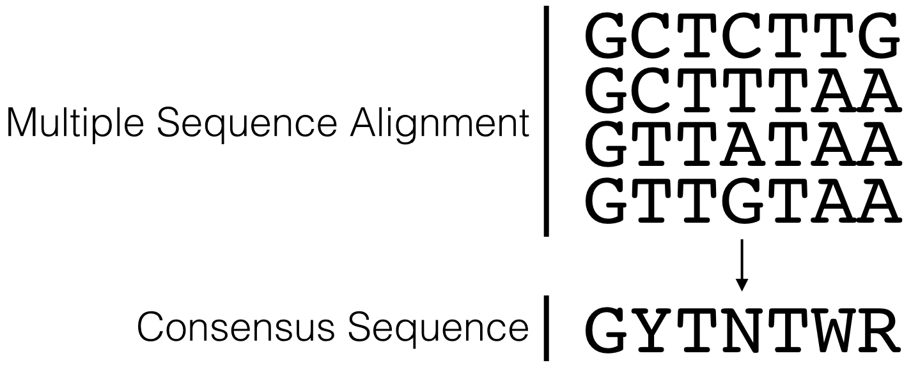
```
<br>

Figure \@ref(fig:CoreConsensus) lists the consensus sequences for each core promoter motif bound by TFIID in mammals. In this figure the **Inr** consensus sequence is listed as **BBCA(+1)BW** (where B = C, G or T; W= A or T and the A is at the +1 position of the TSS). That said, there have been so many exceptions to this consensus sequence that some argue it should be reduced to YR(+1) where R is at the +1 position of the TSS (Haberle and Stark 2018)! My feeling is that this consensus sequence is so short and degenerate that it ceases to be useful. Probability suggests that this motif should present in the genome (on average) every 4 bp *just by chance* (1/2 x 1/2 = 1/4). 

<br>
```{r CoreConsensus, out.width='75%', fig.align='center', fig.cap = "A list of the consensus sequences for each core promoter motif bound by TFIID in mammals."}
knitr::opts_chunk$set(echo = FALSE)
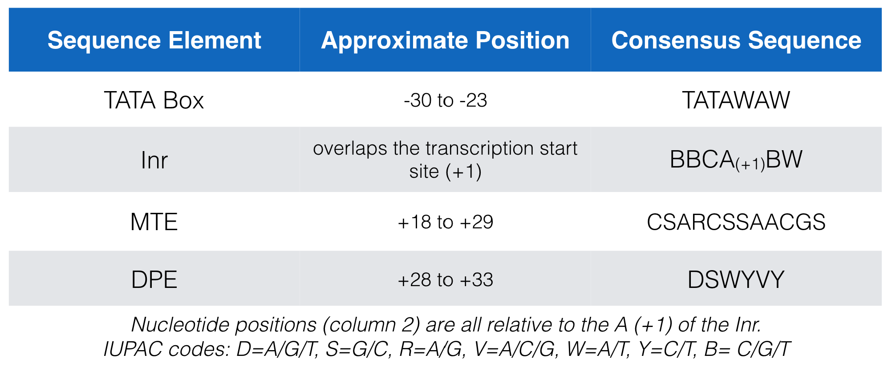
```
<br>

## Searching for a consensus sequence
You can search for a consensus sequence containing IUPAC codes using an evidence track called, "Short Match". Before you open Short Match, open the saved ["TSS-Seq" Session](https://genome.ucsc.edu/s/megallegos/Biol%20310%3A%20Module%202%20TSS%2Dseq){target="_blank"} then zoom in to view the sequence surrounding the TSS for BBS1. Now scroll down to find an evidence track entitled, **"Short Match"** (1) within the section entitled, **"Mapping and Sequencing"** (Figure \@ref(fig:ShortMatch)). Change this evidence track from "hide" to "pack" and click "refresh" (2). A new evidence track will open (3). Click on the gray rectangle at left to open the track settings page for this track (4). 
<br>
```{r ShortMatch, out.width='100%', fig.align='center', fig.cap = "How to search for a consensus sequence: 1) change the **Short Match** evidence track from **hide** to **pack**. 2) Click **Refresh**. 3) A new evidence track will open. 4) Click on the gray rectangle to open the track settings page. Now see figure below."}
knitr::opts_chunk$set(echo = FALSE)
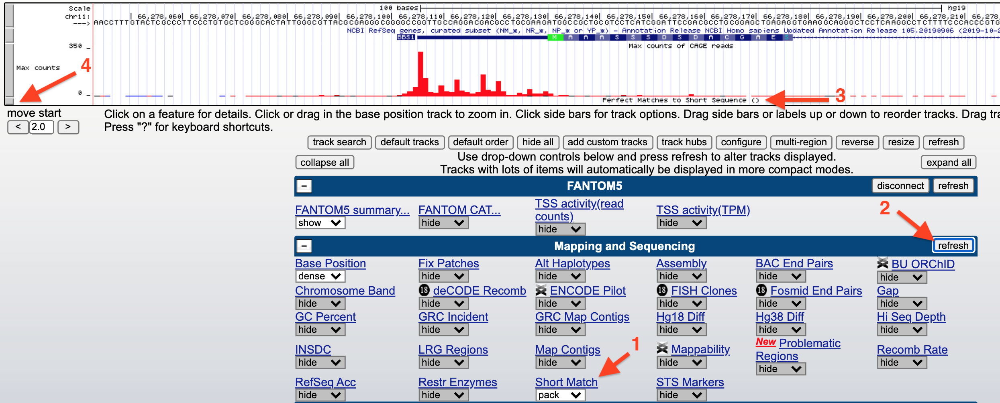
```
<br>

Finally, input any sequence (i.e. ATG) into the search window (1) provided at the Track Settings page for Short Match (Figure \@ref(fig:ShortMatchWindow)) then hit "Submit" (2).
<br>

<br>
```{r ShortMatchWindow, out.width='60%', fig.align='center', fig.cap = "1) Enter a consensus sequence in the window provided. 2) Click Submit."}
knitr::opts_chunk$set(echo = FALSE)
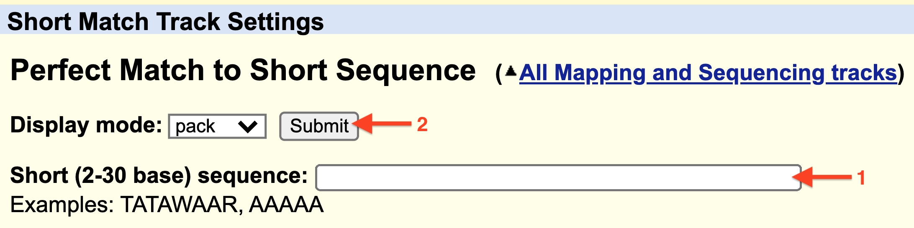
```
<br>

In Figure \@ref(fig:InrEx), I searched for the **Inr** consensus sequence, BBCA(+1)BW, in the genomic region surrounding the human gene (CCT2) TSS. Each match is displayed in the Short Match evidence track as a thick black line. The position (i.e. 69,979,214) and orientation (- or +) of each match is written on the left of each line. In this example, the putative^[potential, possible, not experimentally proven without a doubt but some evidence in support of the possibility] Inr is the one highlighted with a red asterisk. What is my evidence? This is the only Inr consensus sequence that spans the predicted and experimentally-defined TSS at position 69,979,236. It is also found on the plus strand of the genomic DNA and CCT2 is a plus strand gene. Finally, the "A" of the consensus sequence is positioned at the predicted *and* experimentally defined TSS (See red circle in Figure \@ref(fig:InrEx)). 
<br>
<br>
```{r InrEx, out.width='100%', fig.align='center', fig.cap = "Horizonatal black bars within the 'Short Match' evidence track describe the position of each consensus sequence (BBCA(+1)BW) found within this genomic region. Information about the precise nucleotide position and orientation is provided on the left (see boxed consensus on the left). The putative Inr for CCT2 is highlighted with a red asterix. This consensus sequence is found on the plus strand (same as CCT2) and is positioned directly below the experimentally defined TSS at 69,979,236 with the A at the putative +1 position."}
knitr::opts_chunk$set(echo = FALSE)
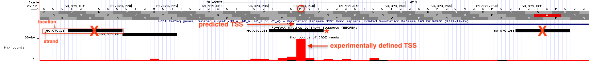
```
<br>

### [Test your understanding](https://docs.google.com/forms/d/e/1FAIpQLSehhRv5LIMoG46n6oDV-KeJYzJ2Krx48XH4efRh2eIcITsZjg/viewform?usp=publish-editor){target="_blank"}
<style>
div.blue {background-color:#e6f0ff}
</style>
<div class = "blue">
<br>
*Click the link above to see the TYU questions.* 
<br>


## Sequence Logos
Sequence conservation, trends and patterns revealed by a multiple sequence alignment (MSA) can also be visualized with a “sequence logo” where the predominant residue is drawn as the tallest and placed at the top among all the residues found at a given position in an alignment. For example, let's say at position 3 of an MSA there is a T in every single sequence (For a simple example see Figure \@ref(fig:MSAdisplays)). In a sequence logo, this would be displayed as a T of maximum height (illustrating that the T in that position is invariant and important). Now let's say position 6 has an A in 75% of the sequences and a T in the remaining 25%. At this position of a sequence logo you would see an A on top of the T, the A would be proportionally larger than the T but the overall height of the two letters combined would be shorter than the T in position 3. And in the extreme case where G, A, T or C are found in equal proportion that position in the sequence logo would be left blank (see position 4 in Figure \@ref(fig:MSAdisplays))! This indicates that that position of the alignment is utterly uninformative. In a traditional consensus sequence using IUPAC codes, this would be written as "N" for any nucleotide. One can also draw a sequence logo using *frequency* for the Y-axis. This type of sequence logo is more intuitive but many think it is less able to emphasize important sequence trends. What do you think? 
<br>
```{r MSAdisplays, out.width='50%', fig.align='center', fig.cap = "The hypothetical multiple sequence alignment is redrawn as a consensus sequence including IUPAC codes, or as a sequence logo with either information bits or frequency as the Y axis."}
knitr::opts_chunk$set(echo = FALSE)
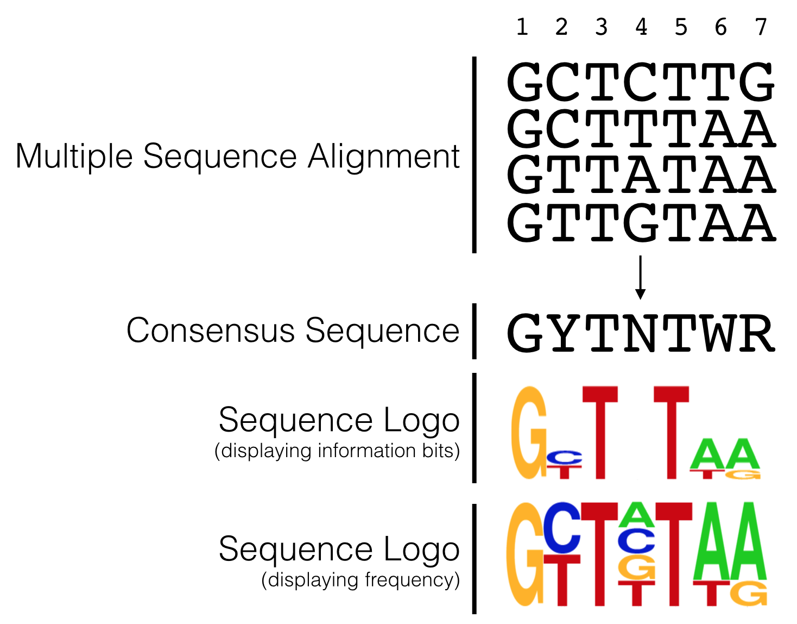
```
<br>

In 2006, Carninci et al. performed an unbiased, systematic analysis of *all* core promoter sequences identified by TSS-seq data obtained from RNA extracted multiple human tissue types. In their analysis confirmed the diversity of promoter types classifying them into four discrete categories (Figure \@ref(fig:promotertypes)) including the two extremes: Single Predominant Peak (SP) and Broad Peak (BR). They aligned core promoter sequences by category, placing the +1 position of the TSS in a single column then adding the surrounding sequences to create a large multiple sequence alignment. They then created a sequence logo for each multiple sequence alignment (MSA). Two are displayed in Figure \@ref(fig:SequenceLogo). As you can see, the SP promoters are more likely to contain a TATA-box-like sequence about 30 nt upstream of the so-called Inr and there is a strong bias for a purine (G or A) at the +1 position of the TSS. Broad Peak (BR) promoters were found to be similar to SP promoters only in that they have a a strong bias for a purine at the +1 position of the TSS but they clearly lack a TATA-box and are enriched overall with Gs and Cs. Take home message: **There are no universal promoter motifs. There may be sequence trends but there is a tremendous amount of sequence diversity at the core promoter.** Clearly it would be very difficult to identify genes based solely on the presence of conserved core promoter sequence motifs. 

What I have not discussed in this chapter is how a cell "knows" when and which tissue a gene should be transcribed. That requires far more than the core promoter sequence and can sometimes involves DNA sequence on other chromosomes! This is a topic for another course. 

```{r SequenceLogo, out.width='100%', fig.align='center', fig.cap = "Sequence Logos for Single Predominent Peak (SP) and Broad Peak (BR) promoter types. The position of the TATA-box and Inr are highlighted in the SP class of promoters. The +1 represents the TSS."}
knitr::opts_chunk$set(echo = FALSE)
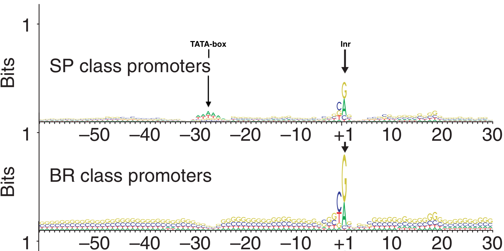
```
<br>

### [Test Your Understanding](https://docs.google.com/forms/d/e/1FAIpQLSfLGc-5Ia8ANgVMtwTcDisybcfW3eG9rhLFqfFqeKoZVjVTbQ/viewform?usp=publish-editor){target="_blank"}
<style>
div.blue {background-color:#e6f0ff}
</style>
<div class = "blue">
<br>
*Click the link above to see the TYU questions.* 
<br>

### [For Discussion](https://docs.google.com/forms/d/e/1FAIpQLSdW3g9FoPAqvmPJwflskUWyCNuUKPcA7FUQ3AiRJbtPYUd04g/viewform?usp=dialog){target="_blank"} 

Click link to see the discussion questions.
<br>

## Take Home Messages
- TSS-seq data is similar to RNA-seq data but with TSS-seq only the mRNA segment closest to the 5’ cap is sequenced.
<br>
- Whereas TSS-seq data identifies transcription start sites (TSS) of expressed genes, RNA-seq identifies exons. 
<br>
- Finally, TSS-seq data combined with RNA-seq data is able to identify each transcription unit with more confidence. 
<br>

© `r as.numeric(format(Sys.Date(), "%Y"))`, Maria Gallegos. All rights reserved.


<style>
p.caption {
  font-size: 0.8em;
  margin-right: 2%;
  margin-left: 2%;
  line-height: 1.2em;
  text-align: left;
}
</style>

<script src="https://ajax.googleapis.com/ajax/libs/jquery/3.1.1/jquery.min.js"></script>

<style>
.zoomDiv {
  opacity: 0;
  position:absolute;
  top: 50%;
  left: 50%;
  z-index: 50;
  transform: translate(-50%, -50%);
  box-shadow: 0px 0px 50px #888888;
  max-height:100%; 
  overflow: scroll;
}

.zoomImg {
  width: 100%;
}
</style>


<script type="text/javascript">
  $(document).ready(function() {
    $('body').prepend("<div class=\"zoomDiv\"></div>");
    // onClick function for all plots (img's)
    $('img:not(.zoomImg)').click(function() {
      $('.zoomImg').attr('src', $(this).attr('src'));
      $('.zoomDiv').css({opacity: '1', width: '100%'});
    });
    // onClick function for zoomImg
    $('img.zoomImg').click(function() {
      $('.zoomDiv').css({opacity: '0', width: '0%'});
    });
  });
</script>
