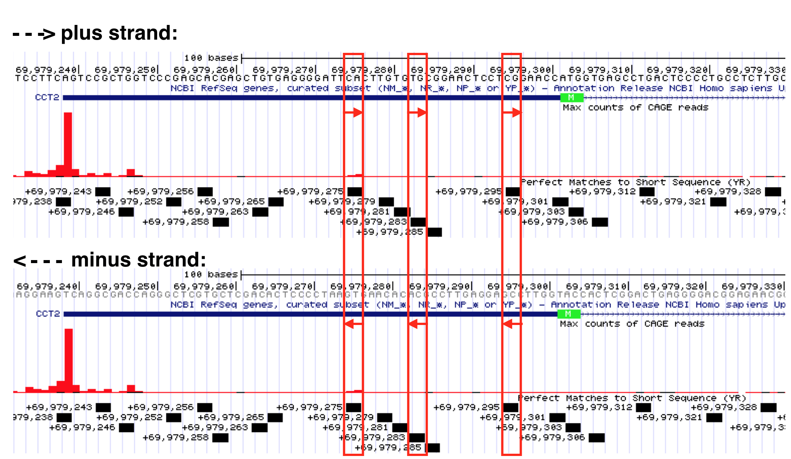
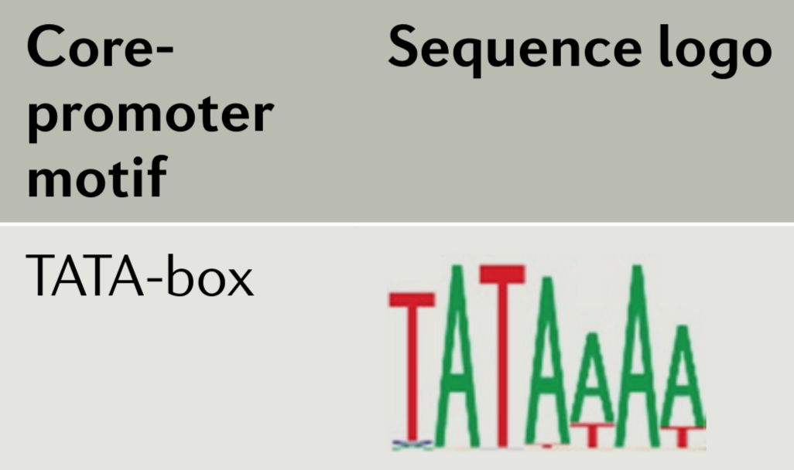

# *DNA motifs for transcription initiation*

The expression of a gene starts with **transcription**. During transcription, one contiguous segment of genomic DNA is used to make a single RNA transcript. But how does the transcription machinery know where transcription should begin? This chapter reviews what we know about DNA sequences that promote transcription initiation and how these sequences provide bioinformatic evidence (albeit weak) for the position of genes in the genome. To follow along in the text and to answer "Test Your Understanding" questions, use the saved ["TSS-Seq" Session](https://genome.ucsc.edu/s/megallegos/Biol%20310%3A%20Module%202%20TSS%2Dseq){target="_blank"} link I created for you.

## The Core Promoter

There are five different RNA polymerases that catalyze transcription in eukaryotes (RNA Pol I, II, III IV and V). Transcription of protein coding genes, like BBS1, require RNA Pol II and will be our focus. Transcription begins once RNA pol II binds near a transcriptional start site (TSS) of a gene. But RNA polymerase II on its own cannot recognize a TSS. Transcription initiation also requires a number of so-called General Transcription Factors or GTFs ^[GTFs for RNA polymerase II include TFIIA, B, D, E, F and H. Each GTF is a complex of proteins. For example, TFIID consists of 15 individual polypeptides encoded by 15 genes] and a core promoter sequence. 

A core promoter is defined as the minimal DNA sequence that directs accurate initiation of transcription. There are two main types of core promoters: focused and dispersed (Danino et al. 2015). A focused core promoter (also called a “sharp peak” or “narrow peak” promoter) contains a single predominant TSS that is confined to a small number of nucleotides. A dispersed promoter, by contrast, contains a large number of transcriptional start sites of equal potency that are dispersed over a 50 to 100 nucleotide region. This type of promoter is also called a "broad peak" or “wide peak” promoter. Both terms “sharp peak” and “broad peak” essentially describe the shape of TSS-seq histrogram data (See Chapter Four). In reality, TSS-seq data and other genome-wide studies of transcription initiation indicate that these two types of core promoters are in fact two ends of a continuum. In other words, promoter types cannot be categorized easily and also include promoters of mixed character (i.e. “broad with peak”) (Figure \@ref(fig:promotertypes)).

<br>
```{r promotertypes, out.width='100%', fig.align='center', fig.cap = "The left schematic from Vo ngoc et al. 2017 illustrates the three main types of promoters that are found in animals: Focused, Dispersed and Mixed. The right image from Carninci et al. 2006 displays TSS seq data for a number of genes that illustrate each type of promoter."}
knitr::opts_chunk$set(echo = FALSE)
knitr::include_graphics('static/images/TypesofPromoters.png')
```
<br>

Focused core promoters were the first described and are the best understood. In humans, they are about 80 nt in length and flank^[extend both upstream and downstream of the TSS] the TSS, the so-called +1 position of transcription (Figure \@ref(fig:80nt)). Each includes a set of short, DNA sequences called core promoter motifs^[Sequence motifs are short, recurring patterns in DNA that are presumed to have a biological function. Often they indicate sequence-specific binding sites for proteins - D'haeseleer 2006]. These DNA motifs serve as binding sites for a subset of GTFs (namely TFIID and TFIIB). Once TFIID and TFIIB bind a focused core promoter, they recruit and stabilize other GTFs which together recruit and stabilize RNA polymerase II to the TSS. This large, multiprotien complex (called the preinitiation complex or PIC) initiates **basal levels of transcription**^[formally defined as the level of transcription observed in an *in vitro* transcription system where only DNA containing a core promoter, an RNA polymerase II and GTFs are added. In other words, the level of transcription that is detected in the absence of other proteins that enhance or repress transcription (so called transcription factors).]. In fact, GTFs are also called Basal Transcription Factors. 

<br>
```{r 80nt, out.width='75%', fig.align='center', fig.cap = "A schematic of a focused core promoter and the GTFs/RNA polymerase II that bind to it. The horizontal line is the genomic DNA. **TATA**, **Inr**, **MTE** and **DPE** are DNA sequence motifs positioned along the core promoter as shown. The **Inr** spans the TSS (+1) while the **TATA-box** is upstream and the **MTE** and **DPE** motifs are downstream.  Image from Danino et al. 2015."}
knitr::opts_chunk$set(echo = FALSE)
knitr::include_graphics('static/images/FCorePromoter.png')
```
<br>

The first core promoter motif identified was the **TATA-box**. The TATA-box recruits TFIID to the core promoter. Initially, the TATA-box was thought to be an essential motif that *all* core promoters possess (Read any textbook). We now know they are only present in a minority of core promoters. For example, only 24% of human genes have a TATA-box. The core promoter motif found *most often* is the **Initiator** (Inr). This DNA motif spans the TSS and also recruits TFIID. That said, nearly half of human promoters lack both a TATA-box *and* an Inr! The take home message? ***There are no universal sequence motif required for transcription initiation in Eukaryotes.*** Not only that, but the sequence of each core promoter motif (i.e. Inr) is somewhat variable. For example, the TATA-box in ACTA2 is **TATATAA** while the TATA-box in HERPUD1 is **TATAAAA** (two distinct human genes).

## What is a Consensus Sequence?
By aligning a large number of well-characterized sequence motifs, one can search for sequence patterns and/or regions of sequence conservation^[In evolutionary biology, conserved sequences are identical or similar sequences (DNA RNA or protein) across species (orthologous sequences) or within a genome (paralogous sequences). Conservation can indicate that a sequence has been maintained by natural selection. A highly conserved sequence suggests that it has remained relatively unchanged far back up the phylogenetic tree, and hence far back in geological time - paraphrased from the "Conserved sequence" article from Wikipedia]. Any region of conservation or pattern observed can then be written as a **consensus sequence**. A consensus sequence (also known as a **canonical sequence**) is defined as the “the most frequent residues, either nucleotide or amino acid, that is found at each position in a multiple sequence alignment” (Wikipedia). For a simple example, see Figure \@ref(fig:consensusonly). Notice that the multiple sequence alignment contains only G, A, T and C while the consensus sequence contains additional letters (Y, N and R). Y,N and R belong to an agreed upon list of [**IUPAC nucleotide codes**](https://www.bioinformatics.org/sms/iupac.html){target="_blank"} also known as IUPAC ambiguity codes. Here, Y = C or T, N = any nucleotide and R = G or A. 


```{r consensusonly, out.width='50%', fig.align='center', fig.cap = "This is a simple multiple sequence alignment (MSA) that includes only 4 sequences. The consensus sequence corresponding to this alignment is written directly below. It was created by examining the observed frequency of each nucleotide present in each column of sequence in the MSA."}
knitr::opts_chunk$set(echo = FALSE)
knitr::include_graphics('static/images/MSA_Consensus.png')
```
<br>
Figure \@ref(fig:CoreConsensus) lists the consensus sequences for each core promoter motif bound by TFIID in mammals. In this figure the **Inr** consensus sequence is listed as **BBCA(+1)BW** (where B = C, G or T; W= A or T and the A is at the +1 position of the TSS). That said, there have been so many exceptions to this consensus sequence that some argue it should be reduced to YR where Y = C or T and R is at the +1 position of the TSS (Haberle and Stark 2018)^[The consensus sequence can vary depending on the size and quality of the sequence motif set used to create the multiple sequence alignment]!

<br>
```{r CoreConsensus, out.width='75%', fig.align='center', fig.cap = "A list of the consensus sequences for each core promoter motif bound by TFIID in mammals."}
knitr::opts_chunk$set(echo = FALSE)
knitr::include_graphics('static/images/CoreConsensusHuman.png')
```
<br>

## Searching for a consensus sequence
You can search for a consensus sequence containing IUPAC codes using an evidence track called, "Short Match". Before you open Short Match, open the saved ["TSS-Seq" Session](https://genome.ucsc.edu/s/megallegos/Biol%20310%3A%20Module%202%20TSS%2Dseq){target="_blank"} then zoom in to view the sequence surrounding the TSS for BBS1. Now scroll down to find an evidence track entitled, **"Short Match"** (1) within the section entitled, **"Mapping and Sequencing"** (Figure \@ref(fig:ShortMatch)). Change this evidence track from "hide" to "pack" and click "refresh" (2). A new evidence track will open (3). Click on the gray rectangle at left to open the track settings page for this track (4). 
<br>
```{r ShortMatch, out.width='100%', fig.align='center', fig.cap = "How to search for a consensus sequence: 1) change the **Short Match** evidence track from **hide** to **pack**. 2) Click **Refresh**. 3) A new evidence track will open. 4) Click on the gray rectangle to open the track settings page. Now see figure below."}
knitr::opts_chunk$set(echo = FALSE)
knitr::include_graphics('static/images/ShortMatchSetup.png')
```
<br>
Finally, input any sequence (i.e. ATG) into the search window (1) provided at the Track Settings page for Short Match (Figure \@ref(fig:ShortMatchWindow)) then hit "Submit" (2).
<br>
<br>
```{r ShortMatchWindow, out.width='60%', fig.align='center', fig.cap = "1) Enter a consensus sequence in the window provided. 2) Click Submit."}
knitr::opts_chunk$set(echo = FALSE)
knitr::include_graphics('static/images/EnterConsensus.png')
```
<br>

In Figure \@ref(fig:InrEx), I searched for the **Inr** consensus sequence, BBCA(+1)BW, in the genomic region surrounding the human gene (CCT2) TSS. Each match is displayed in the Short Match evidence track as a thick black line. The position (i.e. 69,979,214) and orientation (- or +) of each match is written on the left of each line. In this example, the putative^[potential, possible, not experimentally proven without a doubt but some evidence in support of the possibility] Inr is the one highlighted with a red asterisk. What is my evidence? This is the only Inr consensus sequence that spans the predicted and experimentally-defined TSS at position 69,979,236. It is also found on the plus strand of the genomic DNA and CCT2 is a plus strand gene. Finally, the "A" of the consensus sequence is positioned at the predicted *and* experimentally defined TSS (See red circle in Figure \@ref(fig:InrEx)). 
<br>
<br>
```{r InrEx, out.width='100%', fig.align='center', fig.cap = "Horizonatal black bars within the 'Short Match' evidence track describe the position of each consensus sequence (BBCA(+1)BW) found within this genomic region. Information about the precise nucleotide position and orientation is provided on the left (see boxed consensus on the left). The putative Inr for CCT2 is highlighted with a red asterix. This consensus sequence is found on the plus strand (same as CCT2) and is positioned directly below the experimentally defined TSS at 69,979,236 with the A at the putative +1 position."}
knitr::opts_chunk$set(echo = FALSE)
knitr::include_graphics('static/images/Inr_Example.png')
```
<br>
Now look what happens when I search for the degenerate **Inr** consensus sequence (YR). This is an extremely short consensus sequence and so many are expected to be present in any genomic region just by chance. That said, ALL the motifs found by Short Match are labeled as + strand!!! You should know intuitively this is impossible. There MUST be YR sequences on the bottom strand, too. In fact, Y (C/T) is complementary to R (G/A). Thus, where a YR sequence is found on the plus strand a YR sequence will *always* be found on the bottom strand. You can see this for yourself in Figure \@ref(fig:YR). Remember to read the bottom strand from right to left (5' to 3'). For example, a CA dinucleotide in the top strand is a YR consensus sequence but so is its complementary sequence in the bottom strand: TG.

```{r YR, out.width='100%', fig.align='center', fig.cap = "Select YR consensus sequences identified by the Short Match evidence track are boxed in red. Recall, Y = C or T while R=G or A. If you read the top strand sequence (from left to right) you can confirm that each is a YR consensus sequence. If you read the sequence (from right to left) for the exact same position in the minus strand, you will see it is also a YR sequence. Why do they label all YR Short Matches as plus strand? Convenience? I don't know."}
knitr::opts_chunk$set(echo = FALSE)

```
<br>


### [Test your understanding](https://docs.google.com/forms/d/e/1FAIpQLSc4NEqD8He-jer_Qa2zWL5ruhK_J8FJxp5MJ8DOL14UpEimDA/viewform?usp=sf_link){target="_blank"}
<style>
div.blue {background-color:#e6f0ff}
</style>
<div class = "blue">

- *Use [IUPAC nucleotide codes](https://www.bioinformatics.org/sms/iupac.html){target="_blank"} to rewrite the following consensus sequence: T/A, G/A/C, A, G/A, C/T, T, G/A/T/C, T (where "/" = "or").*
<br>

**For the following questions start with the ["TSS-Seq"](https://genome.ucsc.edu/s/megallegos/Biol%20310%3A%20Module%202%20TSS%2Dseq){target="_blank"} session link, zoom into the region containing the BBS1 TSS then change the Short Match evidence track from "hide" to "pack". Remember the core promoter is defined as the region that includes the TSS plus 40 nt upstream and downstream (80 nt in total).** 
<br>

- *Use the ShortMatch evidence track to search for a canonical TATA-box consensus sequence (TATAWAW) within the BBS1 core promoter region. If one or more are found,* 
<br>
-- *Are any on the plus strand as expected?*
<br>
-- *Are any of the plus strand motifs positioned approximately 30 nt upstream of the predicted TSS as expected?*
<br>
- *Use the Short Match evidence track to search for a canonical Inr consensus sequence (BBCABW) within the BBS1 core promoter region. If one or more are found,*
<br>
-- *Are any on the plus strand as expected?*
<br>
-- *Do any of the plus strand motifs span the TSS as expected?*
<br>
- *If a BBCABW consensus sequence is NOT found spanning the the TSS of BBS1, is there a degenerate Inr consensus sequence (YR) spanning the TSS as expected?*
<br>
- *Use the Short Match evidence track to search for a canonical MTE consensus sequence (CSARCSSAACGS) within the BBS1 core promoter region. If one or more are found,*
<br>
-- *Are any on the plus strand as expected?*
<br>
-- *Are any of the plus strand motifs positioned downstream of the TSS as expected?*
<br>
- *Use the Short Match evidence track to search for a canonical DPE consensus sequence (DSWYVY) within the BBS1 core promoter region. If one or more are found,* 
<br>
-- *Are any on the plus strand as expected?*
<br>
-- *Are any of the plus strand motifs positioned downstream of the TSS as expected?*
<br>
</div>

### [Test your understanding](https://docs.google.com/forms/d/e/1FAIpQLSfMGNjfgSnl-GVNBXiKnLIA0yDvAZKE9kAO11CqdXAPRDa3Gw/viewform?usp=sf_link){target="_blank"}
<style>
div.blue {background-color:#e6f0ff}
</style>
<div class = "blue">

**For the following questions start with the ["TSS-Seq"](https://genome.ucsc.edu/s/megallegos/Biol%20310%3A%20Module%202%20TSS%2Dseq){target="_blank"} session link, zoom into the region containing the MYH3 TSS then change the Short Match evidence track from "hide" to "pack". Remember the core promoter is defined as the region that includes the TSS plus 40 nt upstream and downstream (80 nt in total). Also, MYH3 is a minus strand gene.** 
<br>

- *Use the ShortMatch evidence track to search for a canonical TATA-box consensus sequence (TATAWAW) within the MYH3 core promoter region. If one or more are found,* 
<br>
-- *Are any on the minus strand as expected?*
<br>
-- *Are any of the minus strand motifs positioned approximately 30 nt upstream of the predicted TSS as expected?*
<br>
- *Use the Short Match evidence track to search for a canonical Inr consensus sequence (BBCABW) within the MYH3 core promoter region. If one or more are found,*
<br>
-- *Are any on the minus strand as expected?*
<br>
-- *Do any of the minus strand motifs span the TSS as expected?*
<br>
- *If a BBCABW consensus sequence is NOT found spanning the the TSS of MYH3, is there a degenerate Inr consensus sequence (YR) spanning the TSS as expected?*
<br>
- *Use the Short Match evidence track to search for a canonical MTE consensus sequence (CSARCSSAACGS) within the MYH3 core promoter region. If one or more are found,*
<br>
-- *Are any on the minus strand as expected?*
<br>
-- *Are any of the minus strand motifs positioned downstream of the TSS as expected?*
<br>
- *Use the Short Match evidence track to search for a canonical DPE consensus sequence (DSWYVY) within the MYH3 core promoter region. If one or more are found,* 
<br>
-- *Are any on the minus strand as expected?*
<br>
-- *Are any of the minus strand motifs positioned downstream of the TSS as expected?*
<br>
</div>

## Sequence Logos
Sequence conservation, trends and patterns revealed by a multiple sequence alignment (MSA) can also be visualized with a “sequence logo” where the predominant residue is drawn as the tallest and placed at the top among all the residues found at a given position in an alignment. For example, let's say at position 3 of an MSA there is a T in every single sequence (For a simple example see Figure \@ref(fig:MSAdisplays)). In a sequence logo, this would be displayed as a T of maximum height (illustrating that the T in that position is invariant and important). Now let's say position 6 has an A in 75% of the sequences and a T in the remaining 25%. At this position of a sequence logo you would see an A on top of the T, the A would be proportionally larger than the T but the overall height of the two letters combined would be shorter than the T in position 3. And in the extreme case where G, A, T or C are found in equal proportion that position in the sequence logo would be left blank (see position 4 in Figure \@ref(fig:MSAdisplays))! This indicates that that position of the alignment is utterly uninformative. In a traditional consensus sequence using IUPAC codes, this would be written as "N" for any nucleotide. One can also draw a sequence logo using *frequency* for the Y-axis. This type of sequence logo is more intuitive but many think it is less able to emphasize important sequence trends. What do you think? 
<br>
```{r MSAdisplays, out.width='50%', fig.align='center', fig.cap = "The hypothetical multiple sequence alignment is redrawn as a consensus sequence including IUPAC codes, or as a sequence logo with either information bits or frequency as the Y axis."}
knitr::opts_chunk$set(echo = FALSE)
knitr::include_graphics('static/images/MSA_Con_SeqLogo.png')
```
<br>

In 2006, Carninci et al. performed an unbiased, systematic analysis of *all* core promoter sequences identified by TSS-seq data obtained from RNA extracted multiple human tissue types. In their analysis confirmed the diversity of promoter types classifying them into four discrete categories (Figure \@ref(fig:promotertypes)) including the two extremes: Single Predominant Peak (SP) and Broad Peak (BR). They aligned core promoter sequences by category, placing the +1 position of the TSS in a single column then adding the surrounding sequences to create a large multiple sequence alignment. They then created a sequence logo for each multiple sequence alignment (MSA). Two are displayed in Figure \@ref(fig:SequenceLogo). As you can see, the SP promoters are more likely to contain a TATA-box-like sequence about 30 nt upstream of the so-called Inr and there is a strong bias for a purine (G or A) at the +1 position of the TSS. Broad Peak (BR) promoters were found to be similar to SP promoters only in that they have a a strong bias for a purine at the +1 position of the TSS but they clearly lack a TATA-box and are enriched overall with Gs and Cs. Take home message: **There are no universal promoter motifs. There may be sequence trends but there is a tremendous amount of sequence diversity at the core promoter.** Clearly it would be very difficult to identify genes based solely on the presence of conserved core promoter sequence motifs. 

What I have not discussed in this chapter is how a cell "knows" when and which tissue a gene should be transcribed. That requires far more than the core promoter sequence and can sometimes involves DNA sequence on other chromosomes! This is a topic for another course. 

```{r SequenceLogo, out.width='100%', fig.align='center', fig.cap = "Sequence Logos for Single Predominent Peak (SP) and Broad Peak (BR) promoter types. The position of the TATA-box and Inr are highlighted in the SP class of promoters. The +1 represents the TSS."}
knitr::opts_chunk$set(echo = FALSE)
knitr::include_graphics('static/images/SequenceLogo_SP_BR.png')
```
<br>

### [Test Your Understanding](https://docs.google.com/forms/d/e/1FAIpQLScT6tA9iWRqeRGbT3ELUc-RedNhDYg2LuCceRZeTSsNX0A6_g/viewform?usp=sf_link){target="_blank"}
<style>
div.blue {background-color:#e6f0ff}
</style>
<div class = "blue">

**Below is a sequence logo drawn from a multiple sequence alignment (MSA) involving a subset of well-characterized metazoan TATA-boxes^[metazoan means animal] (Haberle and Stark, 2018).** 

```{r LogoTATA, out.width='30%', fig.align='center'}
knitr::opts_chunk$set(echo = FALSE)

```

- *In this manual, I write the consensus sequence for the TATA-box as TATAWAW. It has also been written as TATAWAAR with an A in the 7th position (Kadonaga 2012). Based on the sequence logo above, which consensus sequence is a better match (ignore the "R" in TATAWAAR when you answer this question as the sequence logo above is only 7 nt long)*
<br>
- *In both consensus sequences (TATAWAW and TATAWAAR), an A is placed in the fourth position. Given the sequence logo above what other letter is sometimes present in that position?*
<br>
- *In the fifth position of both consensus sequences is a W. This  implies that a T or A are possible at this position. Given the sequence logo how frequently is the T vs the A observed?*
<br>
</div>

© 2019, Maria Gallegos. All rights reserved.

<style>
p.caption {
  font-size: 0.8em;
  margin-right: 2%;
  margin-left: 2%;
  line-height: 1.2em;
  text-align: left;
}
</style>

<script src="https://ajax.googleapis.com/ajax/libs/jquery/3.1.1/jquery.min.js"></script>

<style>
.zoomDiv {
  opacity: 0;
  position:absolute;
  top: 50%;
  left: 50%;
  z-index: 50;
  transform: translate(-50%, -50%);
  box-shadow: 0px 0px 50px #888888;
  max-height:100%; 
  overflow: scroll;
}

.zoomImg {
  width: 100%;
}
</style>


<script type="text/javascript">
  $(document).ready(function() {
    $('body').prepend("<div class=\"zoomDiv\"></div>");
    // onClick function for all plots (img's)
    $('img:not(.zoomImg)').click(function() {
      $('.zoomImg').attr('src', $(this).attr('src'));
      $('.zoomDiv').css({opacity: '1', width: '100%'});
    });
    // onClick function for zoomImg
    $('img.zoomImg').click(function() {
      $('.zoomDiv').css({opacity: '0', width: '0%'});
    });
  });
</script>
