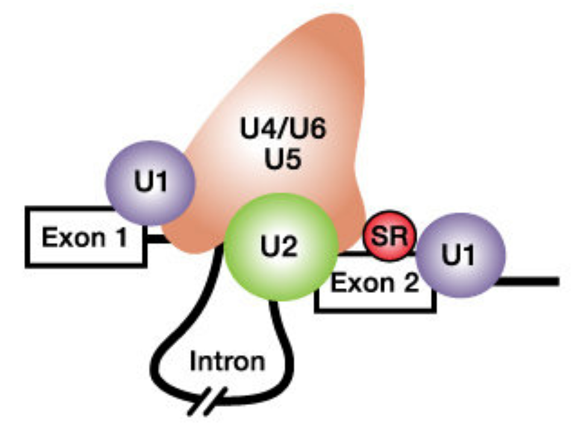

# *RNA motifs for processing and translation* {#chapter6}
In this chapter, you will review the cis-acting sequences that are required for pre-mRNA processing *and* mRNA translation. Again, we will focus on BBS1 as our model gene to find out if BBS1 has all the cis-acting sequences necessary for these events. To follow along with the text and to answer "Test Your Understanding" questions, you can use the ["Gene Structure"](https://genome.ucsc.edu/s/megallegos/Biol%20310%20Module%201
){target="_blank"} session link. 

## The Addition of a 5' guanosine cap
Transcripts created by RNA polymerase II are transformed into messenger RNA (mRNA) *as* they are synthesized. This transformation process is called **pre-mRNA processing**. The first step involves the addition of a 7-methyl guanosine cap structure which is attached to the first *templated* ribonucleotide of RNA polymerase II transcripts as they emerge (5' end first) from the transcription bubble (Figure \@ref(fig:5cap)). *There are no conserved (cis-acting) sequences required for this event to occur*. And while all mRNA transcripts begin with a 7-methyl guanosine cap, you will not see it in the mRNA sequence provided by NCBI or other sequence databases online. Let's review the mRNA sequence of the human gene: SPTBN2 ([NM_006946.4](https://www.ncbi.nlm.nih.gov/nuccore/NM_006946.4?report=fasta){target="_blank"}). Notice that this mRNA (displayed in FASTA format) begins with an A. This is the first *templated* ribonucleotide for SPTBN2 mRNA. 

<br>
```{r 5cap, out.width='50%', fig.align='center', fig.cap = "Original image from Peter J. Russell, iGenetics: Copyright © Pearson Education, Inc., publishing as Benjamin Cummings. Additional annotation added here for clarity."}
knitr::opts_chunk$set(echo = FALSE)
knitr::include_graphics('static/images/capping.png')
```
<br>

## Splicing
The second step in pre-mRNA processing is the removal of or splicing out of introns and the merging or joining of the flanking exons on either side. Introns are spliced out by the **spliceosome**. In brief, specific components of the spliceosome first bind to the 5' splice site, 3' splice site and branchpoint A (in the intron). Then the spliceosome pulls the two adjacent exons together to facilitate excision of the intron and fusion of the two exons together (Figure \@ref(fig:splicingmachinery)). 

<br>
```{r splicingmachinery, out.width='50%', fig.align='center', fig.cap = "From Schneider et al. 2010. The spliceosome includes the U1, U2, U4, U5 and U6 small nuclear ribonucleoproteins (snRNPs). SR proteins (in red) and splicing enhancer sequences within the exon are also utilized for accurate splicing. THis is particularly important with long introns."}
knitr::opts_chunk$set(echo = FALSE)

```
<br>

To identify cis-acting sequences required for splicing, scientists have created multiple sequence alignments involving the 5' and 3' ends of of introns. The result of one such analysis is displayed below as a sequence logo (Figure \@ref(fig:intronsequencelogo)). This particular sequence logo was created by aligning the 5' and 3' ends of *all* human introns below a certain length. This sequence logo clearly illustrates that the first and last two nucleotides of nearly *all* eukaryotic introns are GT and AG, respectively. The GT (or GU as it is found in the unspliced RNA) is at the 5’ end of the intron and is called the 5’ splice site (SS) or splice donor site. The AG is at the 3’ end of the intron and is called the 3’ splice site (SS) or splice acceptor site. Moreover, additional sequences surrounding the 5' and 3' splice sites are enriched for certain nucleotides. This sequence conservation indicates that these sequences are critical for splicing. In fact, we now know that the snRNA components of the spliceosome hybridize to the 5’ and 3’ splice sites. Moreover, mutations that map to the 5' and 3' splice sites in genes known to cause human disease are typically **pathogenic**^[disease causing]. 

<br>
```{r intronsequencelogo, out.width='100%', fig.align='center', fig.cap = "This sequence logo was created by aligning 5' and 3' splice site junctions of *all* human introns below a certain size. The Y axis represents frequency. The intron is bracketed as shown. Modified from Lim and Burge 2001."}
knitr::opts_chunk$set(echo = FALSE)
knitr::include_graphics('static/images/intronlogo.png')
```
### [Test Your Understanding](https://docs.google.com/forms/d/e/1FAIpQLSdyskfsXkMa4UskTctx2oJjQqrXxOeBkARx1U3uWFs4bwnnJw/viewform?usp=publish-editor){target="_blank"}
<style>
div.blue { background-color:#e6f0ff; border-radius: 5px; padding: 5px;}
</style>
<div class = "blue">
<br>
*Click the link above to see the TYU questions.* 
<br>
</div>

<br>


## Cleavage and Polyadenylation
Termination of transcription involves two coupled reactions: 1) **RNA cleavage** to release the RNA transcript from the RNA polymerase machinery and 2) **addition of a poly(A) tail**^[polyadenylation] to the 3' end of the newly released message. Proper cleavage creates a transcript of the correct length. Addition of the poly A tail helps transport the mRNA out to the cytoplasm and improves stability and translation efficiency. 

Like splicing, cleavage and polyadenylation requires specific RNA sequence motifs. These RNA motifs recruit the cleavage and polyadenylation machinery^[a large multiprotein complex] to the RNA. Sequence motifs important for cleavage flank^[are found on either side of] the cleavage site (Figure \@ref(fig:cleavage)a). The best conserved motif is called the Poly Adenylation Signal (or PAS), a sequence consisting of six ribonucleotides positioned 15-30 nucleotides upstream of the cleavage site *within* the 3' UTR (NOTE: The cleavage site can be found by looking for *end* of the transcript). A sequence logo of aligned PAS sequences from humans and flies illustrates this high level of conservation (Figure \@ref(fig:cleavage)b) and reveals the consensus sequence as it would be found in the nontemplate strand of the genome^[For a plus strand gene like BBS1, the nontemplate strand of the genome *is* the plus strand]: AWTAAA (where W = T/A). 
<br>
```{r cleavage, out.width='100%', fig.align='center', fig.cap = "a) A schematic of an RNA (in red) just after cleavage but before polyadennylation. The 5' end of the RNA extends to the bottom left. An open triangle points to the site of cleavage. Notice that the PAS (AAUAAA) is upstream of the cleavage site. The G/U-rich region is downstream. CTD, CFI, CFII, CPSF, CSTF and PAP make up the cleavage and polyadenylation machinery. The **PAP** is the **P**oly **A** **P**olymerase, the enzyme that adds adenine ribonucleotides to the 3' end of the message. b) These sequence logos illustrate how conserved the PAS really is even between humans (top) and flies (bottom). "}
knitr::opts_chunk$set(echo = FALSE)
knitr::include_graphics('static/images/PAS.png')
```
<br>

### [Test Your Understanding](https://docs.google.com/forms/d/e/1FAIpQLSf6D-zf8NPdse2IMjJCGAlNMQydrayWtpwhBpEtfWj4uuG5Lw/viewform?usp=publish-editor){target="_blank"}
<style>
div.blue { background-color:#e6f0ff; border-radius: 5px; padding: 5px;}
</style>
<div class = "blue">
<br>
*Click the link above to see the TYU questions.* 
<br>
</div>

<br>
Take home message: Splicing, cleavage and polyadenlyation are distinct from cap addition. The capping enzyme does not require a specific DNA or RNA sequence for 5' cap addition to occur. On the other hand, splicing, cleavage and polyadenylation do require specific sequence motifs. These sequences are present in the **nontemplate** or **sense** strand of the genome^[For a plus strand gene, like BBS1, the nontemplate or sense strand is the plus strand.] but are recognized by the RNA processing machinery as RNA. 

## Translation Initiation

Once processed, mRNA exits the nucleus to be used as a template to create a polypeptide via a process called **translation**. Translation is mediated in part by the ribosome^[The ribosome is comprised of two large complexes (one large and one small) made up of protein and RNA. Translation also requires tRNAs and of course, amino acids!]. In eukaryotes, the small ribosomal subunit and associated factors first assemble at the mRNA cap structure then scan along the 5’ UTR until a start codon is found. Choosing the correct start codon is critical as it determines the reading frame and thus the polypeptide sequence! During the scanning process, ribosomal proteins within the small ribosomal subunit search for then interact with specific nucleotides both upstream and downstream of the start codon (Llacer et al. 2018). **In other words, context matters.** 

The importance of context in start codon selection by the ribosome was first suggested by Marilyn Kozak. She aligned 699 well-characterized start codons derived from a set of vertebrate genes to search for sequence conservation upstream and downstream of the ATG (Kozak 1987). She then converted this large multiple sequence alignment into a nucleotide frequency table^[Sequence logos were not "invented" until 1990 by Schneider and Stephens] (Figure \@ref(fig:humankozak)A). The most frequent nucleotides she found at each position from -6 to +4 is called the Kozak consensus sequence: GCCACC**ATG**G. 

Now we have sequence for entire genomes! In 2015, Cenik et al. created a sequence logo for a similar region surrounding the start codon for all protein coding genes in the human genome (Figure \@ref(fig:humankozak)B). The results are surprisingly similar. Again, the fact that sequence conservation exists suggests that the sequence surrounding the ATG plays an important role in translation initiation.

<br>
```{r humankozak, out.width='100%', fig.align='center', fig.cap = "A) A multiple sequence alignment of 699 vertebrate genes displayed as a nucleotide frequency table (The ATG is not included since it is invariant). This schematic is from Kozak, 1987 with the most frequently observed nucleotides at positions -6 to +4 highlighted in green. B) This sequence logo was created 28 yeats later from the complete set of human protein coding genes. Notice the similarities!"}
knitr::opts_chunk$set(echo = FALSE)
knitr::include_graphics('static/images/humanseqlogo.png')
```
<br>

A recent study in zebrafish supports this hypothesis. In this study, Grzegorski et al. inserted an optimal translation initiation sequence (GCCACC**ATG**G) into a reporter gene^[In molecular biology, reporter genes are those that can easily be visualized by eye when translated into protein. For example, lacZ is a good reporter because its gene product, B-galactosidase, turns one of its substrates blue. Importantly, there is a linear relationship between the amount of blue pigment produced and the amount of B-galactosidase produced. GFP is also a good reporter which can be visualized by fluorescence microscopy. Reporter genes are used for a large variety of purposes but in this study it was used to measure translation efficiency] then measured the efficiency of translation by visualizing the amound of reporter gene product made. This was the control. They then compared the expression of this control reporter gene to ones with other translation initiation sequences (i.e. GCAAAC**ATG**G, GCAGTC**ATG**G, CTTTCT**ATG**C or CGGTGT**ATG**C). They discovered that a reporter gene fused to a translational initiation sequence found *less frequently* in the genome than the canonical Kozak consensus sequence (GCCACC**ATG**G) was translated to lower levels than the control. By contrast, a reporter gene containing a translational initiation sequence found *more frequently* in the genome than the Kozak consensus was translated to higher levels than the control. Their results are shown in Figure \@ref(fig:startcodonreporter). 

<br>
```{r startcodonreporter, out.width='50%', fig.align='center', fig.cap = "Figure taken from Grzegorski et al. 2014. The Y-axis represents expression levels of the experimental reporter gene divided by expression levels of the control reporter gene containing the canonical kozak consensus sequence "}
knitr::opts_chunk$set(echo = FALSE)
knitr::include_graphics('static/images/ATGreporter.png')
```
<br>

Additional studies found that nucleotides in two highly conserved positions exert the strongest effect: a G residue following the ATG codon (position +4) and a purine three nucleotides upstream (position -3). Thus, overall, a good start codon is one found in the following context: RNNATGG (Where R is a purine and N is any nucleotide). Whereas an adequate start codon is RNNATGY or YNNATGG (where Y is a pyrimidine) (Kozak 1997). 

### [Test Your Understanding](https://docs.google.com/forms/d/e/1FAIpQLSd-mzvwiNSFSaY6R8QNIabUz2hJWlNaYS7PIxNuJm9yP5WxTQ/viewform?usp=publish-editor){target="_blank"}
<style>
div.blue { background-color:#e6f0ff; border-radius: 5px; padding: 5px;}
</style>
<div class = "blue">
<br>
*Click the link above to see the TYU questions.* 
<br>
</div>

## uORFs
uORF stands for upstream Open Reading Frame (pronounced you-orf). A gene is said to have a uORF if it has a start codon in the 5’ UTR that is followed by an in-frame stop codon OR if it has is a start codon in the 5' UTR that is **out-of-frame** with the main start codon (Figure \@ref(fig:uORFdefined)). 

<br>
```{r uORFdefined, out.width='70%', fig.align='center', fig.cap = "Paraphrased from Calvo et al. 2009. A) A schematic representation of an mRNA transcript with two uORFs (red arrows), one fully upstream and one overlapping the main coding sequence (black arrow). uORFs were defined by Calvo et al. as a start codon (AUG) in the 5' UTR followed by an in-frame stop codon (arrowhead) that precedes the **end** of the main coding sequence. Calvo et al. 2009 further refines the definition to only include uORFs that code for a minimum peptide length of 3 amino acids (or a coding sequence minimum length of 9 nt). (B) Number of uORFs in human and mouse RefSeq transcripts."}
knitr::opts_chunk$set(echo = FALSE)
knitr::include_graphics('static/images/uORFdefinition.png')
```
<br>


uORFs, in general, have the capacity to reduce translation initiation from the main start codon (Calvo et al. 2009). Since they are found in a large number of protein coding genes (nearly 50% of human genes are thought to have a uORF), this is thought to be “by design”. In other words, it is thought that the presence of a uORF has an important purpose and is subject to positive selection during evolution as a way to keep gene expression levels appropriately low. Two examples are described in Figure \@ref(fig:uORFregulation). 

<br>
```{r uORFregulation, out.width='70%', fig.align='center', fig.cap = "Paraphrased from Kozak, 2005. Small upstream ORFs or uORFs are thought to down-regulate translation by imposing an inefficient reinitiation mechanism. This constraint on translation ensures against harmful overproduction of potent or toxic proteins. Two examples are described here. A) The presence of an overlapping uORF allows only low-level production of proinsulin in chick embryos. In the adult pancreas where more proinsulin protein is needed, a more efficiently translated form of mRNA is produced via a downstream promoter. B) The human mdm2 oncogene has the ability to cause cancer when it is overexpressed. Overexpression of the mdm2 oncogene in tumor cells is caused by a switch in the transcriptional start site which eliminates two small uORFs, thereby elevating translation 20-fold. The first example illustrates a naturally occuring, developmental switch in gene expression. The second example only occurs in the disease state. In fact, the expression from the crytpic downstream promoter results from the presence of a p53-responsive promoter region that is preferentially utilized when p53 levels increase, a common occurance in tumor cells (Landers 1997)"}
knitr::opts_chunk$set(echo = FALSE)
knitr::include_graphics('static/images/uORFexamples.png')
```
<br>

## Recognizing uORFs
To determine if a gene of interest (GOI) has a uORF in its 5' UTR, you need to focus your genome browser on the 5' UTR of your GOI then make sure your base prediction track is set to full. So long as you are zoomed in close enough to see the green boxes (start codons) and red boxes (stop codons) in the three reading frames, you can recognize most uORFs. For an example of what a uORF would look like, see Figure \@ref(fig:MDM2uORF). At some point you may come across a gene with an intron in the 5' UTR. If you find an upstream start codon in the 5' UTR, this likely means that the gene has a uORF. To be sure, you would need to find the positive evidence. This could be complicated by the fact that the intron might split the uORF. 

<br>
```{r MDM2uORF, out.width='50%', fig.align='center', fig.cap = "MDM2 has two uORFs in the 5' UTR as highlighted here in the bottom image. Both uORFs by definition are upstream of the predicted start codon as highlighted in the top image. Notice a uORF is defined as a start codon in the 5' UTR that is followed by a stop codon **in the same reading frame**."}
knitr::opts_chunk$set(echo = FALSE)
knitr::include_graphics('static/images/Recognizing_uORFs.png')
```
<br>


### [Test Your Understanding](https://docs.google.com/forms/d/e/1FAIpQLSeM7O_dumP0yu5lDOA2Z6HUGy1AhXyCGkoiimCgTkI-RMwNDA/viewform?usp=dialog){target="_blank"}
<style>
div.blue { background-color:#e6f0ff; border-radius: 5px; padding: 5px;}
</style>
<div class = "blue">
<br>
*Click the link above to see the TYU questions.* 
<br>
</div>

## Homework
If your last name begins with A-M click the link provided to download your homework assignment as a [DOCX file](https://docs.google.com/document/d/174K50ZD51-j46B-5_mqM9UqMqUMGJ5wc?rtpof=true&usp=drive_fs){target="_blank"} or a [PDF file](https://drive.google.com/open?id=1-nQzSVpERACivB423zX62idLkugSvQeZ&usp=drive_fs){target="_blank"}. The file includes additional instructions and a template for the MSA, frequency table and consensus sequence.

If your last name begins with N-Z click the link provided to download your homework assignment as a [DOCX file](https://docs.google.com/document/d/1-jGb99YsiAJ5DDjHkjt1KvwgeErEzd2N?rtpof=true&usp=drive_fs){target="_blank"} or a [PDF file](https://drive.google.com/open?id=10-_ublKqVv_Oqh9syVRQVaBlQuNTVz0f&usp=drive_fs){target="_blank"}. The file includes additional instructions and a template for the MSA, frequency table and consensus sequence.

NOTE: You will not have edit access. Download and complete the assignment on your own computer. 

In brief, create a multiple sequence alignment (MSA) that includes either the 5' splice site and surrounding sequence of BBS1 or the 3' splice site and surrounding sequence of BBS1 depending on your last name. HINT: See Figure \@ref(fig:exonjumpingtips) to see how much surrounding sequence to include and how to easily jump from exon to exon. Use the template provided (see file) to create the MSA, frequency table and consensus sequence using IUPAC codes. Finally, use the ["WEB LOGO"](https://weblogo.berkeley.edu/logo.cgi){target="_blank"} sequence logo generator to create a sequence logo of your multiple sequence alignment. Upload both pages of your homework as a single PDF to CANVAS by the due date.  

Also, see Figure \@ref(fig:weblogopage) for additional tips on how to use ["WEB LOGO"](https://weblogo.berkeley.edu/logo.cgi){target="_blank"} to create a sequence logo. 

<br>

```{r exonjumpingtips, out.width='100%', fig.align='center', fig.cap = "An example of the nucleotides you will include in your multiple sequence alignment (MSA) are boxed. For example, if you are creating an MSA of the 5' splice site and surrounding sequence you will always include the last two nucleotides of the upstream exon and the first 5 nucleotides of the intron (See box at left). If you are creating an MSA of the 3' splice site and surrounding sequence you will always include the last five nucleotides of the intron and the first 2 nucleotides of the downstreanm exon (See box at right). To quickly jump to the next intron-exon junction, click on the open arrowhead on the far right (green arrows point to the open arrowheads). Another way to quickly view 5’ and 3’ splice site sequences is by clicking on the gene schematic in the NCBI Refseq track and then clicking on the 'View details of parts of alignment within browser window' link. No additional instructions given for this method."}
knitr::opts_chunk$set(echo = FALSE)
knitr::include_graphics('static/images/5primeSS.png')
```
<br>
```{r weblogopage, out.width='100%', fig.align='center', fig.cap = "To use the Weblogo site successfully, follow the instructions as outlined above."}
knitr::opts_chunk$set(echo = FALSE)
knitr::include_graphics('static/images/weblogoInstructions.png')
```
<br>


© `r as.numeric(format(Sys.Date(), "%Y"))`, Maria Gallegos. All rights reserved.

<style>
p.caption {
  font-size: 0.8em;
  margin-right: 2%;
  margin-left: 2%;
  line-height: 1.2em;
  text-align: left;
}
</style>

<script src="https://ajax.googleapis.com/ajax/libs/jquery/3.1.1/jquery.min.js"></script>

<style>
.zoomDiv {
  opacity: 0;
  position:absolute;
  top: 50%;
  left: 50%;
  z-index: 50;
  transform: translate(-50%, -50%);
  box-shadow: 0px 0px 50px #888888;
  max-height:100%; 
  overflow: scroll;
}

.zoomImg {
  width: 100%;
}
</style>


<script type="text/javascript">
  $(document).ready(function() {
    $('body').prepend("<div class=\"zoomDiv\"></div>");
    // onClick function for all plots (img's)
    $('img:not(.zoomImg)').click(function() {
      $('.zoomImg').attr('src', $(this).attr('src'));
      $('.zoomDiv').css({opacity: '1', width: '100%'});
    });
    // onClick function for zoomImg
    $('img.zoomImg').click(function() {
      $('.zoomDiv').css({opacity: '0', width: '0%'});
    });
  });
</script>

