# *RNA motifs for processing and translation* {#chapter6}
An RNA transcript cannot be **translated** as is. It must be modified first to produce a messenger RNA (mRNA). This modification process is called **pre-mRNA processing** and includes:

1.	The addition of a 5’ methyl guanosine cap (**5’ cap**).
2.	The removal of introns (**splicing**).
3.	**RNA cleavage** (to terminate transcription) and 
4.	The addition of a **poly(A) tail**.

In fact, pol II transcription and RNA processing are closely coordinated with mRNA transport out of the nucleus. This ensures that only fully processed mRNAs make it to the cytoplasm for translation. In this chapter, you will learn about RNA sequence motifs that are required for pre-mRNA processing (in the nucleus) *and* translation (in the cytoplasm). Again we will focus on BBS1 as our model gene to answer the question: Does BBS1 have all the sequence elements required for these processes. Let’s see. To follow along with the text and to answer "Test Your Understanding" questions, you can use the ["Gene Structure"](https://genome.ucsc.edu/s/megallegos/Biol%20310%20Module%201
){target="_blank"} session link. 


## The Addition of a 5' guanosine cap
The first step in pre-mRNA processing involves the addition of a 5' cap structure. A modified guanosine ribonucleotide is covalently attached to the first *templated* ribonucleotide of all pre-mRNA transcripts once the 5' end of the nascent^[new, just coming into existence] RNA chain dissociates from the genomic DNA (Figure \@ref(fig:5cap)). There are no specific sequences required for this event to occur. As a result, all mature mRNAs begin with a ribonucleotide G. Now let's review the mRNA sequence of a random human gene: SPTBN2 ([NM_006946.4](https://www.ncbi.nlm.nih.gov/nuccore/NM_006946.4?report=fasta){target="_blank"}). Notice that the mRNA sequence (displayed in FASTA format) begins with an A! Wait! Didn’t I just say that all mRNAs are capped with a modified guanosine ribonucleotide? While this is true, sequence databases start mRNA sequence with the first *templated* ribonucleotide instead. They assume you know a "G" is added to the 5' end of the emerging RNA during transcription. 

<br>
```{r 5cap, out.width='50%', fig.align='center', fig.cap = "Original image from Peter J. Russell, iGenetics: Copyright © Pearson Education, Inc., publishing as Benjamin Cummings. Additional annotation added here for clarity."}
knitr::opts_chunk$set(echo = FALSE)
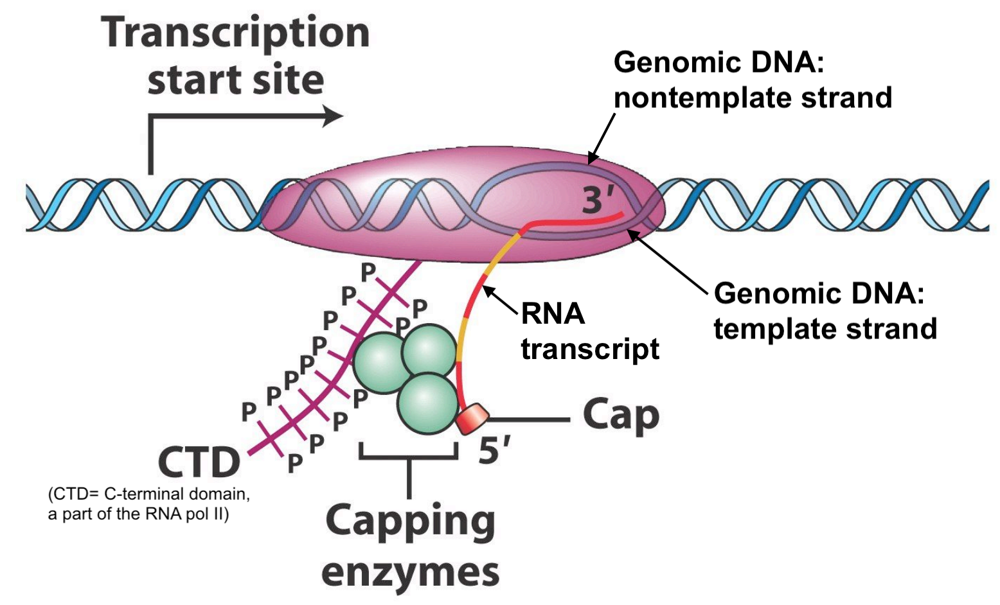
```
<br>

## Splicing
The second step in pre-mRNA processing is the removal or splicing out of introns and the merging or joining of adjacent exons. Introns are spliced out by the splicing machinery also known as the **spliceosome**, a large complex of proteins and RNAs. To initiate splicing, the spliceosome must recognize and bind to the 5' and 3' ends of each intron in the RNA transcript^[also known as splice site junctions]. Then the spliceosome pulls the two adjacent exons together to facilitate the excision of the intron and fusion of the two exons (Figure \@ref(fig:splicingmachinery)).

<br>
```{r splicingmachinery, out.width='50%', fig.align='center', fig.cap = "From Schneider et al. 2010. The spliceosome includes the U1, U2, U4, U5 and U6 small nuclear ribonucleoproteins (snRNPs). SR proteins (in red) and splicing enhancer sequences within the exon are also utilized for accurate splicing. THis is particularly important with long introns."}
knitr::opts_chunk$set(echo = FALSE)
knitr::include_graphics('static/images/splicing.png')
```
<br>

To see if specific RNA motifs are required for splicing, scientists aligned the 5' and 3' ends of thousands of introns one on top of the other creating a multiple sequence alignment to allow patterns of sequence conservation to emerge. The result of one such analysis is displayed below as a sequence logo (Figure \@ref(fig:intronsequencelogo)). This particular sequence logo was created by aligning the 5' and 3' ends of *all* human introns below a certain size. Do you see which nucleotides are invariant? This sequence logo clearly illustrates that splicing DOES require specific sequences for the spliceosome to recognize the 5' and 3' ends of the intron. 

<br>
```{r intronsequencelogo, out.width='100%', fig.align='center', fig.cap = "This sequence logo was created by aligning 5' and 3' splice site junctions of *all* human introns below a certain size. The Y axis represents frequency. The intron is bracketed as shown. Modified from Lim and Burge 2001."}
knitr::opts_chunk$set(echo = FALSE)
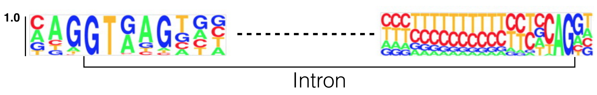
```
### [Test Your Understanding](https://docs.google.com/forms/d/e/1FAIpQLSdLNDxLkxtahAy52dMlJSxcah4fFO6CYDbCJRAqizq7ux14IQ/viewform?usp=sf_link){target="_blank"}
<style>
div.blue { background-color:#e6f0ff; border-radius: 5px; padding: 5px;}
</style>
<div class = "blue">
**Use the sequence logo in Figure \@ref(fig:intronsequencelogo) to answer the following questions (Note: The Y axis represents frequency):**

- *Based on what you know so far about how sequence is typically displayed, where is the 5’ splice site? On the left or right side of the figure?*
<br>
- *This sequence logo demonstrates that there are two nucleotides that are found at the 5' end of nearly 100% of all introns. This is called the 5' splice site (5' SS or 5' donor site). Based on this sequence logo, what is the sequence of the 5' splice site?*
<br>
- *This sequence logo demonstrates that there are two nucleotides that are found at the 3' end of nearly 100% of all introns. This is called the 3' splice site (3' SS or 3' acceptor site). Based on this sequence logo, what is the sequence of the 3' splice site?*
<br>
- *Based on this sequence logo, what is the probability of observing a G immediately 5’ (upstream) of the 5’ splice site?*
<br>
- *Based on this sequence logo, what is the probability of observing a T immediately 3’ (downstream) of the 5’ splice site?*
<br>
- *Based on this sequence logo, what is the probability of observing a A immediately 3’ (downstream) of the 3’ splice site?*
<br>
</div>

<br>
As you discovered, the first and last two nucleotides of nearly *all* eukaryotic introns are GT and AG, respectively. The GT (or GU as it is found in the unspliced RNA) is at the 5’ end of the intron and is called the 5’ splice site (SS) or splice donor site. The AG is at the 3’ end of the intron and is called the 3’ splice site (SS) or splice acceptor site. This *nearly* universal sequence conservation at these two sites suggests the following: 1) The process of splicing arose early during the evolution of the first Eukaryote and 2) The GT and AG sequences are *required* for proper splicing. In fact, we now know that RNA components of the spliceosome hybridize to the 5’ and 3’ splice sites. Moreover, mutations that map to the 5' and 3' splice sites in genes known to cause human disease are typically **pathogenic**^[disease causing]. 

## Intron position - Anything is possible

A common misconception about splicing is that introns are positioned **between** codons. Not true. When introns first “invaded” the genome during early eukaryotic evolution, introns were “blind” to the concept of a codon. In fact, the first intron of BBS1 splits the last codon of exon 1 at position +2^[A codon is 3 nucleotides in length. When an intron splits a codon at the +2 position this means that the intron is positioned after the *second* nucleotide of the codon. An intron can split a codon at the +1 or the +2 position. When an intron is positioned *between* codons one can say is at the 0 or +3 position. A decision has to be made about which should be used]. How can you see this for yourself in the UCSC genome browser? First, open the link to [Gene Structure Session](https://genome.ucsc.edu/s/megallegos/Biol%20310%20Module%201){target="_blank"} then change the “Base Position” Track to “Full” (See "Reading Frames" in Module One for a reminder how to do this). Now zoom way in to view the last few codons of exon 1 (Figure \@ref(fig:codonsplit)). They code for amino acids C-G-A-E-S (If you do you not see the amino acids within the gene prediction track as shown in Figure \@ref(fig:codonsplit), your track settings may have changed. (Figure \@ref(fig:colortrack)) describes how to fix that problem. 

Now review the three possible reading frames for this segment of genomic DNA, you can see that the BBS1 amino acids match the +3 reading frame (last row). Now compare the amino acid sequence in the +3 reading frame to the amino acid sequence in BBS1.  There is an S in BBS1 protein after the E while there is an R in the +3 reading frame! This is because only the **first two** nucleotides (A-G) of the codon coding for Serine comes from exon 1. **The last nucleotide of this codon is found at the *beginning* of exon 2!** Again, one would say that the intron splits this codon at position +2 (XX-intron-X, where XXX is a single codon). 

<br>
```{r codonsplit, out.width='75%', fig.align='center', fig.cap = "Modified from Lim and Burge 2001"}
knitr::opts_chunk$set(echo = FALSE)
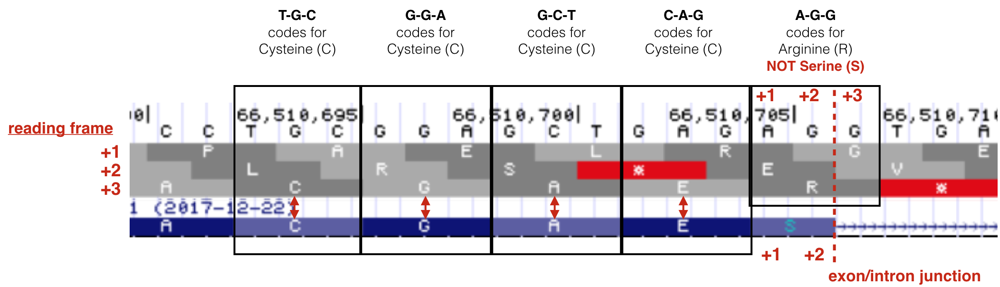
```
<br>
```{r colortrack, out.width='75%', fig.align='center', fig.cap = "If your gene prediction track does not have the amino acids displayed (See 1 and compare to the figure above), then you will need to configure it anew as described here. 2) Right click on the gene prediction schematic and a pull down menu will appear. Choose 'Configure Refseq Curated'. 3) A new yellow box will appear. Click on the pulldown menu for Color track by codons and choose 'genomic codons'. 4) Click 'Apply' then 5) Click 'OK'"}
knitr::opts_chunk$set(echo = FALSE)
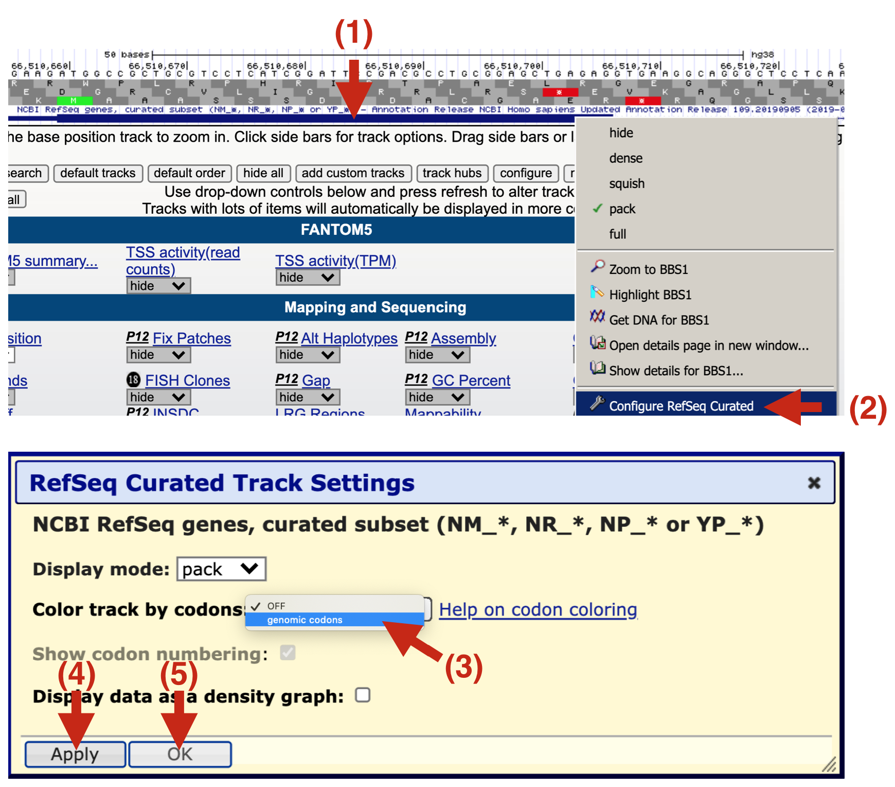
```
<br>

### [Test Your Understanding](https://docs.google.com/forms/d/e/1FAIpQLSfHgaIissZpkT3FqjhWg-1wXB6vjbXZlTz9kqK_OFqTmUTNMw/viewform?usp=sf_link){target="_blank"}
<style>
div.blue { background-color:#e6f0ff; border-radius: 5px; padding: 5px;}
</style>
<div class = "blue">

- *The last codon in exon 1 of BBS1 is split by intron 1. This split codon normally codes for Serine (S). What is the sequence of this codon once splicing is complete?*
<br>
- *If splicing were to fail (intron 1 is not removed), what amino acid would be added after the "E" in the sequence C-G-A-E- at the end of exon 1?*
<br>
- *If splicing were to fail (intron 1 is not removed), how many amino acids would be added after the "E" before a stop codon is encountered? (NOTE: This is the same E as the one mentioned in the above question)*
<br>
- *The last codon in exon 2 of BBS1 is split by intron 2. This split codon normally codes for alanine. What is the sequence of this codon once splicing is complete?*
<br>
- *At what position is the last codon of exon 2 split by intron 2? The +1 or the +2?*
<br>
- *If splicing were to fail (intron 2 is not removed), what amino acid would be added after the "L" in the sequence S-A-C-L at end of exon 2?*
<br>
- *If splicing were to fail (intron 2 is not removed), how many amino acids would be added after the "L" before a stop codon is encountered? (NOTE: This is the same L as the one mentioned in the above question)*
<br>
- *Where is intron 3 of BBS1 positioned (at position +1 of a codon, at position +2 of a codon or between codons)?*
<br>
- *If splicing were to fail (intron 3 is not removed), how many incorrect amino acids would be added until a stop codon is encountered?*
<br>
- *Where is intron 7 of BBS1 positioned (at position +1 of a codon, at position +2 of a codon or between codons)?*
<br>
- *If splicing were to fail (intron 7 is not removed), how many incorrect amino acids would be added until a stop codon is encountered?*
<br>
- *Where is intron 9 of BBS1 positioned (at position +1 of a codon, at position +2 of a codon or between codons)?*
<br>
- *If splicing were to fail (intron 9 is not removed), how many incorrect amino acids would be added until a stop codon is encountered?*
<br>
</div>
<br>
In general, a codon can be split by an intron at any position: the +1 position, the +2 position or between codons. In [Chapter 2](#chapter2), you also learned that exons within a single gene can jump from one reading frame to another. The act of splicing brings these exons back into a *single* reading frame. *Thus, it is critical that splicing is accurate*. One mistake and the reading frame of an mRNA will get out of whack. The protein sequence will change and will most likely be shorter than normal. This explains why splice site mutations are often pathogenic in human disease genes. 86

## Cleavage and Polyadenylation
Termination of transcription involves two coupled reactions: 1) **RNA cleavage** to release the RNA transcript from the RNA polymerase machinery and 2) **addition of a poly(A) tail**^[polyadenylation] to the 3' end of the newly released message. Proper cleavage creates a transcript of the correct length. Addition of the poly A tail helps transport the mRNA out to the cytoplasm and improves stability and translation efficiency. 

Like splicing, cleavage and polyadenylation requires specific RNA sequence motifs. These RNA motifs recruit the cleavage and polyadenylation machinery^[a large multiprotein complex] to the RNA. Sequence motifs important for cleavage flank^[are found on either side of] the cleavage site (Figure \@ref(fig:cleavage)a). The best conserved motif is called the Poly A Site (or PAS), a sequence consisting of six ribonucleotides positioned 15-30 nucleotides upstream of the cleavage site *within* the 3' UTR. A sequence logo of aligned PAS sequences from humans and flies illustrates this high level of conservation (Figure \@ref(fig:cleavage)b) and reveals the consensus sequence as it would be found in the nontemplate strand of the genome^[For a plus strand gene like BBS1, the nontemplate strand of the genome *is* the plus strand]: AWTAAA (where W = T/A). 
<br>
```{r cleavage, out.width='100%', fig.align='center', fig.cap = "a) A schematic of an RNA (in red) just after cleavage but before polyadennylation. The 5' end of the RNA extends to the bottom left. An open triangle points to the site of cleavage. Notice that the PAS (AAUAAA) is upstream of the cleavage site. The G/U-rich region is downstream. CTD, CFI, CFII, CPSF, CSTF and PAP make up the cleavage and polyadenylation machinery. The **PAP** is the **P**oly **A** **P**olymerase, the enzyme that adds adenine ribonucleotides to the 3' end of the message. b) These sequence logos illustrate how conserved the PAS really is even between humans (top) and flies (bottom). "}
knitr::opts_chunk$set(echo = FALSE)
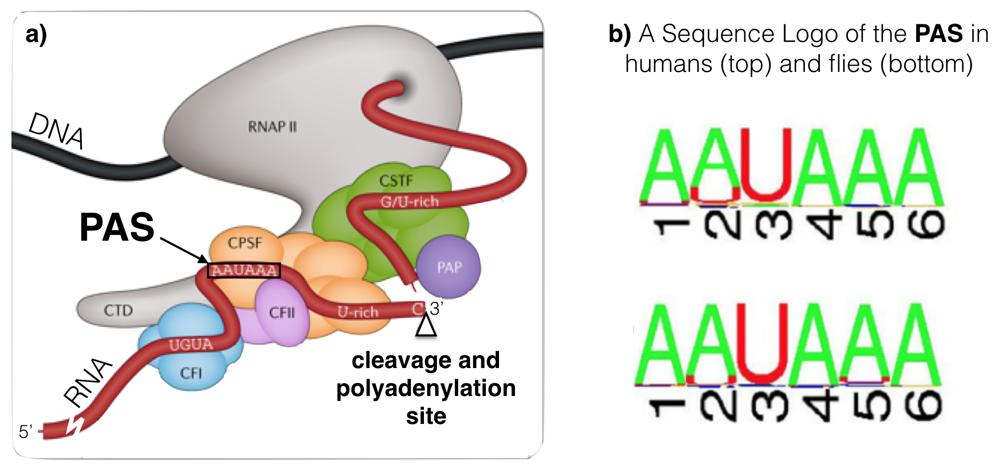
```
<br>

### [Test Your Understanding](https://docs.google.com/forms/d/e/1FAIpQLSeLBjNg4Tjg5PpnU6SFMB9PcJzJvLEg6s9iwJKgzQR97Qtftw/viewform?usp=sf_link){target="_blank"}
<style>
div.blue { background-color:#e6f0ff; border-radius: 5px; padding: 5px;}
</style>
<div class = "blue">
The following questions ask you to locate then describe the PAS for a variety of genes. To begin, open the ["Gene structure"](https://genome.ucsc.edu/s/megallegos/Biol%20310%20Module%201
){target="_blank"} session and use the Short Match evidence track to search for a PAS consensus sequence (AWTAAA). 
<br>

- *Search the 3' UTR of BBS1 for a PAS consensus sequence (AWTAAA). Write out your PAS sequence from 5’ to 3’ as it would be found in the nontemplate strand of the genome.*
<br>
- *How many nucleotides are there between the putative BBS1 PAS identified above and the cleavage site (for the putative position of cleavage, review the gene prediction evidence track).*
<br>
- *Is the putative BBS1 PAS upstream or downstream of the cleavage site?*
<br>
- *Is the putative BBS1 PAS located where it should be?*
<br>
<br>
- *Search the 3' UTR of ZDHHC24 (long isoform) for a PAS consensus sequence (AWTAAA). Don't forget! This is a minus strand gene nearby BBS1. Write out your PAS sequence from 5’ to 3’ as it would be found in the nontemplate strand of the genome.)*
<br>
- *How many nucleotides are there between the putative ZDHHC24 (long isoform) PAS and the cleavage site (for the position of cleavage, review the gene prediction evidence track).*
<br>
- *Is the putative ZDHHC24 (long isoform) PAS upstream or downstream of the cleavage site?*
<br>
- *Is the putative ZDHHC24 (long isoform) PAS located where it should be?*
<br>
<br>
- *Search the 3' UTR of ZDHHC24 (short isoform) for a PAS consensus sequence (AWTAAA). Write out your PAS sequence from 5’ to 3’ as it would be found in the nontemplate strand of the genome.)*
<br>
- *How many nucleotides are there between the putative ZDHHC24 (short isoform) PAS and the cleavage site (for the position of cleavage, review the gene prediction evidence track).*
<br>
- *Is the putative ZDHHC24 (short isoform) PAS upstream or downstream of the cleavage site?*
<br>
- *Is the putative ZDHHC24 (short isoform) PAS located where it should be?*
<br>
<br>
- *Find the MYH3 gene and check which strand it is on. Then search the 3' UTR of MYH3 for a PAS consensus sequence (AWTAAA). Write out your PAS sequence from 5’ to 3’ as it would be found in the nontemplate strand of the genome.)*
<br>
- *How many nucleotides are there between the putative MYH3 PAS and the cleavage site (for the position of cleavage, review the gene prediction evidence track).*
<br>
- *Is the putative MYH3 PAS upstream or downstream of the cleavage site?*
<br>
- *Is the putative MYH3 PAS located where it should be?*
<br>
</div>
<br>
Take home message: Splicing, cleavage and polyadenlyation are distinct from cap addition. The capping enzyme does not require a specific DNA or RNA sequence for 5' cap addition to occur. On the other hand, splicing, cleavage and polyadenylation do require specific sequence motifs. These sequences are present in the **nontemplate** or **sense** strand of the genome^[For a plus strand gene, like BBS1, the nontemplate or sense strand is the plus strand.] but are recognized by the RNA processing machinery as RNA. 

## Translation Initiation

Once processed, mRNA exits the nucleus to be used as a template to create a polypeptide via a process called **translation**. Translation is mediated in part by the ribosome^[The ribosome is comprised of two large complexes (one large and one small) made up of protein and RNA. Translation also requires tRNAs and of course, amino acids!]. In eukaryotes, the small ribosomal subunit and associated factors first assemble at the mRNA cap structure then scan along the 5’ UTR until a start codon is found. Choosing the correct start codon is critical as it determines the reading frame and thus the polypeptide sequence! During the scanning process, ribosomal proteins within the small ribosomal subunit search for then interact with specific nucleotides both upstream and downstream of the start codon (Llacer et al. 2018). **In other words, context matters.** 

The importance of context in start codon selection by the ribosome was first suggested by Marilyn Kozak. She aligned 699 well-characterized start codons derived from a set of vertebrate genes to search for sequence conservation upstream and downstream of the ATG (Kozak 1987). She then converted this large multiple sequence alignment into a nucleotide frequency table^[Sequence logos were not "invented" until 1990 by Schneider and Stephens] (Figure \@ref(fig:humankozak)A). The most frequent nucleotides she found at each position from -6 to +4 is called the Kozak consensus sequence: GCCACC**ATG**G. 

Now we have sequence for entire genomes! In 2015, Cenik et al. created a sequence logo for a similar region surrounding the start codon for all protein coding genes in the human genome (Figure \@ref(fig:humankozak)B). The results are surprisingly similar. Again, the fact that sequence conservation exists suggests that the sequence surrounding the ATG plays an important role in translation initiation.

<br>
```{r humankozak, out.width='100%', fig.align='center', fig.cap = "A) A multiple sequence alignment of 699 vertebrate genes displayed as a nucleotide frequency table (The ATG is not included since it is invariant). This schematic is from Kozak, 1987 with the most frequently observed nucleotides at positions -6 to +4 highlighted in green. B) This sequence logo was created 28 yeats later from the complete set of human protein coding genes. Notice the similarities!"}
knitr::opts_chunk$set(echo = FALSE)
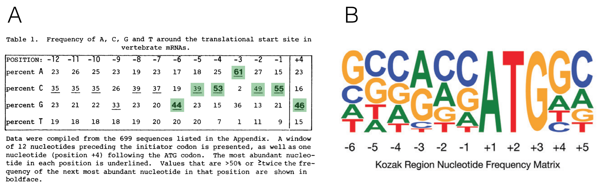
```
<br>

A recent study in zebrafish supports this hypothesis. In this study, Grzegorski et al. inserted the Kozak consensus sequence (GCCACC**ATG**G) into a reporter gene^[In molecular biology, reporter genes are those that can easily be visualized by eye when translated into protein. For example, lacZ is a good reporter because its gene product, B-galactosidase, turns one of its substrates blue. Importantly, there is a linear relationship between the amount of blue pigment produced and the amount of B-galactosidase produced. GFP is also a good reporter which can be visualized by fluorescence microscopy. Reporter genes are used for a large variety of purposes but in this study it was used to measure translation efficiency] then measured the efficiency of translation by visualizing the amound of reporter gene product made. This was the control. They then compared the expression of this control reporter gene to ones with other translation initiation sequences (i.e. GCAAAC**ATG**G, GCAGTC**ATG**G, CTTTCT**ATG**C or CGGTGT**ATG**C). They discovered that a reporter gene fused to a translational initiation sequence found *less frequently* in the genome than the canonical Kozak consensus sequence (GCCACC**ATG**G) was translated to lower levels than the control. By contrast, a reporter gene containing a translational initiation sequence found *more frequently* in the genome than the Kozak consensus was translated to higher levels than the control. Their results are shown in Figure \@ref(fig:startcodonreporter). 

<br>
```{r startcodonreporter, out.width='50%', fig.align='center', fig.cap = "Figure taken from Grzegorski et al. 2014. The Y-axis represents expression levels of the experimental reporter gene divided by expression levels of the control reporter gene containing the canonical kozak consensus sequence "}
knitr::opts_chunk$set(echo = FALSE)
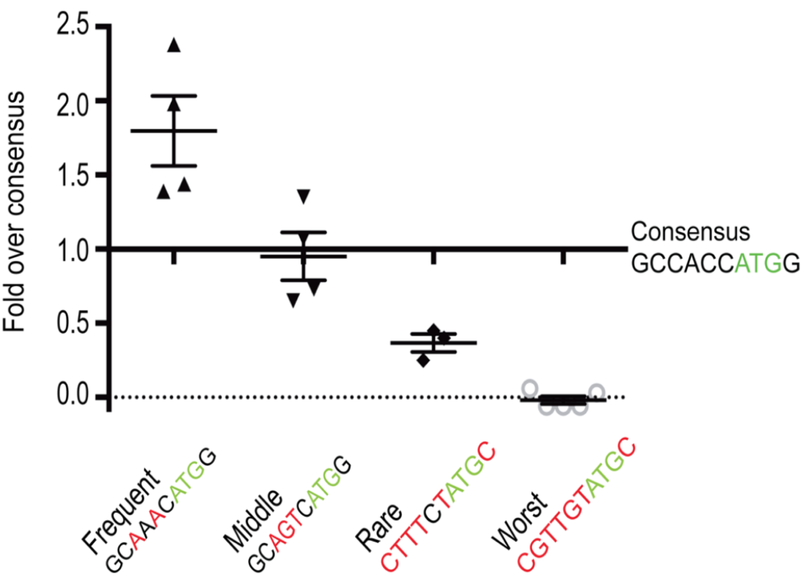
```
<br>

Additional studies found that nucleotides in two highly conserved positions exert the strongest effect: a G residue following the ATG codon (position +4) and a purine three nucleotides upstream (position -3). Thus, overall, a good start codon is one found in the following context: RNNATGG (Where R is a purine and N is any nucleotide). Whereas an adequate start codon is RNNATGY or YNNATGG (where Y is a pyrimidine) (Kozak 1997). 

### [Test Your Understanding](https://docs.google.com/forms/d/e/1FAIpQLSdUb7zLFClMM3JsMUwTKL2YQxSfFQnefExu2x7GsDg02Tz0WQ/viewform?usp=sf_link){target="_blank"}
<style>
div.blue { background-color:#e6f0ff; border-radius: 5px; padding: 5px;}
</style>
<div class = "blue">
The following questions ask you to evaluate the predicted start codon for a variety of genes. To identify the predicted start codon, review the gene prediction track. 


- *Is the predicted BBS1 start codon found in a good context (RNN**ATG**G), adequate context (RNN**ATG**Y or YNN**ATG**G) or neither?*
<br>
- *Now, find the DPP3 gene just upstream of BBS1. Is the predicted DPP3 start codon found in a good context (RNN**ATG**G), adequate context (RNN**ATG**Y or YNN**ATG**G) or neither?*
<br>
- *Now, find the ZDHHC24 gene just downstream of BBS1. Is the predicted ZDHHC24 start codon found in a good context (RNN**ATG**G), adequate context (RNN**ATG**Y or YNN**ATG**G) or neither?*
<br>
- *Now, find the MYH3 gene (use the search window). Is the predicted MYH3 start codon found in a good context (RNN**ATG**G), adequate context (RNN**ATG**Y or YNN**ATG**G) or neither?*
</div>

## uORFs
uORF stands for upstream Open Reading Frame (pronounced you-orf). A gene is said to have a uORF if it has a start codon in the putative 5’ UTR followed by an **in-frame** stop codon that precedes the **end** of the main coding sequence or so-called primary ORF (Figure \@ref(fig:uORFdefined)). 

<br>
```{r uORFdefined, out.width='70%', fig.align='center', fig.cap = "Paraphrased from Calvo et al. 2009. A) A schematic representation of an mRNA transcript with two uORFs (red arrows), one fully upstream and one overlapping the main coding sequence (black arrow). uORFs were defined by Calvo et al. as a start codon (AUG) in the 5' UTR followed by an in-frame stop codon (arrowhead) that precedes the **end** of the main coding sequence. Calvo et al. 2009 further refines the definition to only include uORFs that code for a minimum peptide length of 3 amino acids (or a coding sequence minimum length of 9 nt). (B) Number of uORFs in human and mouse RefSeq transcripts."}
knitr::opts_chunk$set(echo = FALSE)
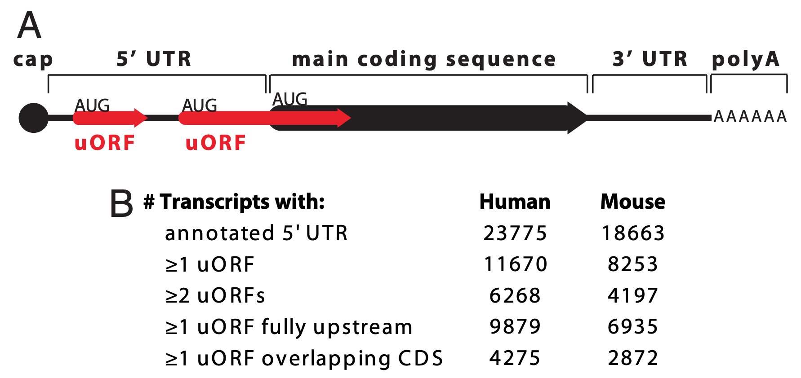
```
<br>


uORFs, in general, have the capacity to reduce translation initiation from the bonafide start codon (Calvo et al. 2009). Since they are found in a large number of protein coding genes (nearly 50% of human genes are thought to have a uORF), this is thought to be “by design”. In other words, it is thought that the presence of a uORF has an important purpose and is subject to positive selection during evolution as a way to keep gene expression levels appropriately low. Two examples are described in Figure \@ref(fig:uORFregulation). 

<br>
```{r uORFregulation, out.width='70%', fig.align='center', fig.cap = "Paraphrased from Kozak, 2005. Small upstream ORFs or uORFs are thought to down-regulate translation by imposing an inefficient reinitiation mechanism. This constraint on translation ensures against harmful overproduction of potent or toxic proteins. Two examples are described here. A) The presence of an overlapping uORF allows only low-level production of proinsulin in chick embryos. In the adult pancreas where more proinsulin protein is needed, a more efficiently translated form of mRNA is produced via a downstream promoter. B) The human mdm2 oncogene has the ability to cause cancer when it is overexpressed. Overexpression of the mdm2 oncogene in tumor cells is caused by a switch in the transcriptional start site which eliminates two small uORFs, thereby elevating translation 20-fold. The first example illustrates a naturally occuring, developmental switch in gene expression. The second example only occurs in the disease state. In fact, the expression from the crytpic downstream promoter results from the presence of a p53-responsive promoter region that is preferentially utilized when p53 levels increase, a common occurance in tumor cells (Landers 1997)"}
knitr::opts_chunk$set(echo = FALSE)
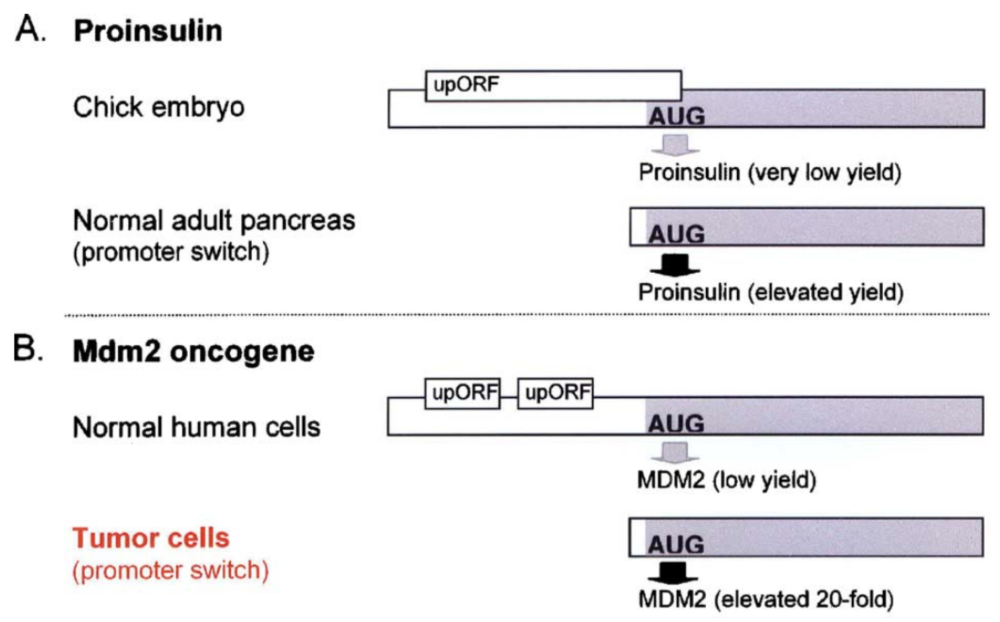
```
<br>

## Recognizing uORFs
To determine if a gene of interest (GOI) has a uORF in its 5' UTR, you need to focus your genome browser on the 5' UTR of your GOI then make sure your base prediction track is set to full. So long as you are zoomed in close enough to see the green boxes (start codons) and red boxes (stop codons) in the three reading frames, you can recognize uORFs. For an example of what a uORF would look like, see Figure \@ref(fig:MDM2uORF). At some point you may come across a gene with an intron in the 5' UTR (it's rare). Just keep in mind that these 5' UTRs are more difficult to assess because the uORF may switch reading frames if it spans the intron. 

<br>
```{r MDM2uORF, out.width='50%', fig.align='center', fig.cap = "MDM2 has two uORFs in the 5' UTR as highlighted here in the bottom image. Both uORFs by definition are upstream of the predicted start codon as highlighted in the top image. Notice a uORF is defined as a start codon in the 5' UTR that is followed by a stop codon **in the same reading frame**."}
knitr::opts_chunk$set(echo = FALSE)
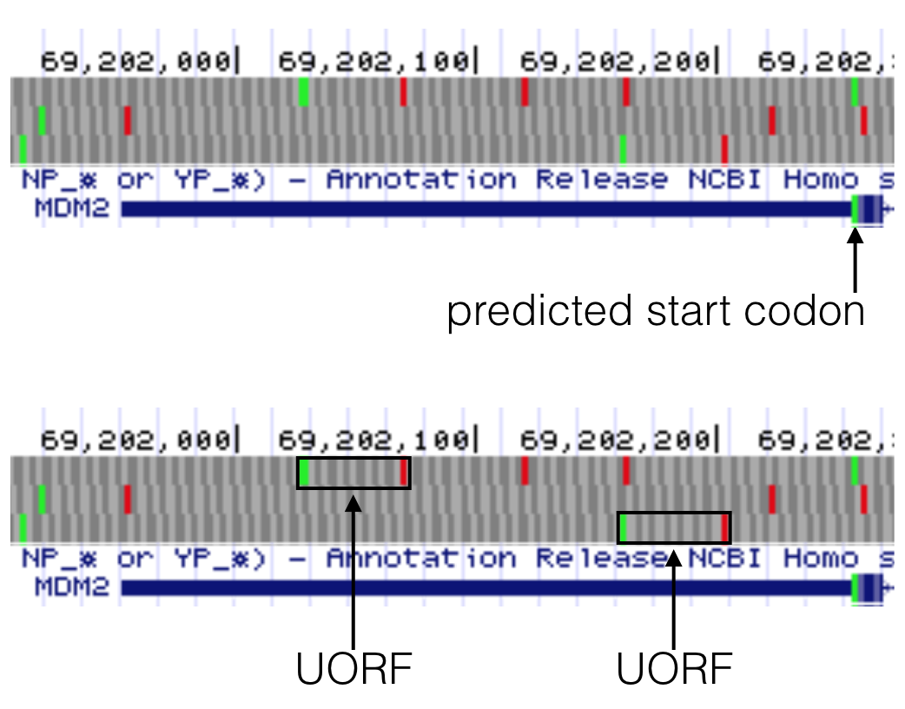
```
<br>


### [Test Your Understanding](https://docs.google.com/forms/d/e/1FAIpQLSe-oas9GK1E-KqyOOzGnrdZGzwiY6GRGVgwlce4FB7GHzW1zg/viewform?usp=sf_link){target="_blank"}
<style>
div.blue { background-color:#e6f0ff; border-radius: 5px; padding: 5px;}
</style>
<div class = "blue">


- *Does BBS1 have a uORF in the 5’ UTR?*
<br>
- *If yes, is the uORF found in a good context (RNN**ATG**G), adequate context (RNN**ATG**Y or YNN**ATG**G) or neither?*
<br>
- *Search for the gene, TAS2R3. It has a uORF in its 5' UTR that is known to impact translation of the primary ORF (Calvo et al. 2009). Is the ATG of the uORF found in a good context (RNN**ATG**G), adequate context (RNN**ATG**Y or YNN**ATG**G) or neither?*
<br>
- *Search for the gene, SFXN3. It has a uORF in its 5' UTR that is known to impact translation of the primary ORF (Calvo et al. 2009). Is the ATG of the uORF found in a good context (RNN**ATG**G), adequate context (RNN**ATG**Y or YNN**ATG**G) or neither?*
<br>
- *Search for the gene, ADH5. It has a uORF in its 5' UTR that is known to impact translation of the primary ORF (Calvo et al. 2009). There are two start codons in-frame with a downstream stop codon within the 5' UTR. Evaluate the context of these two start codons to determine if these start codons are found in a good context (RNN**ATG**G), adequate context (RNN**ATG**Y or YNN**ATG**G) or neither.*
<br>
- *Search for the gene, UCP2. It has a uORF in its 5' UTR that is known to impact translation of the primary ORF (Calvo et al. 2009). There are three start codons in frame with a downstream stop codon. Evaluate the context of these three start codons to determine if these start codons are found in a good context (RNN**ATG**G), adequate context (RNN**ATG**Y or YNN**ATG**G) or neither.*
<br>
</div>

## [For Discussion](https://docs.google.com/forms/d/e/1FAIpQLScUUIanAotTGMtaVZY51ZcYjrJF1qkbuy08SwycPIQrdn8raA/viewform?usp=sf_link){target="_blank"}

1. How did you go about identifying a uORF when you answered your "Test Your Understanding" questions above? 

## Homework
Create your own consensus sequence and sequence logo. 

**If the first letter of your last name falls within A-M:** 

Part 1. Click the appropriate link to download a [DOCX file](https://drive.google.com/file/d/1d0c37m7lQloME0VEw_z_fILAdVX7DrgH/view?usp=sharing){target="_blank"} or a [PDF file](https://drive.google.com/file/d/1NPnzu2LG8kIRGlXKBQVJdWZG3PSGzKvs/view?usp=sharing){target="_blank"}. Complete the **left side** of the table (Figure \@ref(fig:intronMSA)). Instructions are included in the file. Review Figure \@ref(fig:BBS1transcript) to remind yourself what an intron looks like and Figure \@ref(fig:exonjumpingtips) to see how I completed the second row of the table. <br>
Part 2. Create a **sequence logo** for the multiple sequence alignment you built using the [web logo](https://weblogo.berkeley.edu/logo.cgi){target="_blank"} website. See (Figure \@ref(fig:weblogopage)) for instructions on how to use the weblogo site. 

**If the first letter of your last name falls within N-Z:** 

Part 1. Click the appropriate link to download a [DOCX file](https://drive.google.com/file/d/1d0c37m7lQloME0VEw_z_fILAdVX7DrgH/view?usp=sharing){target="_blank"} or a [PDF file](https://drive.google.com/file/d/1NPnzu2LG8kIRGlXKBQVJdWZG3PSGzKvs/view?usp=sharing){target="_blank"}. Complete the **right side** of the table (Figure \@ref(fig:intronMSA)). Instructions are included in the file. Review Figure \@ref(fig:BBS1transcript) to remind yourself what an intron looks like and Figure \@ref(fig:exonjumpingtips) to see how I completed the second row of the table. <br>
Part 2. Create a **sequence logo** for the multiple sequence alignment you built using the [web logo](https://weblogo.berkeley.edu/logo.cgi){target="_blank"} website. See (Figure \@ref(fig:weblogopage)) for instructions on how to use the weblogo site. 

DM your files directly to your instructor via SLACK. 

<br>
```{r intronMSA, out.width='50%', fig.align='center', fig.cap = "Complete either the left half or right half of the table (depending on the first letter of your last name - see below for more detailed instructions). The first two rows have been completed for you. Make sure you understand where this sequence comes from. The columns highlighted in yellow correspond to the 5' splice site (left half) or 3' splice site (right half). Links to the assignment can be found below."}
knitr::opts_chunk$set(echo = FALSE)
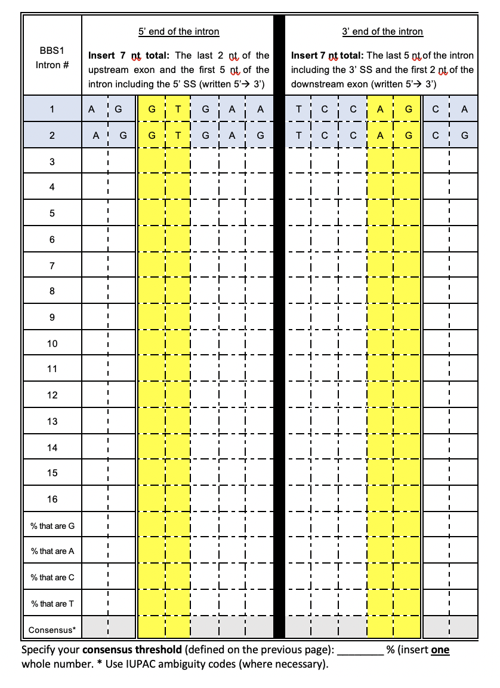
```
<br>
```{r exonjumpingtips, out.width='100%', fig.align='center', fig.cap = "The exon-intron junctions of intron two are shown here. The sequences boxed in red outline the sequence that were input into row 2 of the table above. The top image includes the 5' end of intron 2. The bottom image includes the 3' end of intron 2. The 5' (top) and 3' (botom) splice sites are highlighted in yellow. To quickly jump to the next intron-exon junction, click on the open arrowhead on the far right (green arrows point to the open arrowheads). Another way to quickly view 5’ and 3’ splice site sequences is by clicking on the gene schematic in the NCBI Refseq track and then by clicking on the 'View details of parts of alignment within browser window' link."}
knitr::opts_chunk$set(echo = FALSE)
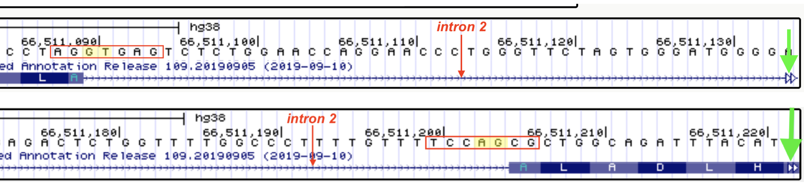
```
<br>
```{r weblogopage, out.width='100%', fig.align='center', fig.cap = "To use the Weblogo site successfully, follow the instructions as outlined above."}
knitr::opts_chunk$set(echo = FALSE)
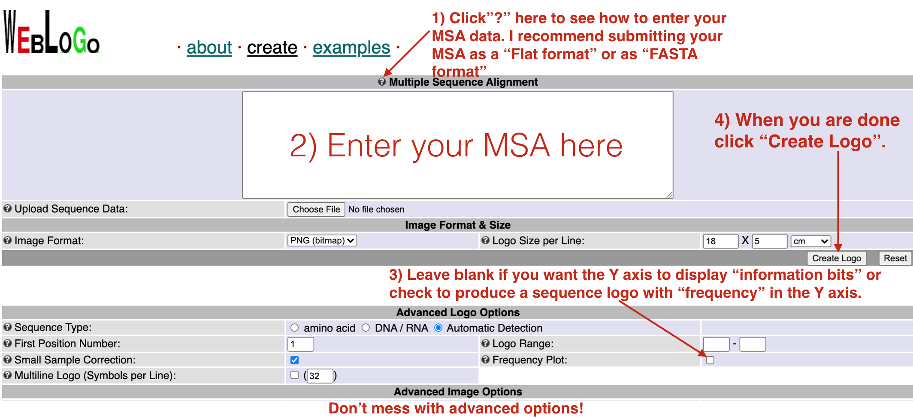
```
<br>


© 2019, Maria Gallegos. All rights reserved.

<style>
p.caption {
  font-size: 0.8em;
  margin-right: 2%;
  margin-left: 2%;
  line-height: 1.2em;
  text-align: left;
}
</style>

<script src="https://ajax.googleapis.com/ajax/libs/jquery/3.1.1/jquery.min.js"></script>

<style>
.zoomDiv {
  opacity: 0;
  position:absolute;
  top: 50%;
  left: 50%;
  z-index: 50;
  transform: translate(-50%, -50%);
  box-shadow: 0px 0px 50px #888888;
  max-height:100%; 
  overflow: scroll;
}

.zoomImg {
  width: 100%;
}
</style>


<script type="text/javascript">
  $(document).ready(function() {
    $('body').prepend("<div class=\"zoomDiv\"></div>");
    // onClick function for all plots (img's)
    $('img:not(.zoomImg)').click(function() {
      $('.zoomImg').attr('src', $(this).attr('src'));
      $('.zoomDiv').css({opacity: '1', width: '100%'});
    });
    // onClick function for zoomImg
    $('img.zoomImg').click(function() {
      $('.zoomDiv').css({opacity: '0', width: '0%'});
    });
  });
</script>

