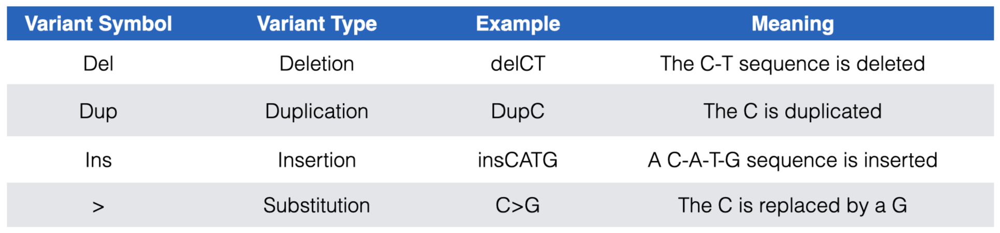
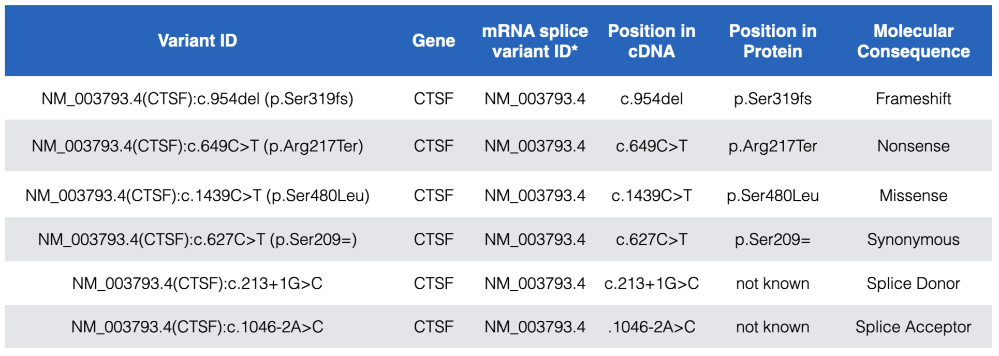
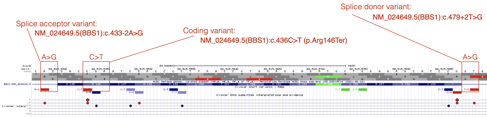
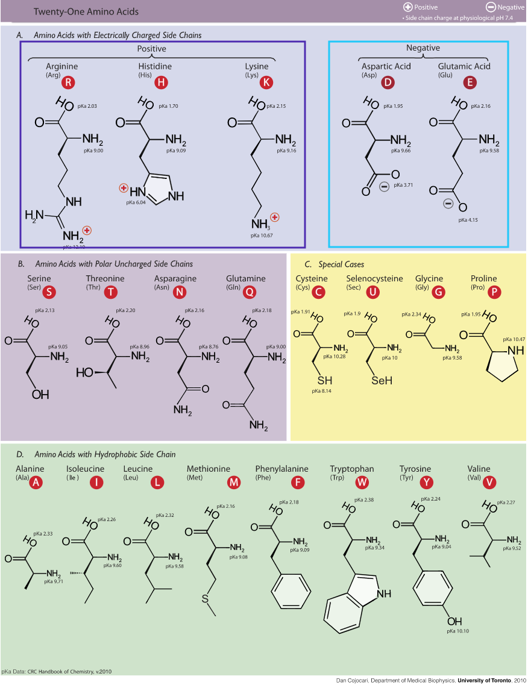

# Finding Genes by Sequence Variant {#chapter7}
A gene is a segmant of DNA that is first transcribed to produce a gene product. In chapters [3](#chapter3) and [4](#chapter4), we looked at RNA to pinpoint the location of a gene. A gene is also “a *functional* unit of inheritance”. In this chapter you will see how **DNA variants**^[A DNA variant is a sequence difference at a specific spot in the genome (different from the reference sequence) that can either be benign or pathogenic. Background: Each human genome is unique. Combined there are millions of sequence variants (small differences in sequence). Most variants have unknown effects and are likely benign. Some contribute to differences between humans like eye color and blood type while a small number are pathogenic (cause disease). Pathogenic variants in humans are also sometimes called mutations. Benign variants are sometimes called polymorphisms.] can be used to locate genes. How? Some DNA variants in humans are pathogenic (cause disease). These variants are assumed to inactivate a gene somehow underscoring the importance of that nucleotide or nucleotides within the gene. When the DNA variant is mapped to the genome, the location of the disrupted gene is also discovered. To follow along with the text and answer **Test Your Understanding** questions, you will be using the ["DNA Variant"](https://genome.ucsc.edu/s/megallegos/Biol%20310%3A%20Module%204%3A%20Mutational%20Analysis){target="_blank"} session link. You can also use this link as a starting point to view DNA variant data for *any* gene of interest.

## Understanding how DNA variants are displayed
Open the ["DNA Variant"](https://genome.ucsc.edu/s/megallegos/Biol%20310%3A%20Module%204%3A%20Mutational%20Analysis){target="_blank"} session link to view the "ClinVar Variants" evidence track. This evidence track is configured to display two subtracks entitled, "**ClinVar Short Variants < 50bp**" (top) and "**ClinVar SNVs submitted interpretations and evidence**" (bottom). Both subtracks show the genomic positions of DNA substitutions^[one or a few nucleotide base changes - length of DNA stays the same] and indels^[one or a few nucleotide insertions and/or deletions] from the ClinVar database. "ClinVar is a free, public archive of reports of the relationships among human variations and phenotypes, with supporting evidence."^[quote taken from the Track Settings page for the "ClinVar Variants" evidence track]. Importantly, the DNA variants included in each subtrack come from a similar **but nonoverlapping set** of data. 

The DNA variants in both subtracks are color coded according to clinical significance: red for pathogenic (P) or likely pathogenic (LP), green for benign (B) or likely benign (LB), dark blue for "variant of uncertain significance" (VUS), dark gray for not provided (OTH) and light blue for "conflicting interpretation of pathogenicity". In the "**ClinVar Short Variants < 50bp**" subtrack, each DNA variant is also displayed according to variant type. See Figure \@ref(fig:MutationCodes) for a list of DNA variant types you are likely to encounter. 


<br>
```{r MutationCodes, out.width='100%', fig.align='center', fig.cap = "The most common DNA variant symbols you are likely to see in the **ClinVar Short Variants < 50 bp** substrack."}
knitr::opts_chunk$set(echo = FALSE)

```
<br>
Each DNA variant in the "**ClinVar Short Variants < 50bp**" subtrack is clickable. A mouse click will take you to a new page with a table that describes the sequence variant in more detail. Useful information can often be found in the rows entitled, "Link to ClinVar with Variant ID", "Clinical significance", "Molecular Consequence" and "Phenotypes". The **"Link to ClinVar with Variant ID"** row tells you exactly which nucleotide in the gene is affected and how this DNA change impacts the mRNA sequence and the protein sequence (if at all or if known). Figure \@ref(fig:HGVScodes) lists common DNA variant IDs you may encounter. These examples all map to CTSF, a gene nearby BBS1 (zoom out to locate it). For example, you might find **"NM_003793.4(CTSF):c.649C>T (p.Arg217Ter)"**. This means that that the C nucleotide, in the *reference genome*^[The word, "reference" in this context is what geneticists use to describe the "wildtype" genome. Since there is no single wildtype genome, geneticists use the word reference instead.] at position 649 of the CTSF mRNA (mRNA sequence described in [**NM_003793.4**](https://www.ncbi.nlm.nih.gov/nuccore/NM_024649.5?report=GenBank){target="_blank"}^[NM_003793.4 is a unique identifier for the CTSF mRNA. Each mRNA created by the genome has a unique ID. Recall that some genes produce alternative splice forms and thus multiple, unique mRNAs and so the position of a specific nucleotide variant is often *isoform dependent* and must be stated explicitly. CTSF only has one splice form and so all the mutations map to the same mRNA splice variant ID]) is changed to a T. As a result of this DNA substitution, the reference amino acid at position 217 of the protein changes from an Arg (Arginine) to a termination codon (stop codon).  Click [here](http://www2.csudh.edu/nsturm/CHEMXL153/DNAMutationRepair.htm){target="_blank"} to review how DNA variant types are classified at both the DNA and protein levels.

<br>
```{r HGVScodes, out.width='100%', fig.align='center', fig.cap = "Examples of the most common DNA variants and how the variant ID describes where each maps within the gene, mRNA (cDNA) and protein. In the **Variant ID** and **Position in Protein** columns, Ter=termination and the equal sign indicates no change. Also notice that while splice site variants do not map to coding sequence they are still described relative to a position in the cDNA. See text for more details."}
knitr::opts_chunk$set(echo = FALSE)

```
<br>

You can also click on any circle (red, green, etc) in the **ClinVar Interpretations subtrack** to review a similar table of information except that the "Phenotype" row is replaced by a "Description" row. This row typically explains the impact that the DNA variant has on the gene product *and* the person harboring the variant^[The description often mentions an observed frequency of the variant in the so-called ExAC database. The ExAC database, maintained at the [gnomAD database](https://gnomad.broadinstitute.org/){target="_blank"}, is comprised of whole exome sequencing data from healthy human volunteers. If you find the phrase, "(ExAC no frequency)", then the DNA variant is **NOT observed in a large random healthy population* of 60,706 individuals. ** and is likely to be pathogenic. By contrast, if the Exac frequency is >> 0, then the DNA variant is likely to be benign]. Although someetimes it is left blank. 

As you explore BBS1 DNA variants, you will see that most pathogenic DNA variants map to coding sequence. One example is shown in Figure \@ref(fig:TtoC). The reference codon, C-G-A, is outlined in red (See Base Position Track). C-G-A codes for Arginine (Arg or R) at position 146 (See Gene Prediction Track). The pathogenic mutation at this position is a C>T substitution changing the C-G-A codon to T-G-A. If you consult the genetic code (Figure \@ref(fig:geneticcode)) you will see that T-G-A codes for a stop codon. This is consistent with the classification of this variant as pathogenic. 

<br>
```{r TtoC, out.width='100%', fig.align='center', fig.cap = "Three variants that are described in detail in the text."}
knitr::opts_chunk$set(echo = FALSE)

```
<br>

By contrast, pathogenic mutations that map outside the coding sequence typically map to either a 5' splice site (splice donor site) or a 3' splice site (splice acceptor site). An example of each is also shown in Figure \@ref(fig:TtoC). Notice that DNA variants that map to splice sites do not provide information about how the DNA variant impacts the protein sequence (click on any splice site mutation and review the Clinvar Variant ID or Protein HGVS information). This is because it is nearly impossible to predict how a splice site mutation will impact splicing and thus the central open reading frame that is produced. The intron might remain in the mature mRNA, a nearby cryptic splice site^["Cryptic splice sites also match the consensus motifs, and by definition they are splice sites that are not detectably used in wild-type pre-mRNA, but are only selected as a result of a mutation elsewhere in the gene, most often at the authentic splice site" - Roca et al. 2003] might get utilized or the exon impacted by the splice site mutation might be skipped entirely. Whatever happens, splice site mutations typically lead to shifts in the reading frame and early stop codons. 

Finally, notice how the position of a splice site mutation is described relative to the mRNA (cDNA). The location of the splice acceptor variant in Figure \@ref(fig:TtoC) is described as NM_024649.5(BBS1):c.433-2A>G. In this example, position 433 is the first nucleotide of exon 5 of BBS1 (as described by NM_024649.5). Thus the DNA variant is located at position 433-2 (the 2nd nucleotide *upstream* of exon 5 in the genome). In other words, the highly conserved A in the **A**-G of the 3’ SS of intron 4 is mutated to a G. The location of the splice donor variant in Figure \@ref(fig:TtoC) is described as M_024649.5(BBS1):c.479+2T>G. In this example, position 479 is the last nucleotide of exon 5. Thus, the DNA variant is located at position 479+2 (the 2nd nucleotide *downstream* of exon 5). In other words, the highly conserved T in the G-**T** of the 5’ SS of intron 5 is mutated to a G. 

Importantly, given a **Clinvar variant ID** (i.e. NM_024649.5(BBS1):c.433-2A>G) or **Nucleotide HGVS ID** (i.e. NM_024649.4:c.433-2A>G) you can locate this DNA variant within the UCSC genome browser. Simply copy and paste the Variant ID into the search window and click Go. This knowledge will come in handy when you Test Your Understanding!

### [Test Your Understanding](https://docs.google.com/forms/d/e/1FAIpQLSe4661QFvixviLrC9nB5QxVFjC19_k_mI_aMwXnhcu0bFhP4Q/viewform?usp=sf_link){target="_blank"}
<style>
div.blue { background-color:#e6f0ff; border-radius: 5px; padding: 5px;}
</style>
<div class = "blue">

To answer the following "Test Your Understanding" questions, use the ["DNA Variant"](https://genome.ucsc.edu/s/megallegos/Biol%20310%3A%20Module%204%3A%20Mutational%20Analysis){target="_blank"} session. You may also need to consult Figure \@ref(fig:aminoacids) below to remember how amino acids are grouped according to the functional properties associated with their side chains (hydrophobic, polar uncharged etc). 
<br>
Consider the coding variant	**NM_024649.5:c.235G>T** to answer the following questions:

- *Copy and paste Nucleotide HGVS description from above into the Genome Browser window. What type of sequence variant is this (i.e. transition, transversion or indel)?*
<br>
- *What is the sequence of the reference codon impacted by the G>T mutation?*
<br>
- *What amino acid does the reference codon code for?*
<br>
- *What does the reference codon become in the 	NM_024649.5:c.235G>T variant?*
<br>
- *What amino acid does the variant codon code for (if any)?*
<br>
- *What type of protein variant is this?*
<br>
</div>

<br>
```{r aminoacids, out.width='75%', fig.align='center', fig.cap = "Amino acid side chains can be grouped according to chemical properties. This image illustrates one way amino acids can be grouped. Image credit: [Dan Cojocari](https://commons.wikimedia.org/w/index.php?curid=9179304)."}
knitr::opts_chunk$set(echo = FALSE)

```
<br>


### [Test Your Understanding](https://docs.google.com/forms/d/e/1FAIpQLSeFPVWrhrsiNtMIHhQF2eNraOkg3sjLqcY-q8y9FtL7H_N5eA/viewform?usp=sf_link){target="_blank"}
<style>
div.blue { background-color:#e6f0ff; border-radius: 5px; padding: 5px;}
</style>
<div class = "blue">

To answer the following "Test Your Understanding" questions, use the ["DNA Variant"](https://genome.ucsc.edu/s/megallegos/Biol%20310%3A%20Module%204%3A%20Mutational%20Analysis){target="_blank"} session.
<br>
<br>
Now consider the coding variant **NM_024649.5:c.41C>G** to answer the following questions: 

- *Copy and paste Nucleotide HGVS description from above into the Genome Browser window. What type of sequence variant is this (i.e. transition, transversion or indel)?*
<br>
- *What is the sequence of the reference codon impacted by the C>T mutation?*
<br>
- *What amino acid does the reference codon code for?*
<br>
- *What does the reference codon become with the NM_024649.5:c.41C>G variant?*
<br>
- *What amino acid does the variant codon code for (if any)?*
<br>
- *What type of protein variant is this?*

Now consider the coding variant **NM_024649.5:c.240C>T** to answer the following questions: 

- *Copy and paste Nucleotide HGVS description from above into the Genome Browser window. What type of sequence variant is this (i.e. transition, transversion or indel)?*
<br>
- *What is the sequence of the reference codon impacted by the C>T mutation?*
<br>
- *What amino acid does the reference codon code for?*
<br>
- *What does the reference codon become with the NM_024649.5:c.240C>T variant?*
<br>
- *What amino acid does the variant codon code for (if any)?*
<br>
- *What type of protein variant is this?*

General Questions about mutations. 

- *What type of sequence variants lead to a frameshift mutation (transition, transversion, indel)?*
<br>
- *By definition, where must frameshift mutations be located (i.e. exons, introns, 5' UTR, 3' UTR, promoter)?*
<br>
- *By definition, where must splice site mutations be located (i.e. exons, introns, 5' UTR, 3' UTR, promoter)?*
<br>
- *By definition, where must nonsense mutations be located (i.e. exons, introns, 5' UTR, 3' UTR, promoter)?*
<br>

Step back and look at a larger region surrounding BBS1. Specifically, click on the link for ["DNA Variant"](https://genome.ucsc.edu/s/megallegos/Biol%20310%3A%20Module%204%3A%20Mutational%20Analysis){target="_blank"} session then zoom out 10X. This region now includes neighboring genes including MRPL11, DPP3, BBS1, ZDHHC24, ACTN3 and CTSF. 

- *Copy and paste a nucleotide HGVS code for any frameshift mutation that maps to BBS1*
<br>
- *Pathogenic sequence variants map to two genes in this region. Choose the two among MRPL11, DPP3, BBS1, ZDHHC24, ACTN3 and CTSF?*
<br>
</div>

## [For Discussion](https://docs.google.com/forms/d/e/1FAIpQLSda-6Xh3SbF8zzKhoQVZ6biWLkzigculLabj8y3Jg1I4Yc5KA/viewform?usp=sf_link){target="_blank"}

1. Some genes don’t have any variants associated with them. Why do you think this is? More than one answer is possible.
2. Find the sequence variant that maps to the gene, CCS (Nucleotide HGVS: NM_005125.2:c.487C>T). It suggests that it might lead to neurodegeneration but it is rated as "uncertain significance". How likely do you think it is that this is a pathogenic allele. Use any tool (including Google searches, your knowledge of genetics and reasoning abilities) to argue one way or the other (there are no right answers). 

## Caveats and Limitations
Absence of evidence is not evidence of absence. In other words, *every* gene cannot be identified in this way even if a DNA variant renders a gene inactive. Why, you ask? Some genes when inactive do not produce a measurable phenotypic change or perhaps one doesn't know where to look or what to measure. Or there might be more than one gene capable of performing the same function (genetic redundancy^[In engineering the word redundancy is used to describe the inclusion of extra components which are not strictly necessary to functioning, but are there in case of failure of other components. In genetics, genetic redundancy is a term used to describe situations where a given biochemical function is encoded by two or more genes that perform the same function. In these cases, mutations (or defects) in one of these genes will have a smaller effect on the fitness of the organism than expected from the genes' known function. Paraphrased from Wikipedia]) and thus inactivating one gene may not lead to a phenotypic change because another similar gene is still functional. 

## [Homework](https://drive.google.com/file/d/11T71xL2ylto_hP32Uo560bUnb0kbLp61/view?usp=sharing){target="_blank"}


© 2019, Maria Gallegos. All rights reserved.

<style>
p.caption {
  font-size: 0.8em;
  margin-right: 2%;
  margin-left: 2%;
  line-height: 1.2em;
  text-align: left;
}
</style>

<script src="https://ajax.googleapis.com/ajax/libs/jquery/3.1.1/jquery.min.js"></script>

<style>
.zoomDiv {
  opacity: 0;
  position:absolute;
  top: 50%;
  left: 50%;
  z-index: 50;
  transform: translate(-50%, -50%);
  box-shadow: 0px 0px 50px #888888;
  max-height:100%; 
  overflow: scroll;
}

.zoomImg {
  width: 100%;
}
</style>


<script type="text/javascript">
  $(document).ready(function() {
    $('body').prepend("<div class=\"zoomDiv\"></div>");
    // onClick function for all plots (img's)
    $('img:not(.zoomImg)').click(function() {
      $('.zoomImg').attr('src', $(this).attr('src'));
      $('.zoomDiv').css({opacity: '1', width: '100%'});
    });
    // onClick function for zoomImg
    $('img.zoomImg').click(function() {
      $('.zoomDiv').css({opacity: '0', width: '0%'});
    });
  });
</script>

