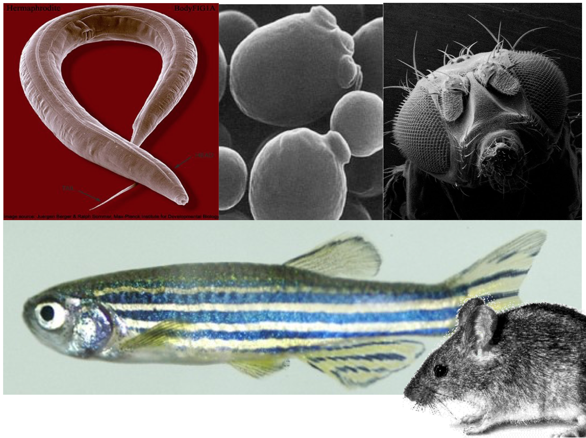
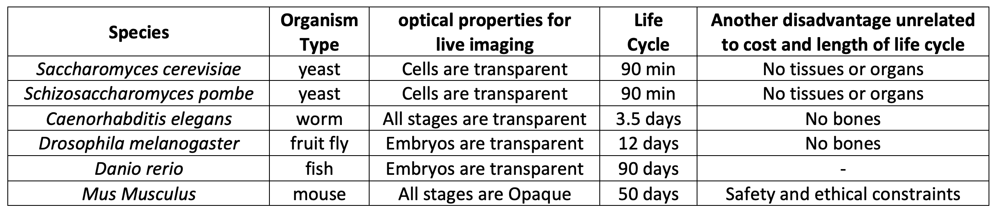
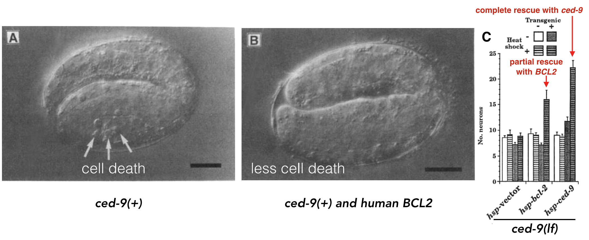
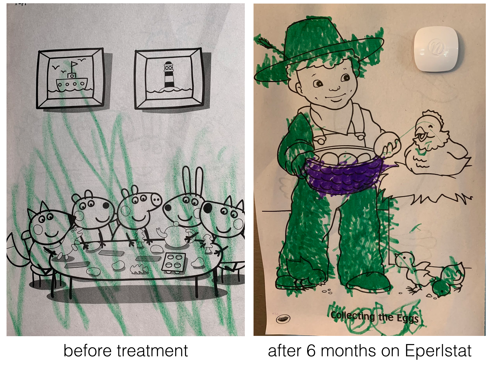
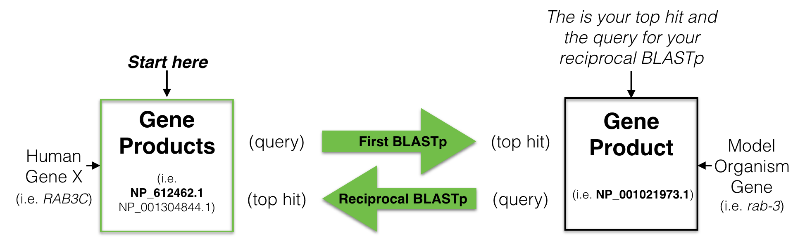
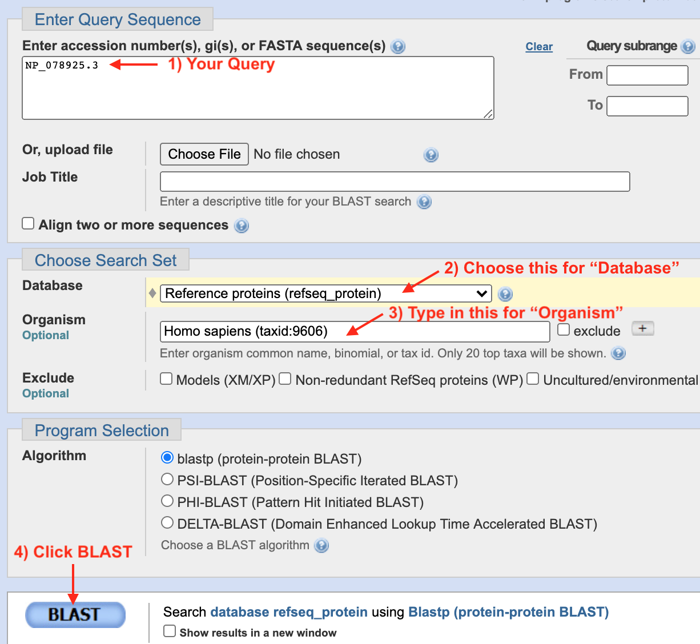
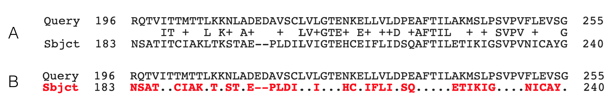
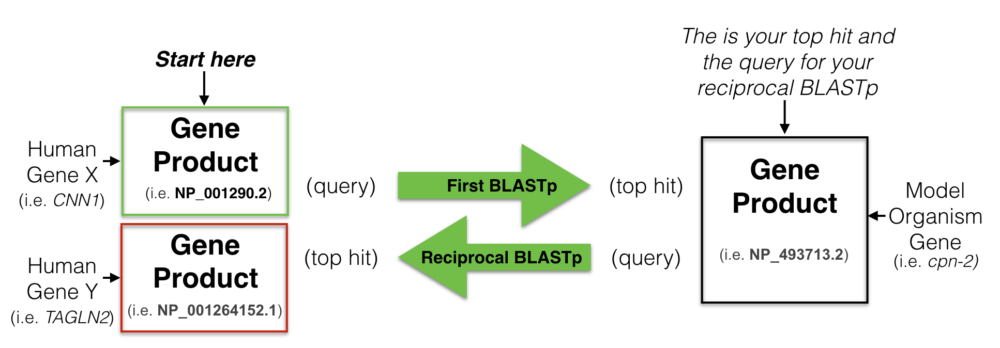
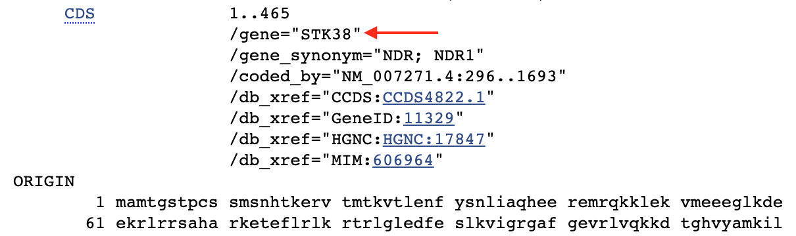

# *Finding Genes with Orthology* {#chapter8}

Genetic model organisms like yeast, worms, flies, fish and mice play a critical role in the advancement of biomedical research (Figure \@ref(fig:modelorganisms)). Each offers unique advantages and all allow the opportunity to investigate gene function and model human disease in an organism that is amenable to genetic, molecular and biochemical studies. Moreover, research in model organisms is cheaper, faster and more ethical than research on humans! A list of  advantages and disadvantages for each of the most common species studied today are shown in Figure \@ref(fig:modelsystems). 

<br>
```{r modelorganisms, out.width='60%', fig.align='center', fig.cap = "Popular model organisms used in genetic research. Clockwise from top left: *Caenorhaditis elegans* (round worm), *Saccharomyces cerevisiae* (budding yeast), *Drosophila melanogaster* (fruit fly), *Mus musculus*, (house mouse) and *Danio rerio* (zebrafish). Image sources: worm image from [Wormatlas](https://www.wormatlas.org/hermaphrodite/introduction/Introframeset.html), yeast image by Alan Wheals, University of Bath, UK., fly, mouse and fish image sources unknown."}
knitr::opts_chunk$set(echo = FALSE)

```
<br>
```{r modelsystems, out.width='100%', fig.align='center', fig.cap = "Advantages and disadvantages of the common model organisms used in genetic research listed from cheapest (yeast) to most expensive (mice)."}
knitr::opts_chunk$set(echo = FALSE)

```
<br> 

While at the surface humans appear to have little in common with mice, fish, flies, worms or fungi, this approach works. Why? [Cell Theory](https://en.wikipedia.org/wiki/Cell_theory#:~:text=All%20known%20living%20things%20are,total%20activity%20of%20independent%20cells.){target="_blank"} states that "all cells come from pre-existing cells". And in fact, a significant percentage of genes from these ancestral cells persist in some form in Eukaryotes today. Despite nearly 1 billion years of evolution, many gene products are recognizable at the amino acid sequence level and in some cases are functionally interchangeable! 

For example, a human gene called BCL2 was found that inhibits **programmed cell death** in human cells grown in a dish (Vaux et al. 1988). Programmed cell death is a biological process that has been observed in all animals studied to date. When certain cells are no longer needed, they "commit suicide" by activating an intracellular death program. But programmed cell death must be kept under control. Too much death is also problematic. In 1992, Vaux et al. discovered that if you inject human *BCL2* fused downstream to a worm heat-shock promoter^[A promoter that is activated by heat. With heat shock, the promoter will initiate high levels of transcription!] its progeny^[offspring or descendants of an animal, or plant - online dictionary] not only expressed the human gene when heat shocked but also had ***less*** programmed cell death! See Figure \@ref(fig:BCL2rescue) A and B.

<br>
```{r BCL2rescue, out.width='100%', fig.align='center', fig.cap = "A) Normal worm development includes a certain amount of programmed cell death. B) When human *BCL2* is expressed in worm embryos, less cell death is observed (Vaux et al. 1992). *+* indicates, wildtype allele. C) Data demonstrating that human *BCL2* is able to partially rescue the *ced-9* loss-of-function mutant phenotype (Hengartner and Horvitz, 1994). "}
knitr::opts_chunk$set(echo = FALSE)

```
<br>

A worm gene called *ced-9* was later found to function similarly. In loss of function *ced-9* mutants, more cells died suggesting that wildtype *ced-9* (like *BCL2*) inhibits programmed cell death. In subsequent experiments, Hengartner and Horvitz partially **rescued** *ced-9* loss of function mutants with the human *BCL2* gene! In other words, *ced-9* mutant worms expressing human *BCL2* looked more like wild type (Figure \@ref(fig:BCL2rescue) C). Dr. Vaux, the first author explained in an [interview](https://www.nature.com/articles/4401439){target="_blank"}: "This meant that the human BCL2 protein must be interacting with the worm's cell death mechanism. The fact that human *BCL2* could work in a worm suggested that human *BCL2* can interact with whatever proteins the worm CED-9 protein interacts with. That, in turn, suggests that not only the gene but also the pathway of cell death is likely to be universal." That is one billion years of evolution separating worms and humans! This is strong evidence that human *BCL2* and worm *bcl-2* are **orthologs** a term that describes two genes in distinct species that evolved from an ancestral gene present in the last common ancestor. 

In 2014, Dr. Ethan Perlstein created Perlara, a biotech Public Benefit Corporation which aimed to accelerate the discovery of treatments for rare genetic diseases through the use of simple model organisms. While this company has since shut down^[an early backer and partner withdrew from a licensing deal which triggered a fatal downward spiral] they were ultimately successful in in their efforts. 

In one example, Perlara created yeast, worm and fly models of a rare congenital disorder of glycosylation called PMM2-CDG^[According to Wikipedia, **glycosylation** is a process whereby a carbohydrate is attached to a hydroxyl or other functional group of another molecule (often a lipid or protein)] caused by mutations in the PMM2 gene^[According to Genetics Home Reference, the PMM2 gene produces an enzyme called phosphomannomutase 2. This enzyme is involved in glycosylation (see earlier footnote), which acts by attaching groups of sugar molecules to proteins]. From their initial studies they knew they needed a drug that would boost the enzymatic activity of PMM2. To identify such a drug, Perlara performed a drug repurposing screen^[searching through a library of drugs already available and approved for a different disorders] using the worm model Perlara created for PMM2-CDG. Eperlstat, a drug normally used to treat diabetic neuropathy looked promising and was later shown to boost PMM2 enzyme function in PMM2-CDG patient fibroblasts^[PMM2-CDG patient fibroblasts are skin cells taken from patients with the PMM2 disorder.]! Finally in early 2020 Dr. Ethan Persltein began treatment of the first human patient, Maggie Carmichael. After 6 months, the change has been dramatic (Figure \@ref(fig:PMM2Perlquest)).  

<br>
```{r PMM2Perlquest, out.width='50%', fig.align='center', fig.cap = "Image courtesy of Holly and Dan Carmichael"}
knitr::opts_chunk$set(echo = FALSE)

```
<br>

Luckily for us, they also left behind a rich collection of blogs and publications that outline their approach for the benefit of others. The ones about the animal models for PMM2-CDG are listed below:  

1. [Yeast Models of Phosphomannomutase2 Deficiency, a Congenital Disorder of Glycosylation](https://www.g3journal.org/content/ggg/9/2/413.full.pdf){target="_blank"}
2. [Modeling PMM2 deficiency in Drosophila](https://www.perlara.com/blog/developing-pmm2-drosophila-models/){target="_blank"}.
3. [A chemical modifier screen for PMM-2 deficiency in worms](https://www.perlara.com/blog/a-chemical-modifier-screen-for-pmm2-deficiency-in-worms/){target="_blank"}.
<br>

**The bottom line: The accurate identification of an orthologous pair between a model organism and humans is a prerequisite for creating a human disease model**. A simple and widely used approach to identify putative orthologs is known as the reciprocal best hit (RBH) method^[Sometimes called the bidirectional best hit (BBH) method]. In fact, a recent study concludes that a high proportion of RBH pairs are likely to be true orthologs (Dalquen and Dessimoz, 2013). 

## Performing a Reciprocal Best Hit Analysis

To find a putative ortholog of a human gene, you start with a human protein (a gene product) as a **query**^[defined by the online dictionary as "a question, especially one addressed to an official or organization". In our context, your human protein sequence *implies* the question: Are there proteins in my model system of choice that are similar to this human protein sequence?] to search a protein database from a model organism of your choice. This is called performing a **BLASTP**^[BLAST finds regions of similarity between biological sequences. The program compares nucleotide or protein sequences to sequence databases and calculates the statistical significance. The "p" in BLASTP searches protein databases with protein queries. BLASTN is for searching nucleotide databases with nucleotide sequences]. Your goal is to identify one protein in your model organism of choice with the **best** sequence similarity to the human protein you used as your query. This is your **best hit** also known as your **top hit**. You then use this “best hit” from the model organism as a query to search the human protein database (**a reciprocal BLASTP**). If your “best hit” in the human database is a gene product of the gene you used as a query in your first BLAST then you have found a **“Reciprocal Best Hit”** (Figure \@ref(fig:RBH)). In other words, a reciprocal best hit succeeds at identifying a pair of orthologs when it identifies a pair of *genes* that are *eachother's* best hit. If successful, you now have evidence that a specific gene pair are putative orthologs. 

<br>
```{r RBH, out.width='100%', fig.align='center', fig.cap = "A schematic diagram to explain a reciptrocal best hit analysis. See text for details."}
knitr::opts_chunk$set(echo = FALSE)

```
<br>

## RBH analyis of human BBS1: First BLASTP.

To start, click the link for [Module One](https://genome.ucsc.edu/s/megallegos/Biol%20310%20Module%201){target="_blank"}. Click on the BBS1 schematic within the NCBI Refseq Gene Predictions Track to open the gene information page. In the gene information page, click on the Protein Accession link (Format: NP_XXXXX.X) to open the protein information page. At the top right corner of the protein information page, under the section entitled, “Analyze this sequence”, click on “Run BLAST”. A BLASTP page will open. On the BLASTP page, notice that the protein accession code for BBS1 has been entered into the query sequence window. This is the “Query ID” for your first BLASTP search. Keep all default settings *except* the following: Choose the "Reference Proteins (Refseq proteins)" from the pull down menu for your **Database**. Then type *“Caenorhabditis elegans”* into the query window for "Organism". As you type, a drop down menu will appear for your convenience. Choose the correct species on this list. *Caenorhabditis* is not easy to spell. Best to just type *"elegans"*! Finally, scroll to the bottom of the BLASTP page, click “BLAST” and wait (Figure \@ref(fig:FIRSTBLAST)).

<br>
```{r FIRSTBLAST, out.width='75%', fig.align='center', fig.cap = "1) If you get to this page via the protein information page, your Refseq Accession number will already be present in the query window. If you get here via Google, you can type in your Refseq Accession number manually. To simplify your results, 2) choose **Reference Proteins (Refseq Proteins)** for your **Database**. 3) Type in your model system of choice in the **Organism** window. In most cases, you need to know the latin species name. 4) Now click **BLAST** then wait."}
knitr::opts_chunk$set(echo = FALSE)

```
<br>

Your results page will appear after some time. It will contain multiple tabs near the top of the page including "Descriptions", "Graphic Summary", "Alignments" and "Taxonomy". You are welcome to "click around" and play but for now we will stick with the "Descriptions" tab. This tab includes a table that lists all your "hits" that have significant similarity to your query sequence. The table includes seven columns. In the descriptions column you will find the common or systematic name of the protein and the species in brackets. Columns 2, 3 and 5 quantify how similar your query is to the protein listed. Columns 2 and 3 should be high numbers while column 5 should be tiny. More intuitive measures of sequence similarity include "Query Cover" and "Percent Identity". "Query Cover" describes what fraction of the "hit" aligns with your query. "Percent Identity" describes the fraction of the **alignment** that are identical between the two sequences. The last column provides the accession number of the "hit". The "best hit" or "top hit" is the hit in the top row (row 1). It should have (in sum) the largest "Max Score", "Total Score", "Query Coverage" and "Percent Identity". It should also have the lowest "E value". To see the pairwise alignment of your top hit and query, click the "Alignment" tab. Scroll down to see the complete alignment. Each alignment includes a description of the hit including the protein name (descriptive or systematic) and the species in brackets. The next line includes the "Sequence ID" (Refseq Accesion Code) and the "Length" of the hit (in our example, this is the number of amino acids). 

## Understanding a Pairwise Alignment

Now that you have done your first BLASTP, you need to understand how to “read” a pairwise alignment. Figure \@ref(fig:pairwise) includes a small portion of a pairwise alignment in two different formats. The default format is displayed in A. The first row of the alignment (A and B) contains the query sequence (from amino acids 196 to 255). This sequence is aligned to and stacked on top of a protein sequence that has significant sequence simalarity with the query (from amino acids 183 to 240). This aminco acid sequence is displayed in the "Sbjct" row. The middle row of the alignment in Figure \@ref(fig:pairwise)A displays the *degree* of matching between the two sequences at each position. "+" is placed in each column of the alignment where the amino acids in the "query" and "sbjct" are similar but not identical (conserved). An amino acid (in single letter code) is placed in the column where the amino acids in the "query" and "sbjct" are identical. Columns where the the amino acids in the "query" and "sbjct" are unrelated are left blank. The format in Figure \@ref(fig:pairwise)B emphasizes the differences in the alignment as a “.” is placed in columns where in the "query" and "sbjct" are identical. In both formats, a **gap** in the alignment is represented by “-“. Each gap suggests that during the process of evolution, one or more complete codons were either deleted in the query gene or added in the subject gene. It is not clear from a simple pairwise alignment if the ancestral gene looked more like the subject or query gene.

<br>
```{r pairwise, out.width='100%', fig.align='center', fig.cap = "A single row (small portion) of a pairwise alignment displayed in two different formats. The default format is shown on top. See text for details."}
knitr::opts_chunk$set(echo = FALSE)

```
<br>

To better understand how the numbering system works in a pairwise alignment, see if you can confirm the following statements. In Figure \@ref(fig:pairwise), there is a "Q" at position 197 of the Query sequence. Q197 aligns with an S at position 184 of the Sbjct. The "I" at position 200 of the Query is identical to the "I" at position 187 of the Sbjct. The "M" at position 203 of the Query is not identical but conserved with the "I" at position 190 in the Sbjct (methionine (M) and isoleucine (I) are both hydrophobic). Finally, there is a "P" at position 200 of the Sbjct. Can't confirm? Note that **gaps in an alignment are NOT counted.** 

### [Test Your Understanding](https://docs.google.com/forms/d/e/1FAIpQLSeACOPQeUC_YCjHqISD95DYyEpiSjJPHThNVxIYZ0v1Okmd2g/viewform?usp=sf_link){target="_blank"}
<style>
div.blue { background-color:#e6f0ff; border-radius: 5px; padding: 5px;}
</style>
<div class = "blue">

Use the pairwise alignment from your top hit of your first BLASTP (human BBS1 as your Query, C. elegans as your Subject, the "Reference proteins" as your database) to answer the following questions: 

- *There is a gap in the second alignment row with the sequence, **LSS -- -- IPS**, in the Subject row (the worm sequence). The S next to the gap in this sequence is at position 87. At what position is the P?*
<br>
- *What is the amino acid at position 260 of the human BBS1 protein (Use single letter amino acid code)?*
<br>
- *Consider the worm amino acid that is aligned with the human amino acid at position 260. What is it? (Use single letter amino acid code)?*
<br>
- *Consider the worm amino acid that is aligned with the human amino acid at position 260. Where is it? What position is it at within the worm protein? (Insert whole number)?*
<br>
- *Is amino acid 260 in humans identical, similar or unrelated to the worm amino acid it is aligned to?*
<br>
- *What is the amino acid at position 479 of the worm BBS1 protein? (use the single letter amino acid code)?*
<br>
- *Is amino acid at position 479 in worms identical, similar or unrelated to the human amino acid it is aligned to?*
<br>
- *What is the Refseq accession Code for the top hit (Hint: It should be begin with NP_ or XP_ and be from the C. elegans protein database?*
<br>
- *What is the % identity of your top hit in C. elegans?*
<br>
- *What is the % query cover of your top hit in C. elegans?*
<br>
</div>

## RBH analyis of human BBS1: Reciprocal BLASTP.

Now that you have performed your first BLASTP, you are ready to look to see if the best hit in worms is a “reciprocal best hit”. First step, identify your top hit from first BLASTP. You can either go to the "Descriptions" tab and click on the link to the Refseq Accession Code (Format: NP_XXXXX.X) in the "Accession" Column for your **top hit**. Or you can go to the "Alignment" tab and click on the Refseq Accession Code link listed for "Sequence ID:". Either will take you to the same protein information page for your top hit in *C. elegans*. Again, at the top right of the protein information page, under the section entitled, “Analyze this sequence”, click on the word “Run BLAST”. The BLASTP page will open. Again, on the BLASTP page, the accession code will have been entered into the query sequence window for you. This is your new “Query ID” for your reciprocal BLASTP. Keep all default settings *except* the following: Choose the "Reference Proteins (Refseq proteins)" from the pull down menu for your **Database**. Then type *“Homo sapiens”* into the query window for "Organism". As you type, a drop down menu will appear for your convenience. Choose the correct species on this list. Finally, scroll to the bottom of the BLASTP page, click “BLAST” and wait.

### [Test Your Understanding](https://docs.google.com/forms/d/e/1FAIpQLSctC_EHT6uey1_zYviwwxNJRCgWAM-bKxlkiJawl5HfZk6siw/viewform?usp=sf_link){target="_blank"}
<style>
div.blue { background-color:#e6f0ff; border-radius: 5px; padding: 5px;}
</style>
<div class = "blue">

Perform your Reciprocal BLASTp to answer the following questions:

- *For your reciprocal BLAST hit analysis, what is the Refseq protein accession code for your query?*
<br>
- *What is the Refseq protein accession code for the top hit in homo sapiens?*
<br>
- *Is this the same as the HUMAN Refseq accession code that you started with (for your first BLASTP) Look through your notes.*
<br>
- *What is the % identity of the top hit in homo sapiens?*
<br>
- *What is the % Query Cover of the top hit with human BBS1?*
<br>
- *Is this a Reciprocal Best Hit? Yes or no.*
<br>
- *How do you know? Be as specific as possible about your evidence.*
<br>
- *Does C. elegans have a putative ortholog of human BBS1 in its genome?*
<br>
</div>

## Understanding your RBH analysis
In this module, you learned what an RBH analysis is and how to perform it starting with the human BBS1 protein as the query in your first BLASTP. The interpretation was straightforward. It is easy to interpret an RBH analysis when the Refseq ID used as a query in the first BLASTP is the same refseq ID obtained as the top hit in the reciprocal BLASTP. What does it mean when they don't match? One possibility, each protein refseq ID corresponds to two distinct genes and the gene pair are NOT orthologs. This is illustrated in Figure \@ref(fig:alternativeRBHoutcome). Compare this outcome with Figure \@ref(fig:RBH).

<br>
```{r alternativeRBHoutcome, out.width='75%', fig.align='center', fig.cap = "A schematic diagram to another possible outcome for a reciptrocal best hit analysis. See text for details."}
knitr::opts_chunk$set(echo = FALSE)

```
<br>

When the the Refseq Protein Accession IDs do not match you need to *confirm* that they are gene products of *different* genes before you claim that they are NOT orthologous. *Recall, a gene can produce multiple protein isoforms! Thus, one gene can have multiple protein Accession number ID codes.* Where can you find this information? One way, go to the protein information page for each protein Refseq ID and search (Control F) for the gene annotation buried at the bottom of the page. (Figure \@ref(fig:officialgenename)). 

<br>
```{r officialgenename, out.width='75%', fig.align='center', fig.cap = "This is a screenshot of a small portion of a protein information page for [NP_009202.1](https://www.ncbi.nlm.nih.gov/protein/NP_009202.1). The CDS annotation includes information about the gene. The official gene corresponding to this protein is STK38. This is the gene name used by the UCSC genome browser. Search for it!"}
knitr::opts_chunk$set(echo = FALSE)

```
<br>

**Take home Message:**
<br>

When one does an RBH analysis, protein sequences are used to perform each BLASTP (first and reciprocal). *But* a reciprocal best hit successfully identifies a pair of orthologs when it identifies a pair of ***genes*** that are *eachother's* best hit. The BLASTP is used as a tool to identify those genes. 

### [Test Your Understanding](https://docs.google.com/forms/d/e/1FAIpQLSdpIxVjTG0lSzcHmQr_21sdnyP5tj6GgEZI0MjvFeflmLqkiQ/viewform?usp=sf_link){target="_blank"}
<style>
div.blue { background-color:#e6f0ff; border-radius: 5px; padding: 5px;}
</style>
<div class = "blue">

Perform a reciprocal best hit analysis of human ACVR1 using [NP_001334596.1](https://www.ncbi.nlm.nih.gov/protein/NP_001334596.1){target="_blank"} as your query and the Refseq protein database from *Caenorhabditis elegans* as your Subject in the first BLASTP.
<br>

- *What is the top hit in C. elegans following your first BLASTP? Provide the Refseq Accession Code.*
<br>
- *What is the name of the gene corresponding to the top hit in C. elegans. Find the gene name on the protein information page linked to the refseq accession code.*
<br>
- *What is the top hit in H. sapiens following your reciprocal BLASTP? Provide the Refseq Accession Code.*
<br>
- *What is the name of the gene corresponding to the top hit found in H. sapiens following your reciprocal BLASTP? Find the gene name on the protein information page linked to the refseq accession code.*
<br>
- *Based on the results of your RBH analysis, does C. elegans have a putative ortholog of human ACVR1?*
<br>

Perform a reciprocal best hit analysis of human PICALM using [NP_009097.2](https://www.ncbi.nlm.nih.gov/protein/NP_009097.2){target="_blank"} as your query and the Refseq protein database from *Caenorhabditis elegans* as your Subject in the first BLASTP.
<br>

- *What is the top hit in C. elegans following your first BLASTP? Provide the Refseq Accession Code.*
<br>
- *What is the name of the gene corresponding to the top hit in C. elegans. Find the gene name on the protein information page linked to the refseq accession code.*
<br>
- *What is the top hit in H. sapiens following your reciprocal BLASTP? Provide the Refseq Accession Code.*
<br>
- *What is the name of the gene corresponding to the best hit found in H. sapiens following your reciprocal BLASTP? Find the gene name on the protein information page linked to the refseq accession code.*
<br>
- *Based on the results of your RBH analysis, does C. elegans have a putative ortholog of human ACVR1?*
<br>
</div>


## [Homework](https://drive.google.com/file/d/1CWf927mnP3droqocuIpVahigShlSgt6R/view?usp=sharing){target="_blank"}

## [Independent Project](https://drive.google.com/file/d/1uDrvFGWak0VfqcvS_N6fbTqZ_-hIk7Y1/view?usp=sharing){target="_blank"}

Due: TBD

© 2019, Maria Gallegos. All rights reserved.

<style>
p.caption {
  font-size: 0.8em;
  margin-right: 2%;
  margin-left: 2%;
  line-height: 1.2em;
  text-align: left;
}
</style>

<script src="https://ajax.googleapis.com/ajax/libs/jquery/3.1.1/jquery.min.js"></script>

<style>
.zoomDiv {
  opacity: 0;
  position:absolute;
  top: 50%;
  left: 50%;
  z-index: 50;
  transform: translate(-50%, -50%);
  box-shadow: 0px 0px 50px #888888;
  max-height:100%; 
  overflow: scroll;
}

.zoomImg {
  width: 100%;
}
</style>


<script type="text/javascript">
  $(document).ready(function() {
    $('body').prepend("<div class=\"zoomDiv\"></div>");
    // onClick function for all plots (img's)
    $('img:not(.zoomImg)').click(function() {
      $('.zoomImg').attr('src', $(this).attr('src'));
      $('.zoomDiv').css({opacity: '1', width: '95%'});
    });
    // onClick function for zoomImg
    $('img.zoomImg').click(function() {
      $('.zoomDiv').css({opacity: '0', width: '0%'});
    });
  });
</script>


