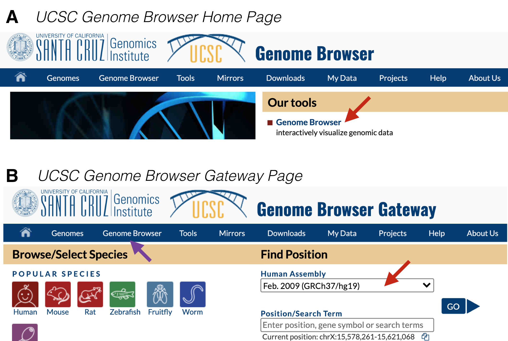
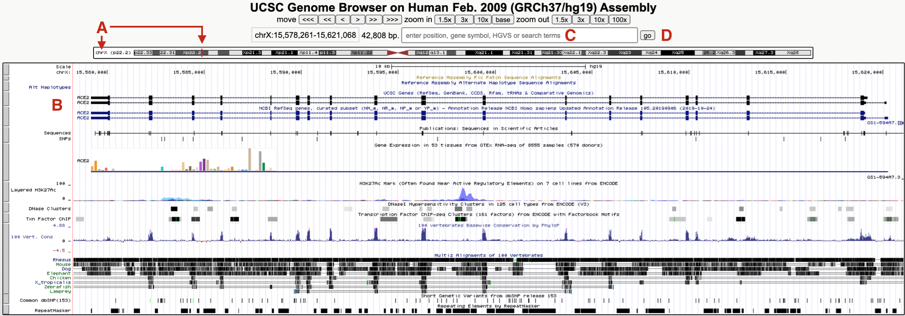
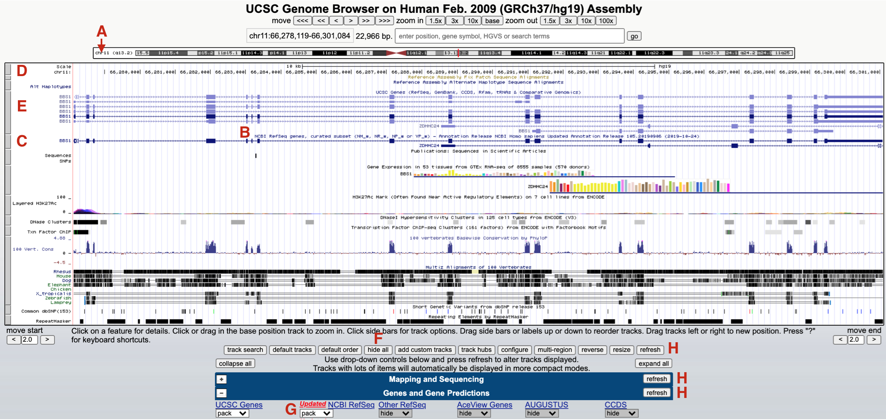
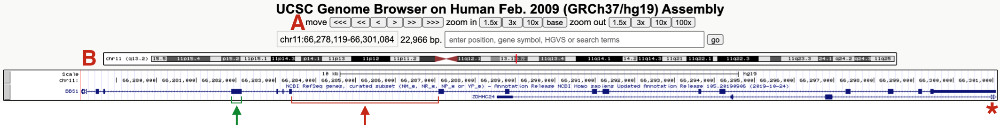

# Advanced Methods {#chapter9}

## Create an Account at the UCSC Genome Browser

Creating an account at the UCSC Genome Browser site is useful for a variety of reasons. For example, having an account will enable you to save your favorite settings into a named session, and then return to the named session later regardless of which computer you use. You can also share named sessions with other users (something I will do for you throughout the semester). 

To create an account, go to the [UCSC Genome Browser](https://genome.ucsc.edu/){target="_blank"}. In the toolbar at the top of the page hover over “My Data” then choose “My Sessions” from the pulldown menu. At the top of the page click “Create an Account”. Complete the form then click “Sign Up”. You are done! 

## How to Configure the Genome Browser from Scratch

<br>
```{r gateway, out.width='50%', fig.align='center', fig.cap = "A) This is the UCSC Genome Browser Homepage. Click on *Genome Browser* (red arrow) to get to the Browser Gateway Page. B) This is the Browser Gateway Page. Choose the *Feb. 2009* Human assembly (red arrow) then click *Go*."}
knitr::opts_chunk$set(echo = FALSE)

```
<br>

To begin from scratch, go to the [UCSC Genome Browser](https://genome.ucsc.edu/){target="_blank"}. At the home page, click on “Genome Browser” under “Our Tools” (Figure \@ref(fig:gateway) A). Within the Genome Browser Gateway page, hover your mouse over "Genome Browser" in the tool bar (Figure \@ref(fig:gateway) B, purple arrow) and click on "Reset All User Settings". Then click on the pull down menu under Human Assembly^[A Genome Assembly is a whole genome sequence produced after chromosomes have been fragmented, sequenced, and the resulting sequences have been put back together (assembled). Each time the genome is sequenced, errors are corrected then uploaded as a new genome assembly. The Feb. 2009 is still the most popular assembly to date with the most useful evidence tracks.] and choose "Feb. 2009 (GRCh37/hg19)" (Figure \@ref(fig:gateway) B, red arrow). Now click "Go" to be taken to the Human Genome Browser window. 

Since you did not search for a specific gene, you have been taken to a default position within the genome, specifically, a small region on the **short arm** of the X chromosome where a gene called ACE2 resides (Figure \@ref(fig:ACE2) A and B). Why here? This paragraph was written in 2020 when ACE2 became *infamous*. Google "ACE2" and "coronavirus" to see why! 

<br>
```{r ACE2, out.width='100%', fig.align='center', fig.cap = "The UCSC Genome Browser window focused on a small region of the X chromosome (A) on a gene called ACE2 (B). To hop to BBS1, use the search window (C) then click *Go* (D). See text for important details."}
knitr::opts_chunk$set(echo = FALSE)

```
<br>

To hop to where BBS1 resides, type BBS1 into the search window (Figure \@ref(fig:ACE2) C). **As you type, a popup menu will appear with a short list of related genes**. Choose BBS1 then click “GO” (Figure \@ref(fig:ACE2) D). If you *do not* choose a gene from this list, you will be transported to a new page with a long list of related genes grouped according to sequence database (there are many). It might be easiest to go back and try again. Alternatively, scroll down until you find the “NCBI RefSeq” database^[The “NCBI RefSeq” database is the one we will be using.] then click on the link for BBS1. 

Your browser window should now jump to chromosome 11 (Figure \@ref(fig:BBS1) A). The default genome browser window will now display a variety of so-called "evidence tracks". These are graphical representations of genome features or experimental data related to the region displayed. Nearly all evidence tracks include a centrally located title heading (Figure \@ref(fig:BBS1) B) and all include a gray rectangle positioned on the left (Figure \@ref(fig:BBS1) C). Three evidence tracks are highlighted in total. The one at the top is the **Base Position** track (Figure \@ref(fig:BBS1) D). This is the only evidence track that *does not have a track title*. This track displays the genome sequence itself. That said, you will only be able to see individual nucleotides when you zoom in close enough. Two **Gene Prediction** tracks are also highlighted. One is the "UCSC Genes" track (Figure \@ref(fig:BBS1) E). Another is the "NCBI Refseq genes" track (Figure \@ref(fig:BBS1) C). Notice the gene name is displayed on the left side of each schematic. 

<br>
```{r BBS1, out.width='100%', fig.align='center', fig.cap = "The browser window now focused on a small region of chromosome 11 (A) where BBS1 resides (C and E). Each evidence track includes a track title (B) and is demarcated by a gray rectangle (D, E and C). To hide all tracks click *hide all* (F) and click *refresh* (H). To open the NCBI Refseq track change the pulldown menu from *hide* to *pack* (G)."}
knitr::opts_chunk$set(echo = FALSE)

```
<br>

Each gray rectangle corresponding to an evidence track is clickable. Clicking on a gray rectangle will take you to a track settings page for that particular evidence track. Try it. Then click the back button to get back. Right clicking on a gray rectangle on the other hand will open up a small window for *quick* formatting. For example, you can hide any evidence track that you don't need in this way. To hide all evidence tracks at once, scroll down to below the browser window and click "hide all" (Figure \@ref(fig:BBS1) F). Everything but the Base Position track will disappear. Now scroll down to view the most commonly used evidence tracks below the browser window to confirm. All but the "Base Position" track found within the "Mapping and Sequencing" section should be set to hide. **Now change the "NCBI Refseq" evidence track (found within the "Genes and Gene Predictions" section) to "pack"** (Figure \@ref(fig:BBS1) G) **and click "refresh"** (Figure \@ref(fig:BBS1) H). You should now see only two gray rectangles on the left. The base position track on top and the "NCBI refseq genes" Gene Prediction track is below (Figure \@ref(fig:BBS1simple)).

<br>
```{r BBS1simple, out.width='100%', fig.align='center', fig.cap = "This is what the *BBS1 Gene Structure* named session should look like. One example of an exon and intron are highlighted. The asterix points on the right highlights the open triangles extending from ZDHHC24 indicating that this gene extends further to the right. (A) highlights the navigational toolbar and (B) highights the schematic of the chromosome where BBS1 resides. One exon (green bracket) and one intron (red bracket) are also shown."}
knitr::opts_chunk$set(echo = FALSE)

```
<br>

Again, the "NCBI Refseq genes" evidence track includes a graphical representation of the BBS1 gene^[Gene: Genome browsers provide a precise position for each gene, in reality, we don't really know where a gene truly begins or ends (there is sequence both upstream and downstream of the RNA transcript that is important for regulating gene expression). That said, we can experimentally determine the transcribed region of a gene. Thus, it makes most sense to equate the transcribed region of a gene to the gene itself even though we know more sequence is required for the gene to be transcribed properly.]. This gene schematic displays the position of BBS1 exons and introns (see red and green brackets in Figure \@ref(fig:BBS1simple)). You may also notice that a second gene (ZDHHC24) partly overlaps BBS1. The open arrowheads at the far right of the graphical representation for ZDHHC24 (red asterisk, Figure \@ref(fig:BBS1simple)) indicates that this gene extends farther to the right. 

## Creating a Named Session

Compare what you configured to my named session, [BBS1 gene structure](https://genome.ucsc.edu/s/megallegos/Biol%20310%20Module%201){target="_blank"}. If they are identical, congratulations. If not, try again but don't stress too much. You can always use my link to get to a correctly formatted page. You are now ready to create your own named session based on the browser window you created (or mine). First, make sure your browser window looks the way you want it to. Next, make sure you are logged into your account. Hover your mouse over “My Data” then click on “My Sessions”. Scroll down to the section entitled, “Save Settings”. Within the window under “Save current settings as named session”, input a reasonable name for this session (i.e. “Gene and Base Prediction Tracks only”). Then hit submit. Now anytime you want to sit down at a computer (anywhere, any computer) to view BBS1 with only the base position and gene prediction tracks open, you simply need to log into your UCSC Genome Browser account, go into “My Sessions” and click on your named session. You won't need to rely on this manual for links. **You can also use this named session as a springboard to view any other gene by using the search window.**

© `r as.numeric(format(Sys.Date(), "%Y"))`, Maria Gallegos. All rights reserved.

<style>
p.caption {
  font-size: 0.8em;
  margin-right: 2%;
  margin-left: 2%;
  line-height: 1.2em;
  text-align: left;
}
</style>

<script src="https://ajax.googleapis.com/ajax/libs/jquery/3.1.1/jquery.min.js"></script>

<style>
.zoomDiv {
  opacity: 0;
  position:absolute;
  top: 50%;
  left: 50%;
  z-index: 50;
  transform: translate(-50%, -50%);
  box-shadow: 0px 0px 50px #888888;
  max-height:100%; 
  overflow: scroll;
}

.zoomImg {
  width: 100%;
}
</style>


<script type="text/javascript">
  $(document).ready(function() {
    $('body').prepend("<div class=\"zoomDiv\"></div>");
    // onClick function for all plots (img's)
    $('img:not(.zoomImg)').click(function() {
      $('.zoomImg').attr('src', $(this).attr('src'));
      $('.zoomDiv').css({opacity: '1', width: '95%'});
    });
    // onClick function for zoomImg
    $('img.zoomImg').click(function() {
      $('.zoomDiv').css({opacity: '0', width: '0%'});
    });
  });
</script>


