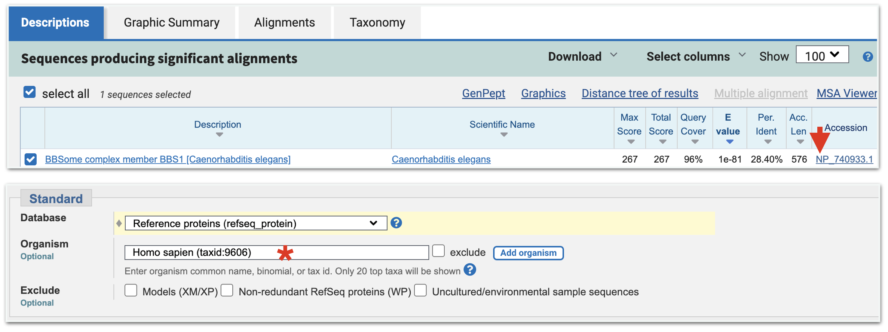
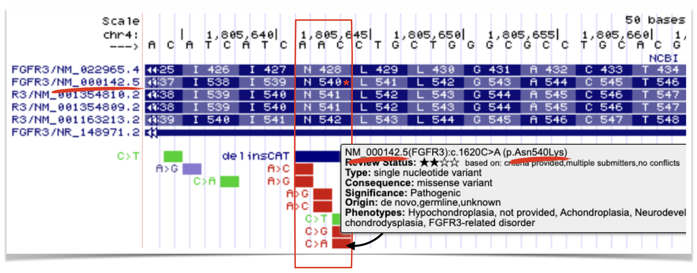

# *Finding Genes with Orthology* {#chapter8}

Genetic model organisms like yeast, worms, flies, fish and mice play a critical role in the advancement of biomedical research. Research in model organisms can be cheaper, faster and is undoubtedly more ethical than conducting research on humans! They are particularly useful for studying gene function *in vivo*. A list of  advantages and disadvantages for each of the most common species studied today are shown in Figure \@ref(fig:modelsystems). 

<br>
```{r modelsystems, out.width='100%', fig.align='center', fig.cap = "Popular model orgsanisms used in genetic and biomedical research. Advantages and disadvantages are listed from cheapest (yeast) to most expensive (mice). This image was modified from Kim et al. 2020, Nature Reviews Molecular Cell Biology"}
knitr::opts_chunk$set(echo = FALSE)
knitr::include_graphics('static/images/modelorganisms.png')
```
<br> 

While at the surface humans appear to have little in common with mice, fish, flies, worms or fungi, this approach works. Why? [Cell Theory](https://en.wikipedia.org/wiki/Cell_theory#:~:text=All%20known%20living%20things%20are,total%20activity%20of%20independent%20cells.){target="_blank"} states that "all cells come from pre-existing cells". And in fact, a significant percentage of genes from these ancestral cells persist in some form in Eukaryotes today. Despite nearly 1 billion years of evolution, many gene products are recognizable at the amino acid sequence level and in some cases are functionally interchangeable! 

For example, a human gene called BCL2 is known to inhibit **programmed cell death** (Vaux et al. 1988). Programmed cell death is a biological process that has been observed in all animals studied to date. When certain cells are no longer needed, they "commit suicide" by activating this intracellular death program. But programmed cell death is tightly regulated. Too much death is also problematic. In 1992, Vaux et al. discovered that if you inject human *BCL2* fused downstream of a worm heat-shock promoter^[A promoter that is activated by heat. With heat shock, the promoter will initiate high levels of transcription!] its progeny^[offspring or descendants of an animal, or plant - online dictionary] had ***less*** programmed cell death following heat shock! See Figure \@ref(fig:BCL2rescue) A and B.

<br>
```{r BCL2rescue, out.width='100%', fig.align='center', fig.cap = "A) Normal worm development includes a certain amount of programmed cell death. B) When human *BCL2* is expressed in worm embryos, less cell death is observed (Vaux et al. 1992). *+* indicates, wildtype allele. C) Data demonstrating that human *BCL2* is able to partially rescue the *ced-9* loss-of-function mutant phenotype (Hengartner and Horvitz, 1994). "}
knitr::opts_chunk$set(echo = FALSE)
knitr::include_graphics('static/images/BCL2.png')
```
<br>

A worm gene called *ced-9* functions similarly. In loss of function *ced-9* mutants, more cells die suggesting that wildtype *ced-9* (like wildtype *BCL2*) inhibits programmed cell death. In subsequent experiments, Hengartner and Horvitz partially **rescued** *ced-9* loss of function mutants with the human *BCL2* gene! In other words, *ced-9* mutant worms expressing human *BCL2* looked more like wild type (Figure \@ref(fig:BCL2rescue) C). Dr. Vaux, the first author explained in an [interview](https://www.nature.com/articles/4401439){target="_blank"}: "This meant that the human BCL2 protein must be interacting with the worm's cell death mechanism. The fact that human *BCL2* could work in a worm suggested that human *BCL2* can interact with whatever proteins the worm CED-9 protein interacts with. That, in turn, suggests that not only the gene but also the pathway of cell death is likely to be universal." That is one billion years of evolution separating worms and humans! This is strong evidence that human *BCL2* and worm *ced-9* are **orthologs**. Again, this is a term that describes two genes in distinct species that evolved from an ancestral gene present in the last common ancestor. 

## Modelling Human Disease

In 2014, Dr. Ethan Perlstein created Perlara, a biotech Public Benefit Corporation which aimed to accelerate the discovery of treatments for rare genetic diseases through the use of simple model organisms. They begin by first creating "patient avatars" using simple organisms that share genetic similarity with humans. This allows them to screen disease models with drug candidates quickly and at low cost. 

For example, Perlara created yeast, worm and fly models of a rare congenital disorder of glycosylation called PMM2-CDG^[According to Wikipedia, **glycosylation** is a process whereby a carbohydrate is attached to a hydroxyl or other functional group of another molecule (often a lipid or protein)] caused by mutations in the PMM2 gene^[According to Genetics Home Reference, the PMM2 gene produces an enzyme called phosphomannomutase 2. This enzyme is involved in glycosylation (see earlier footnote), which acts by attaching groups of sugar molecules to proteins]. From their initial studies they knew they needed a drug that would boost the enzymatic activity of PMM2. To identify such a drug, Perlara performed a drug repurposing screen^[searching through a library of drugs already available and approved for a different disorders] using the worm model Perlara created for PMM2-CDG. Epalrestat, a drug normally used to treat diabetic neuropathy looked promising and was later shown to boost PMM2 enzyme function in PMM2-CDG patient fibroblasts^[PMM2-CDG patient fibroblasts are skin cells taken from patients with the PMM2 disorder.]! Finally in early 2020 Dr. Ethan Persltein began treatment of the first human patient, Maggie Carmichael. After 6 months, the change was dramatic (Figure \@ref(fig:PMM2Perlquest)). To read more, you can subscribe to [Ethan's substack](https://perlara.substack.com/){target="_blank"}  

<br>
```{r PMM2Perlquest, out.width='50%', fig.align='center', fig.cap = "Image courtesy of Holly and Dan Carmichael"}
knitr::opts_chunk$set(echo = FALSE)
knitr::include_graphics('static/images/MaggiesPerlquest.png')
```
<br>

**The bottom line: The accurate identification of an orthologous pair between a model organism and humans is a prerequisite for creating a human disease model**.  

## Reciprocal Best Hit Analysis

A simple and widely used approach to identify putative orthologs is known as the reciprocal best hit (RBH) method^[Sometimes called the bidirectional best hit (BBH) method]. In fact, one study concludes that a high proportion of RBH pairs are likely to be true orthologs (Dalquen and Dessimoz, 2013).

In brief, a reciprocal best hit analysis starts with the protein sequence coded by the human gene of interest. This protein sequence is used as a **query**^[defined by the online dictionary simply as "a question". In our context, your human protein sequence *implies* the question: Are there proteins in my model system of choice that are similar to this human protein sequence?] to search a protein database from a model organism of your choice (i.e. *C. elegans*). This is called your first **BLASTP**^[The BLAST algorithm finds and aligns regions of similarity between biological sequences. The BLASTP website searches protein databases using a protein sequence as a query]. Your goal is to identify a protein in your model organism of choice that is **most** similar to the human protein you used as a query. This is your **top hit** also known as your **best hit**. You then use this protein sequence, the “top hit”, as a query to search the human protein database for the best match. This is called your **reciprocal BLASTP**. If your “top hit” in the reciprocal BLASTP pulls up a protein that is coded by your starting human gene then you have found a **“Reciprocal Best Hit”** (Figure \@ref(fig:RBH)). In other words, a reciprocal best hit succeeds at identifying a pair of orthologs when it identifies a pair of *genes* that are *eachother's* best hits. 

<br>
```{r RBH, out.width='100%', fig.align='center', fig.cap = "A schematic diagram to explain a reciptrocal best hit analysis. See text for details."}
knitr::opts_chunk$set(echo = FALSE)
knitr::include_graphics('static/images/RBHanalysis.png')
```
<br>

## First BLASTP

To start, use the ["DNA Variant"](https://genome.ucsc.edu/s/megallegos/Fantastic%20Genes%20and%20Where%20to%20Find%20them%20Chapter%206){target="_blank"} session link. This session link takes you to BBS1. To obtain gene product information for BBS1, click on the only gene schematic within the NCBI Refseq Gene Predictions Track. Once open, click on the **Protein** Accession ID link (See asterix, top panel in Figure \@ref(fig:FIRSTBLAST)). This opens the protein information page. At the top right corner of the protein information page, under the section entitled, “Analyze this sequence”, click on “Run BLAST” (See asterix, middle panel in Figure \@ref(fig:FIRSTBLAST)). A BLASTP page will open. On the BLASTP page, notice that the protein accession code for BBS1 has been entered into the query sequence window. This is the “Query ID” for your first BLASTP search. Keep most default settings. For "Organism", however, type any part of a species name into the query window (i.e. *“elegans”*). As you type, a drop down menu will appear. Choose the correct species from the list. For database, it is critical that you choose **Reference Proteins (`refseq_proteins`)**. This is the third choice on the popup menu. Finally, scroll to the bottom of the BLASTP page and click “BLAST”. (See bottom panel in Figure \@ref(fig:FIRSTBLAST)). 

<br>
```{r FIRSTBLAST, out.width='75%', fig.align='center', fig.cap = "When you click anywhere on the BBS1 gene schematic, a gene information page will open. Click on the protein accession ID link (asterix, top image). A protein information page for BBS1 will open. Click on the **Run BLAST** link on the right side of the page (asterix, middle image). A BLASTP submission page will open with the BBS1 Protein Accession ID present in the Query window. Now scroll down to the section where you choose your Organism. In the **Organism** window, start typing in the species name then click on your species from the dropdown menu (asterix, bottom image). Finally, scroll all the way to the end of the page and click **BLAST**."}
knitr::opts_chunk$set(echo = FALSE)
knitr::include_graphics('static/images/firstBLASTP.png')
```
<br>

A results page will appear after some time. It will contain multiple tabs near the top of the page including "Descriptions", "Graphic Summary", "Alignments" and "Taxonomy". We will focus mainly on the "Descriptions" and "Alignments" tabs. The "Descriptions" tab includes a table that lists all the "hits" that have some similarity to your query sequence (BBS1 is fairly unique in that it only retrieves one hit!). When there is more than one hit, they are listed in order of increasing E value. "E value", in simple terms, estimates the statistical significance of the match. It depends on the length of the query sequence, the size of the database searched, the scoring system used and the alignment quality (matches, gaps and mismatches). The lower the E value, the more significant the match is (less likely due to random chance). Anything less than 1e-10 is considered a very strong match. Other important columns in the table include "Query Cover" and "Percent Identity". Query Cover" describes the percentage of the "query" sequence that aligns with the subject sequence (the "hit"). "Percent Identity" describes the percentage of amino acids that are exactly the same between the query sequence and the subject sequence in the alignment. To see the pairwise alignment of your top hit and query, click the "Alignment" tab then scroll down. The "top hit" is simply the hit in the top row (row 1) of the "Descriptions" tab and first alignment in the "Alignments" tab. It should have the lowest E value. 


## Understanding a Pairwise Alignment

Figure \@ref(fig:pairwise) includes a portion of the pairwise alignment between human BBS1 and its top hit from *C. elegans*. The alignment begins with a description of the subject sequence (the "hit") from the target database (in our case, *C. elegans*) including the protein name and species in brackets. The next line includes the "Protein Sequence ID" of the hit (In this case, the Refseq Accession ID) and the "Length" of the protein (in amino acids). Above the alignment you will find "Score", "Expect", "Identities", "Positives" and "Gaps" which all describe the quality of the alignment in some way. "Expect" is the E value as defined previously. "Score" was also defined above except the value is converted into "bits", which is a normalized score. This allows for comparisons across different BLAST runs and databases. The higher the bit score, the more meaningful the alignment. A bit score of 682 is extremely high.

The "Query" sequence is displayed in the first line of the alignment (in our case, the human BBS1 protein). The "Sbjct" ( subject) sequence is placed below the "Query" (in our case, this is the top and only hit found in *C. elegans*). A description of the type of match observed between the two sequences at each position is displayed between the "Query" and the "Sbjct" lines. A "+" is placed in the alignment where the amino acids in the "query" and "sbjct" are chemically similar but not identical (Figure \@ref(fig:pairwise), lavender box). This type of match contributes to the overall percent "Positives". Amino acids are placed between the "query" and "sbjct" when they are identical (Figure \@ref(fig:pairwise), green box). This type of match contributes to the overall percent "Identities". Positiions in the alignment where the "query" and "sbjct" are unrelated are left blank (Figure \@ref(fig:pairwise), red box). Finally, a **gap** in the alignment is represented by “-“ (Figure \@ref(fig:pairwise), blue box). These contribute to the percent "Gaps" in the alignment. Gaps and mismatches result from the slow process of evolution. For a gap to occur, one or more complete codons were either deleted in the query gene or added in the subject gene.

To better understand how the numbering system works in a pairwise alignment, see if you can confirm the following statements. In Figure \@ref(fig:pairwise), there is an "M" at position 77 of the Query sequence. Q at position 136 of the Query aligns with an S at position 123 of the Sbjct (although they don't match). That said, the "E" at position 135 of the Query is identical to the "E" at position 122 of the Sbjct. Finally, there is a "T" at position 162 of the Query (this may take some counting to confirm). Can't confirm? It is likely that you counted the gap as an amino acid. **Gaps in an alignment are NOT counted.** Try again and see if you can confirm. 

<br>
```{r pairwise, out.width='100%', fig.align='center', fig.cap = "A portion of the pairwise alignment between human BBS1 and the top hit in worms. See text for details."}
knitr::opts_chunk$set(echo = FALSE)
knitr::include_graphics('static/images/TwoPairwiseAlignments.png')
```
<br>

### [Test Your Understanding](https://docs.google.com/forms/d/e/1FAIpQLSeACOPQeUC_YCjHqISD95DYyEpiSjJPHThNVxIYZ0v1Okmd2g/viewform?usp=sf_link){target="_blank"}
<style>
div.blue { background-color:#e6f0ff; border-radius: 5px; padding: 5px;}
</style>
<div class = "blue">
<br>
*Click the link above to see the TYU questions.* 
<br>
</div>

## Reciprocal BLASTP

Now that you have performed your first BLASTP using human BBS1 as your Query, you are ready to see if the best hit in worms will identify the human BBS1 gene as the top hit in a “reciprocal BLASTP”. First step, retrieve the protein information page for your top hit from the first BLASTP. You can either go to the "Descriptions" tab and click on the link to the Refseq Accession ID (Format: NP_XXXXX.X) in the "Accession" Column for your **top hit** ((Figure \@ref(fig:SECONDBLAST)). Or you can go to the "Alignment" tab and click on the Refseq Accession ID link listed for "Sequence ID:". Either will take you to the same protein information page for your top hit in *C. elegans*. Then click on the “Run BLAST” link as before. A BLASTP submission page will open. On this BLASTP submission page, the accession code for the worm top hit will be entered into the query sequence window for you. This is your new “Query ID” for your reciprocal BLASTP. Again, use the same settings as before with one exception. This time type *“Homo sapiens”* into the query window for "Organism" ((Figure \@ref(fig:SECONDBLAST)). Again, as you type, a drop down menu will appear. Choose the correct species on the list. Then scroll to the bottom of the BLASTP page and click “BLAST”. Once your results page open ask yourself, you will need to evaluate the "top hit" that appears in the table? Specifically, you need to answer the question, is the top hit coded by the human BBS1 gene?

<br>
```{r SECONDBLAST, out.width='75%', fig.align='center', fig.cap = "From your BLAST results page for your first BLASTP, click on the Protein Accession ID (top image, red arrow). This will take you to the protein information page for the worm best hit. Click on **Run BLAST** as before. At the BLASTP submission page, change the Organism to **Homo Sapiens** (bottom image, asterix)."}
knitr::opts_chunk$set(echo = FALSE)

```
<br>

### [Test Your Understanding](https://docs.google.com/forms/d/e/1FAIpQLSctC_EHT6uey1_zYviwwxNJRCgWAM-bKxlkiJawl5HfZk6siw/viewform?usp=sf_link){target="_blank"}
<style>
div.blue { background-color:#e6f0ff; border-radius: 5px; padding: 5px;}
</style>
<div class = "blue">
<br>
*Click the link above to see the TYU questions.* 
<br>
</div>

## Understanding your RBH analysis
In the section above, I explained how to do an RBH analysis for the human gene, BBS1. The interpretation was straightforward. The protein Refseq ID used as a query in the first BLASTP was the same Protein refseq ID obtained as the top hit in the reciprocal BLASTP. What does it mean when they don't match? There are two possibilities: The two protein Refseq IDs are gene products of two distinct genes and thus not orthologs. Or the two protein refseq IDs are protein isoforms of the same gene. In the latter case, the gene pair *are* orthologs (Figure \@ref(fig:alternativeRBHoutcome). Compare this outcome with Figure \@ref(fig:RBH).

<br>
```{r alternativeRBHoutcome, out.width='75%', fig.align='center', fig.cap = "A schematic diagram to another possible outcome for a reciptrocal best hit analysis. See text for details."}
knitr::opts_chunk$set(echo = FALSE)
knitr::include_graphics('static/images/RBH2.png')
```
<br>

To determine whether two protein sequences are gene products of the same or different genes, you go to the protein information page for each protein Refseq ID and **search (Control F) for "/gene"**. This will take you to the gene annotation buried at the bottom of the protein information page. (Figure \@ref(fig:officialgenename)). 

<br>
```{r officialgenename, out.width='75%', fig.align='center', fig.cap = "This is a screenshot of a small portion of a protein information page for [NP_009202.1](https://www.ncbi.nlm.nih.gov/protein/NP_009202.1). The CDS annotation includes information about the gene. The official gene corresponding to this protein is STK38. This is the gene name used by the UCSC genome browser. Search for it!"}
knitr::opts_chunk$set(echo = FALSE)
knitr::include_graphics('static/images/GeneName.png')
```
<br>

**Take home Message:**
<br>

When one does an RBH analysis, protein sequences are used to perform each BLASTP (first and reciprocal). *But* a reciprocal best hit successfully identifies a pair of orthologs only when it identifies a pair of ***genes*** that are *eachother's* best hit. The BLASTP is used as a tool to identify those genes. 

### [Test Your Understanding](https://docs.google.com/forms/d/e/1FAIpQLSdpIxVjTG0lSzcHmQr_21sdnyP5tj6GgEZI0MjvFeflmLqkiQ/viewform?usp=sf_link){target="_blank"}
<style>
div.blue { background-color:#e6f0ff; border-radius: 5px; padding: 5px;}
</style>
<div class = "blue">
<br>
*Click the link above to see the TYU questions.* 
<br>
</div>

## Mapping patient alleles to a pairwise alignment
Orthologs are genes in different species that evolved from a common ancestral gene through speciation and typically retain similar molecular functions. Ortholog pairs are often recognized by their high levels of sequence similarity, which is why a reciprocal best hit (RBH) analysis is a powerful way to identify them. That said, sequence similarity among distantly related orthologs is not uniformly distributed along the polypeptide but is concentrated at amino acid residues that are critical for protein function, such as a ligand-binding or active sites. Pathogenic missense variants identified in patients often map to these conserved positions, highlighting residues that are essential for protein activity and, by extension, expected to be conserved among orthologs.

To determine whether these critical amino acids are conserved among ortholog pairs, you must first create a pairwise alignment using the correct protein isoform (if multiple isoforms are produced). To identify which isoform to use for a BLASTP search, hover over several DNA variants in the genome browser. You will find that all DNA variants for a given gene are mapped relative to a single specific isoform, indicated in the popup message.

For example, all **FGFR3** DNA variants map relative to isoform `NM_000142.5`. Figure \@ref(fig:AccessionChoice) highlights one pathogenic mutation that results in an Asn-to-Lys missense change at position **540** in the **FGFR3** protein. Notice that this numbering applies only to isoform `NM_000142.5`. The same amino acid corresponds to position **428** in isoform `NM_022965.4`. Therefore, if you wish to examine whether this amino acid is conserved in a simpler genetic model system, you should use `NM_000142.5` as the query isoform for the BLASTP search. Doing so ensures that the amino acid will appear at the expected position in the pairwise alignment.

<br>
```{r AccessionChoice, out.width='75%', fig.align='center', fig.cap = "The C to A substitution mutation leads to a Asn to Lys missense mutation at position 540 in the FGFR3 protein. That said, this is true only for isoform `NM_000142.5`. Thus, if you wanted to see if this amino acid is conserved in a genetic model system, you would want to use this isoform to perform the BLASTP. Doing so ensures you can find this amino acid in the pairwise alignment."}
knitr::opts_chunk$set(echo = FALSE)

```
<br>

### [Homework](https://drive.google.com/file/d/1CWf927mnP3droqocuIpVahigShlSgt6R/view?usp=sharing){target="_blank"}

## [Independent Project](https://docs.google.com/document/d/1f6JfkyjoCzrnMQNOYK4zwh8v6UWDpyhe/edit?usp=sharing&ouid=105099724878084618453&rtpof=true&sd=true){target="_blank"}

## [Lab Practical Practice](https://docs.google.com/forms/d/e/1FAIpQLScfBuVHhWGDfSWYeuAXYh3gV2odaTh9D-OPFHhJlHeFUM_06w/viewform?usp=sf_link){target="_blank"}

Due: See Syllabus

© `r as.numeric(format(Sys.Date(), "%Y"))`, Maria Gallegos. All rights reserved.

<style>
p.caption {
  font-size: 0.8em;
  margin-right: 2%;
  margin-left: 2%;
  line-height: 1.2em;
  text-align: left;
}
</style>

<script src="https://ajax.googleapis.com/ajax/libs/jquery/3.1.1/jquery.min.js"></script>

<style>
.zoomDiv {
  opacity: 0;
  position:absolute;
  top: 50%;
  left: 50%;
  z-index: 50;
  transform: translate(-50%, -50%);
  box-shadow: 0px 0px 50px #888888;
  max-height:100%; 
  overflow: scroll;
}

.zoomImg {
  width: 100%;
}
</style>


<script type="text/javascript">
  $(document).ready(function() {
    $('body').prepend("<div class=\"zoomDiv\"></div>");
    // onClick function for all plots (img's)
    $('img:not(.zoomImg)').click(function() {
      $('.zoomImg').attr('src', $(this).attr('src'));
      $('.zoomDiv').css({opacity: '1', width: '95%'});
    });
    // onClick function for zoomImg
    $('img.zoomImg').click(function() {
      $('.zoomDiv').css({opacity: '0', width: '0%'});
    });
  });
</script>


