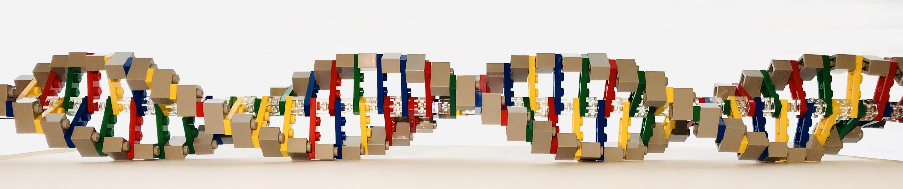

```{r eval=FALSE}
install.packages("bookdown")
# or the development version
# devtools::install_github("rstudio/bookdown")
```


```{r setup, include=FALSE}
knitr::opts_chunk$set(echo = FALSE)
```
  
# Preface {-}
```{r legoDNA, fig.align='center', out.width='\\linewidth'}

```

First, I would like to acknowledge the Genome Education Partnership ([GEP](http://gep.wustl.edu/curriculum/introducing_genes){target="_blank"}) for inspiration. They created a resource for learning about Eukaryotic gene structure using the UCSC Genome Browser (Laakso et al. 2017). Their focus is on the *Drosophila* genome. My focus is on *humans*. This manual has been written for a undergraduate course entitled Principle of Genetic analysis (BIOL 310) at Cal State University, East Bay but can be used by anyone wanting to learn more about gene structure and function. My hope is that skills learned within these pages and the saved sessions I created (and will continue to curate) can be used as a springboard for continued exploration of the human genome.

© 2023, Maria Gallegos. All rights reserved.

# Overview {-}

Throughout the semester, you will use a web-based visualization tool called a Genome Browser to explore gene structure and function. We will focus on the human gene, BBS1. Mutations in BBS1 have been implicated in Bardet Biedl Syndrome, a pleiotropic^[pleiotropy is a condition in which a single gene influences more than one trait (Snustad).] disease with a variety of symptoms including blindness, obesity, polydactyly, cognitive impairment, renal abnormalities, infertility and anosmia. In addition to learning how to navigate through the genome browser, you will also learn about 

1. The relationship between gene expression and gene structure.
2. How RNA sequencing DATA can pinpoint where genes are located in the genome. 
3. How pathogenic variant DATA can reveal genotype–phenotype relationships and help identify genes responsible for human disease.
4. How to create a disease model involving a simple genetic model system (ie. Worms!)

This manual is used in conjunction with an undergraduate genetics course taught at Cal State University, East Bay. It's called BIOL 310, Genetic Analysis I. The course begins with a superficial overview of genetics followed by two lectures about single gene inheritance. After that we start covering the chapters that discuss DNA structure, DNA replication, transcription, translation, DNA damage etc. 

# How to use this manual {-}

This manual can be read on a computer, tablet or phone. When on a computer, the table of contents (side bar) can be toggled in and out by typing "s". The arrow keys can be used to move to later or earlier chapters. 

Figures in the manual can be enlarged by clicking on an image of interest. You can use your track pad to zoom in further if necessary. To continue reading, reduce the image back to its original size by clicking on the image again. 

Throughout this tutorial, you will come across footnotes. When you click on the link to a footnote, you will be taken to the end of the chapter. To continue reading where you left off, click the return arrow at the end of the footnote. 

For students at Cal State University, East Bay, "Test your understanding" (TYU) and "For Discussion" headings are clickable and take  you to a corresponding "Google quiz" in a new tab. To submit your answers you will need your netID. Moreover, I will only accept answers submitted from your horizon email account. **It is your responsibility to make sure you are logged into your horizon email account before you get started**. After you submit you can check your accuracy. It is best to get the answers correct before moving on. TYU questions are designed to assess if you understand how to navigate through the genome AND understand what you are seeing. With this in mind, **you can submit each quiz multiple times**. I will be available during the activity section to answer any questions you might have.

If you spot errors or typos in this manual, please let me know. Thanks!

<!--
<style>
p.caption {
  font-size: 0.8em;
  margin-right: 2%;
  margin-left: 2%;
  line-height: 1.2em;
  text-align: center;
}

</style>

<script src="https://ajax.googleapis.com/ajax/libs/jquery/3.1.1/jquery.min.js"></script>

<style>
.zoomDiv {
  opacity: 0;
  position:absolute;
  top: 50%;
  left: 50%;
  z-index: 50;
  transform: translate(-50%, -50%);
  box-shadow: 0px 0px 50px #888888;
  max-height:100%; 
  overflow: scroll;
}

.zoomImg {
  width: 100%;
}
</style>


<script type="text/javascript">
  $(document).ready(function() {
    $('body').prepend("<div class=\"zoomDiv\"></div>");
    // onClick function for all plots (img's)
    $('img:not(.zoomImg)').click(function() {
      $('.zoomImg').attr('src', $(this).attr('src'));
      $('.zoomDiv').css({opacity: '1', width: '95%'});
    });
    // onClick function for zoomImg
    $('img.zoomImg').click(function() {
      $('.zoomDiv').css({opacity: '0', width: '0%'});
    });
  });
</script>
-->

```{r, results='asis', echo=FALSE}
if (knitr::is_html_output()) {
  cat('
<style>
p.caption {
  font-size: 0.8em;
  margin-right: 2%;
  margin-left: 2%;
  line-height: 1.2em;
  text-align: center;
}
.zoomDiv {
  opacity: 0;
  position:absolute;
  top: 50%;
  left: 50%;
  z-index: 50;
  transform: translate(-50%, -50%);
  box-shadow: 0px 0px 50px #888888;
  max-height:100%; 
  overflow: scroll;
}
.zoomImg { width: 100%; }
</style>

<script src="https://ajax.googleapis.com/ajax/libs/jquery/3.1.1/jquery.min.js"></script>

<script>
$(function() {
  $("body").prepend("<div class=\\"zoomDiv\\"></div>");
  $("img:not(.zoomImg)").click(function() {
    $(".zoomImg").attr("src", $(this).attr("src"));
    $(".zoomDiv").css({opacity: "1", width: "95%"});
  });
  $("img.zoomImg").click(function() {
    $(".zoomDiv").css({opacity: "0", width: "0%"});
  });
});
</script>
  ')
}
```


